# Ağdaki Uçlar, Roller ve Kapsam

::: {.notes}
Bir ağı incelemeye başlamanın doğal noktası, ağı oluşturan uçlardır. Bu bölüm önce bir ucun ne olduğunu, ardından bu ucun iletişimde hangi rolü üstlendiğini ve son olarak ağın hangi coğrafi kapsamda kurulduğunu ele alır. Bu üç soru birbirinin ön koşulu değildir: bir ucun rolü değişirken kapsamı sabit kalabilir, kapsam büyürken rol dağılımı aynı kalabilir.

Bu bölümde ele alınmayan soru, uçların birbirine hangi düzende bağlandığıdır. Bir ucun rolü veya ağın kapsamı, o ağın bağlantı biçimini veya topolojisini belirlemez; bu ayrım izleyen bölümlerde ayrı olarak incelenir.
:::

---

## Bir Ağı Nasıl Tanımlarız?

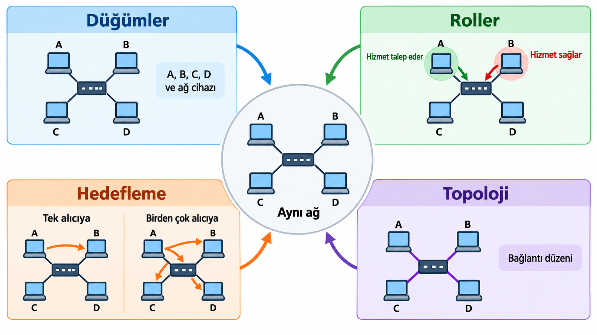{width="88%" fig-align="center" fig-alt="Aynı ağ çizimini düğümler, roller, hedefleme ve topoloji boyutlarıyla ayrı ayrı değerlendiren şema"}

::: {.notes}
Bir ağı yalnız çizim üzerinden değerlendirmek yanıltıcı olabilir. İki ağın kablo düzeni aynı görünse de biri sabit bir istemci–sunucu ilişkisiyle çalışırken diğeri bütün uçların birbirine eşit erişebildiği bir yapı kurabilir; aynı şekilde bir ileti tek bir hedefe gönderilebileceği gibi geniş bir gruba da yöneltilebilir. Bu farklar bağlantı çiziminden doğrudan okunamaz.

Bu nedenle ağ yapısı dört ayrı boyutla incelenir: ağdaki düğümler, uçların işlevsel rolleri, iletişimin hedef kapsamı ve bağlantıların topolojisi. Bu boyutlar bağımsız sorulara cevap verir; bir ağın istemci–sunucu modeliyle çalışması ne kullanacağı hedefleme biçimini ne de fiziksel bağlantı düzenini belirler.
:::

---

## Düğüm, Uç Sistem ve Bağlantı

- **Düğüm (node):** Ağdaki bağlantı veya işlem noktası
- **Uç sistem:** İletişimin başladığı veya sonlandığı sistem
- **Bağlantı (link):** İki veya daha fazla düğüm arasındaki iletişim yolu

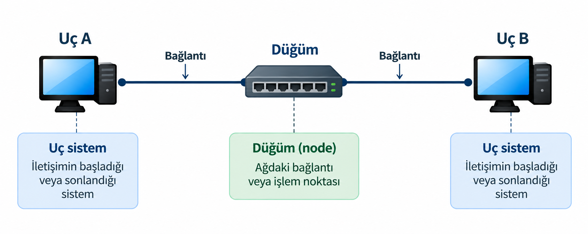{width="88%" fig-align="center"}

::: {.notes}
Düğüm, ağ üzerindeki her bağlantı veya işlem noktasını kapsayan geniş bir terimdir; hem iletişimin başladığı uç sistemleri hem de bir router veya switch gibi iletiyi yalnız ileten ara noktaları içerir. Uç sistem ise kullanıcı verisini üreten, tüketen veya bir hizmete katılan iletişim ucudur ve bu bakımdan ara düğümden ayrılır: ara düğüm iletiyi işleyip yönlendirirken uç sistem iletinin gerçek kaynağı veya hedefidir.

Yukarıdaki çizimde Uç A ve Uç B birer uç sistemdir; ikisi arasındaki Düğüm ise iletiyi yalnız ileten bir ara noktadır. Bağlantı, düğümler arasındaki fiziksel veya mantıksal iletişim yoludur; bir topoloji, ağdaki bütün düğüm ve bağlantıların birlikte oluşturduğu düzeni gösterir.
:::

---

## Ağlar Ne Kadar Büyük Olabilir?

Bir kişinin yanındaki cihazları bağlamakla bir binayı, şehri veya farklı şehirleri bağlamak aynı ölçekte bir problem değildir.

{width="72%" fig-align="center" fig-alt="Bir kişinin yakınındaki cihazlardan bina, şehir ve geniş coğrafyalara uzanan PAN, LAN, MAN ve WAN ağ kapsamları"}

::: {.notes}
Ağları kapsadıkları coğrafi alana göre ayırmak, bağlantının fiziksel kapsamını ve cihazların ne kadar dağınık yerleştiğini ifade etmeyi sağlar. Bir kişinin birkaç cihazını yakın çevrede bağlaması ile farklı şehirlerdeki kurumları bağlaması aynı planlama sorunu değildir. Kapsanan alan büyüdükçe bağlanan sistemler daha geniş bir alana yayılır; bu sınıflandırma kesin kilometre sınırları koymaz.

**PAN (kişisel alan ağı),** bir kişinin yakın çevresindeki cihazları kapsar. Örneğin telefon, akıllı saat ve kulaklık arasındaki bağlantılar kişisel ölçekte düşünülebilir.

**LAN (yerel alan ağı),** ev, laboratuvar, ofis ya da bina gibi sınırlı bir alandaki cihazları bir araya getirir. Bir laboratuvardaki bilgisayarların aynı LAN içinde olması buna örnektir.

**MAN (metropol alan ağı),** şehir ölçeğindeki bağlantıyı anlatır. Örneğin aynı şehirdeki kurumsal yerleşkeleri bağlayan ağ bu ölçekte değerlendirilebilir.

**WAN (geniş alan ağı),** şehirler, ülkeler veya daha geniş coğrafyalar arasında uzanır. Farklı şehirlerdeki kurum şubeleri arasındaki bağlantı buna örnektir. İnternet'i yalnızca tek bir büyük WAN olarak düşünmemek gerekir: İnternet, çok sayıda farklı ağın birbirine bağlandığı bir **ağlar ağıdır (internetwork)**.

Bu adlar bir ağın fiziksel yayılımını anlamaya yarar; ağın nasıl düzenlendiğini ya da cihazların hangi görevleri üstlendiğini açıklamaz. Görseldeki bina/kampüs ifadesi LAN'ın yerel ölçeğini sezdirir; kampüsün gerçek ağ düzeni birden fazla yerel ağ içerebilir.
:::


---

## Host ve İşlevsel Rol

**Host**, ağ üzerinden iletişime katılan uç sistem için kullanılan bir terimdir.

Bir host farklı iletişimlerde:

- Hizmet isteyebilir.
- Hizmet sunabilir.

::: {.notes}

Host teriminin kapsamı kullanılan kaynağa ve mimari bağlama göre değişebilir. Bu notta host, uygulama çalıştıran ve ağ iletişiminin uç noktası olan sistemi ifade eder.

Host olmak ile istemci veya sunucu olmak aynı şey değildir. Host, iletişime katılan uç sistemi; istemci ve sunucu ise bu sistemin belirli bir hizmet ilişkisinde üstlendiği işlevsel rolü belirtir.

Aynı host, farklı hizmet ilişkilerinde farklı roller üstlenebilir. Örneğin bir bilgisayar bir web hizmetinden içerik isterken istemci, aynı anda başka bir cihaza dosya hizmeti sunarken sunucu rolünde olabilir.

:::

---

## İstemci ve Sunucu Rolleri

```text
İstemci (Client): Bir hizmeti talep eden host
Sunucu  (Server): İstenen hizmeti sağlayan host
````

**İstemci ve sunucu, sabit cihaz türleri değil iletişim rolleridir.**

::: {.notes}

İstemci, belirli bir hizmeti talep eden; sunucu ise bu hizmeti sağlayan taraftır. Bu ayrım cihazın fiziksel türüne veya adına göre değil, belirli bir hizmet ilişkisindeki görevine göre yapılır.

Aynı host farklı hizmetlerde aynı anda farklı roller üstlenebilir. Örneğin bir bilgisayar bir sunucudan web sayfası isterken istemci, başka bir bilgisayarın eriştiği dosyaları paylaşırken sunucu olabilir.

Bu nedenle bir cihaz kalıcı olarak yalnızca istemci veya yalnızca sunucu şeklinde sınıflandırılmaz; rol, her iletişim ilişkisi için ayrı değerlendirilir.

:::

---

## Örnek: İletişime Göre Değişen Roller

Bir firmada **A**, ihtiyaç duyduğu bilgiyi **B**'den ister. **B** ise bu bilgiyi bulut hizmeti **C**'den alarak A'ya iletir.

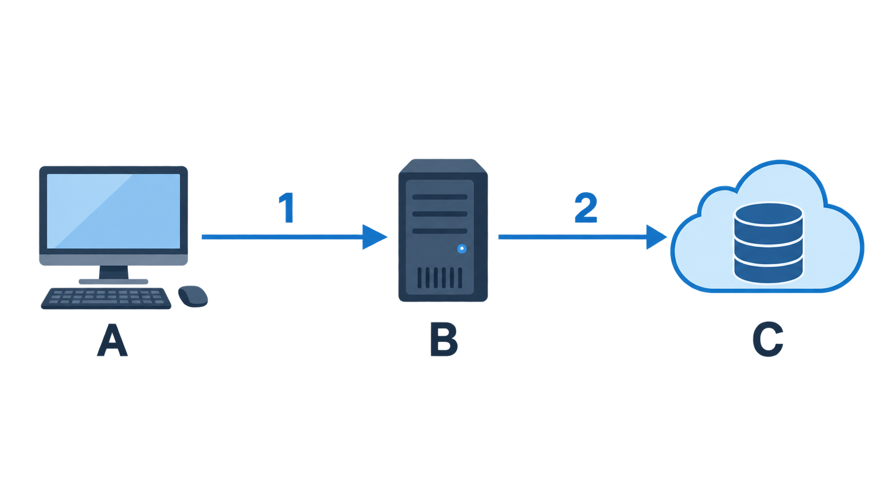{width="64%" fig-align="center" fig-alt="A cihazından B cihazına ve B cihazından C bulut hizmetine yönelen iki isteği gösteren şema"}

**1 ve 2 numaralı iletişimlerde istemci ve sunucu rolleri nasıl dağılır?**

::: {.notes}
Rolü belirlemek için her iletişim ayrı değerlendirilir ve isteği hangi tarafın başlattığına bakılır. Birinci iletişimde isteği A başlattığı için A istemci, bu isteğe hizmet veren B ise sunucudur.

İkinci iletişimde bu kez isteği B başlatır. Bu nedenle B istemci, bilgiyi sağlayan C ise sunucudur. B'nin birinci iletişimde sunucu, ikinci iletişimde istemci olması; istemci ve sunucunun sabit cihaz türleri değil, belirli bir iletişimde üstlenilen roller olduğunu gösterir.
:::

---

## Eşler Arası (Peer-to-Peer) Model

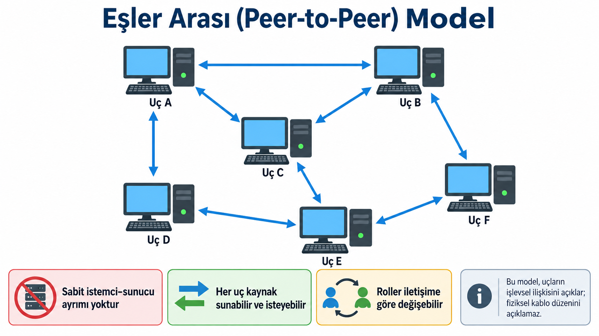


::: {.notes}
Eşler arası modelde uçlar yalnız hizmet isteyen ya da yalnız hizmet sunan kalıcı sınıflara ayrılmaz. Bir uç başka bir uca veri sağlarken aynı anda farklı bir uçtan veri isteyebilir; istemci–sunucu modelinden farklı olarak bu iki rol aynı hizmet için eşzamanlı olarak üstlenilebilir. Örneğin dosya paylaşımı yapan bir uygulamada bir uç, elinde bulunan bir parçayı başka bir uca gönderirken aynı anda kendisinde eksik olan başka bir parçayı üçüncü bir uçtan isteyebilir.

Eşler arası model, uçların işlevsel ilişkisini açıklar; kabloların fiziksel düzenini açıklamaz. Eşler arası çalışan bir ağ yıldız, örgü veya başka bir fiziksel topoloji kullanabilir; model, bağlantıların nasıl döşendiğini değil hizmetin uçlar arasında nasıl paylaşıldığını belirler.
:::

---

## İki Farklı Kavram: Peer-to-Peer ve Point-to-Point

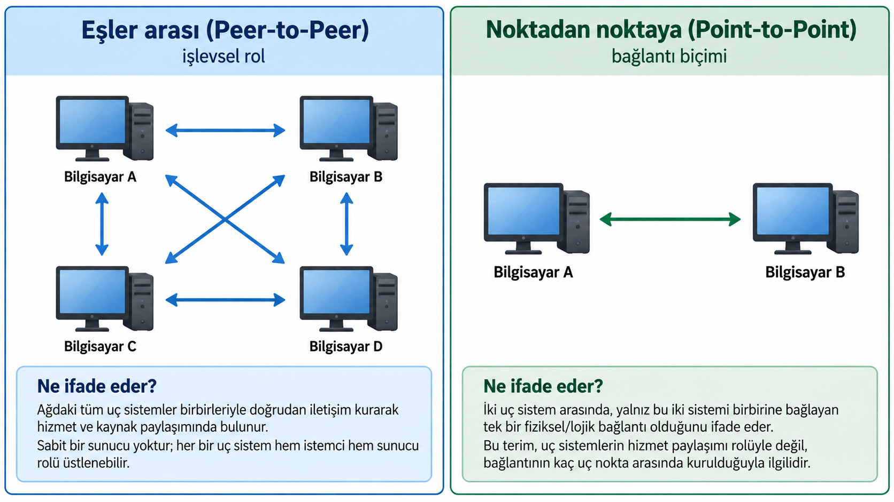{width="96%" fig-align="center" fig-alt="Eşler arası rol modelini noktadan noktaya bağlantı biçimiyle karşılaştıran şema"}

::: {.notes}
Peer-to-peer ve point-to-point ifadeleri farklı kavramları tanımlar ve aynı kısaltmayla anılmaları gerçek bir karışıklık kaynağıdır. Peer-to-peer, hizmet sunma ve kullanma rollerinin uçlar arasında nasıl dağıldığıyla ilgilidir; point-to-point ise tek bir bağlantının kaç ve hangi noktayı birleştirdiğiyle ilgilidir. Bir ağ eşler arası çalışırken uçlar arasındaki bağlantılar noktadan noktaya kurulabilir; bu iki özellik birbirini gerektirmez.

Karışıklığı önlemek için bu notta bağlantı biçimi Türkçe olarak “noktadan noktaya”, işlevsel model ise “eşler arası (P2P)” biçiminde adlandırılır. Örneğin merkezi bir sunucu üzerinden eşleştirilen ama veriyi doğrudan birbirleriyle aktaran iki uç, eşler arası çalışsa da aralarındaki veri bağlantısı noktadan noktayadır.
:::

---

# Bağlantılar ve Hedefleme

::: {.notes}
Önceki bölümde bir ucun üstlendiği rol incelendi; bu bölüm ise aynı ucun iletişim kurarken kullandığı bağlantının yapısını ve iletisinin kaç alıcıya yöneldiğini ele alır. İki soru da roller kadar temel bir ayrımı taşır: bir istemcinin unicast isteği noktadan noktaya bir bağlantı üzerinden gidebileceği gibi paylaşılan bir ortam üzerinden de iletilebilir.

Noktadan noktaya ve paylaşılan bağlantı, iletişim yolunun kaç ucu kapsadığını; unicast, broadcast ve multicast ise iletinin kaç alıcıyı hedeflediğini gösterir. Bu iki sınıflandırma birbirinden ve önceki bölümdeki rol ayrımından bağımsız çalışır.
:::

---

## Bağlantının Paylaşım Biçimi

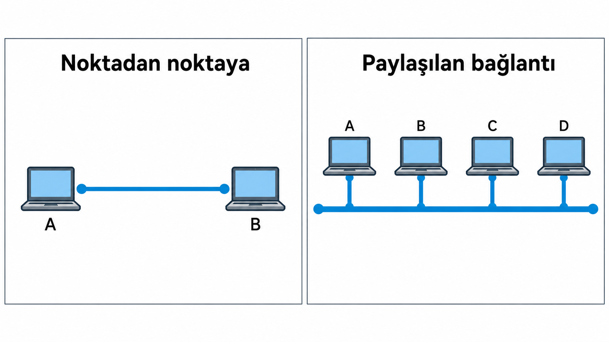{width="92%" fig-align="center" fig-alt="Noktadan noktaya bağlantı ile birden fazla cihazın kullandığı paylaşılan bağlantıyı karşılaştıran şema"}

::: {.notes}
Noktadan noktaya bağlantının iki belirli ucu vardır ve bu bağlantı yalnız o iki uca aittir; üçüncü bir tarafın aynı yolu aynı anda kullanması söz konusu olmaz. Paylaşılan bağlantıda ise birden fazla uç aynı fiziksel veya mantıksal iletişim yoluna katılır ve ortak kapasiteyi birlikte kullanır; bu durumda hangi ucun ne zaman gönderim yapabileceğini belirleyen ayrı bir düzenlemeye gerek doğar.

Bu ayrım topoloji adından farklıdır. Örneğin yıldız görünümündeki bir ağın uç bağlantıları merkeze ayrı ayrı ulaşarak noktadan noktaya çalışabilir; aynı görünümdeki başka bir ağda merkez, gelen sinyali bütün uçlara tekrarlayarak uçların mantıksal olarak ortak bir ortamı paylaşmasına neden olabilir.
:::

---

## İletişimin Hedef Kapsamı

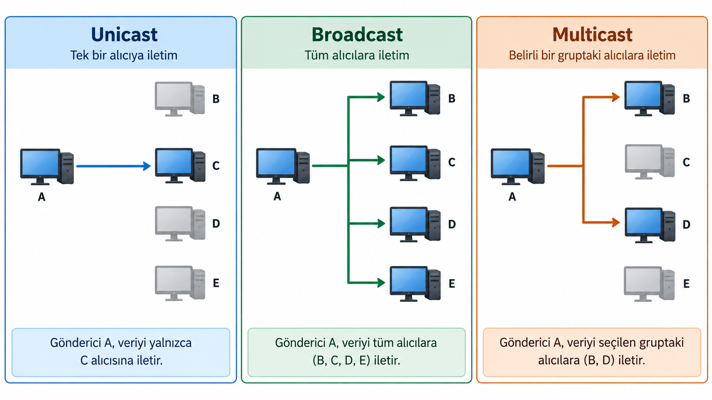{width="94%" fig-align="center" fig-alt="Unicast, broadcast ve multicast hedefleme biçimlerinde iletinin ulaştığı alıcıları karşılaştıran şema"}

::: {.notes}
Hedef kapsamı, bir iletinin kaç alıcıya yönelik olduğunu açıklar. Unicast, örneğin bir dosya sunucusundan istek gönderen tek bir bilgisayara dönen yanıt gibi, tek bir hedefi işaret eder. Broadcast, yerel ağdaki bütün cihazları arayan bir keşif iletisi gibi, belirli bir yayın kapsamındaki bütün uçlara ulaşır. Multicast ise bir video akışına kayıt olmuş sınırlı bir izleyici grubu gibi, seçilmiş bir alıcı kümesini hedefler.

Bu sınıflandırma iletinin amacını, yani kaç alıcıya ulaşmasının beklendiğini belirtir. İletinin fiziksel ortamda hangi noktalardan geçtiği veya ağ içinde nasıl aktarıldığı ayrı bir sorudur; hedefleme biçimi tek başına iletinin izleyeceği yolu belirlemez.
:::

---

## Unicast ve Broadcast

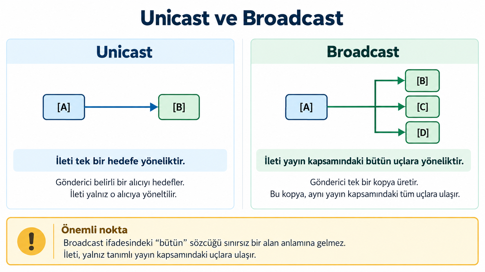


::: {.notes}
Unicast iletişimde gönderici belirli bir alıcıyı hedefler ve iletiyi yalnız o alıcıya yöneltir. Broadcast iletişimde ise aynı ileti, tanımlı yayın kapsamındaki bütün uçlara yöneltilir; gönderici tek bir kopya üretir, ancak bu kopya kapsam içindeki her uca ulaşır.

Broadcast ifadesindeki “bütün” sözcüğü sınırsız bir alan anlamına gelmez. İletişim, kullanılan ağ teknolojisinin ve ağ sınırlarının belirlediği yayın kapsamıyla sınırlıdır; örneğin bir yerel ağ içindeki broadcast, o yerel ağın dışındaki cihazlara varsayılan olarak ulaşmaz. Bu sınır, broadcast'i sınırsız bir yayın değil, tanımlı bir kapsam içindeki toplu bir hedefleme biçimi yapar.
:::

---

## Roller ve Hedefleme Birbirinden Farklıdır

- İstemci, sunucuya **unicast** istek gönderebilir.
- Bir sunucu, birden fazla istemciyle ayrı unicast iletişimler kurabilir.
- Eşler arası uçlar unicast veya başka hedefleme biçimleri kullanabilir.
- Broadcast kullanımı, göndereni istemci ya da sunucu yapmaz.

::: {.notes}
İstemci–sunucu ve eşler arası sınıflandırması, uçların hizmet ilişkisini açıklar; unicast, broadcast ve multicast ise tek bir iletinin hedef kapsamını belirtir. Bu iki boyut bağımsız çalışır: bir sunucu, bağlı bütün istemcilere aynı duyuruyu broadcast olarak gönderebileceği gibi her istemciyle ayrı ayrı unicast iletişim de kurabilir.

Bu iki boyut birbirine karıştırılmamalıdır. Bir iletinin broadcast olması, uygulamanın eşler arası çalıştığını göstermez; unicast olması da istemci–sunucu modelini zorunlu kılmaz. Eşler arası çalışan uçlar da birbirleriyle unicast iletişim kurabilir; rol ile hedefleme, farklı sorulara cevap veren ayrı özelliklerdir.
:::

---

# Temel Topolojiler

::: {.notes}
Önceki bölümde tek bir bağlantının noktadan noktaya veya paylaşılan olabileceği görüldü. Bir ağda çok sayıda düğüm bulunduğunda bu bağlantılar belirli bir düzende bir araya gelir; bu düzen ağın topolojisini oluşturur. Bu bölüm, düğümlerin hangi bağlantı düzeniyle bir araya geldiğini ve bu düzenin bir arızayı hangi ölçüde sınırladığını inceler.

Her topoloji farklı bir bağlantı sayısı, genişleme biçimi ve arıza etkisi taşır; bir topolojiyi diğerinden üstün yapan tek bir ölçüt yoktur. Bu bölümde tanıtılan topolojiler ağın fiziksel bağlantı düzenini tanımlar; aynı düzenin iletişim sırasında nasıl kullanılacağı sonraki bölümün konusudur.
:::

---

## Temel Topolojilerin Bağlantı Düzenleri

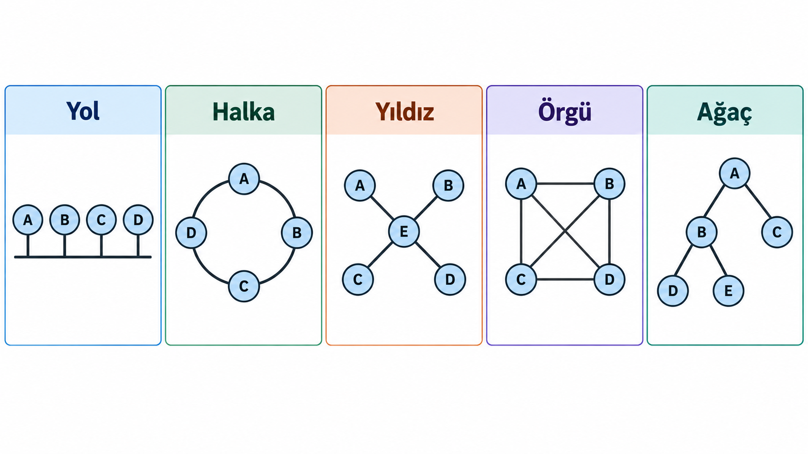{width="94%" fig-align="center" fig-alt="Yol, halka, yıldız, örgü ve ağaç topolojilerinin bağlantı düzenlerini birlikte gösteren şema"}

::: {.notes}
Beş temel topoloji aynı düğümleri farklı bağlantı düzenleriyle bir araya getirir. Yol topolojisi ortak bir omurga, halka kapalı bir dolaşım yolu, yıldız merkezi bir bağlantı noktası, örgü alternatif yollar ve ağaç hiyerarşik dallar oluşturur.

Şekiller yalnız bağlantı düzenini gösterir. Topolojiler ayrıntılı incelenirken her düzenin hangi ortak noktaya bağımlı olduğu, tek bir bağlantı arızasının hangi düğümleri etkilediği ve yeni düğümlerin yapıya nasıl eklendiği ayrıca değerlendirilir.
:::

---

## Yol (Bus) Topolojisi

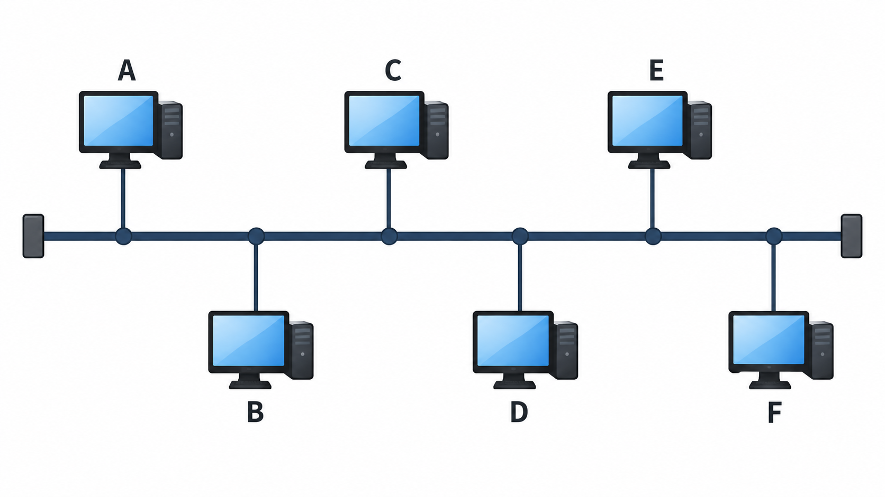{width="94%" fig-align="center"}

- Bütün düğümler ortak omurgaya bağlanır.
    
- Ortak ortamda eş zamanlı gönderimler **çakışabilir (collision)**.
    
- Omurgadaki sorun birçok düğümü etkileyebilir.
    
- Yeni düğümler ortak yola eklenir.
    

::: {.notes}

Yol topolojisinde bütün düğümler aynı ana bağlantı üzerinde yer alır. Ortak omurga yapıyı basitleştirir; her yeni düğüm mevcut ana bağlantıya eklenir ve merkezi bir cihaz gerekmez. Buna karşılık bütün düğümler aynı fiziksel bağlantıya bağımlıdır.

Ortak omurga aynı zamanda paylaşılan bir iletim ortamıdır. İki düğüm birbirine çok yakın zamanlarda gönderim yaparsa sinyaller aynı ortamda karşılaşarak çakışabilir. Bu durumda iletim güvenilir biçimde tamamlanamaz ve yeniden gönderim gerekir.

Omurgadaki bir kopma veya sonlandırma sorunu, ortak bağlantı üzerindeki iletişimi geniş ölçüde etkileyebilir. Düğüm sayısı arttıkça hem ortak ortam üzerindeki rekabet hem de fiziksel arıza noktasının bulunması güçleşebilir.

:::

---

## Halka (Ring) Topolojisi


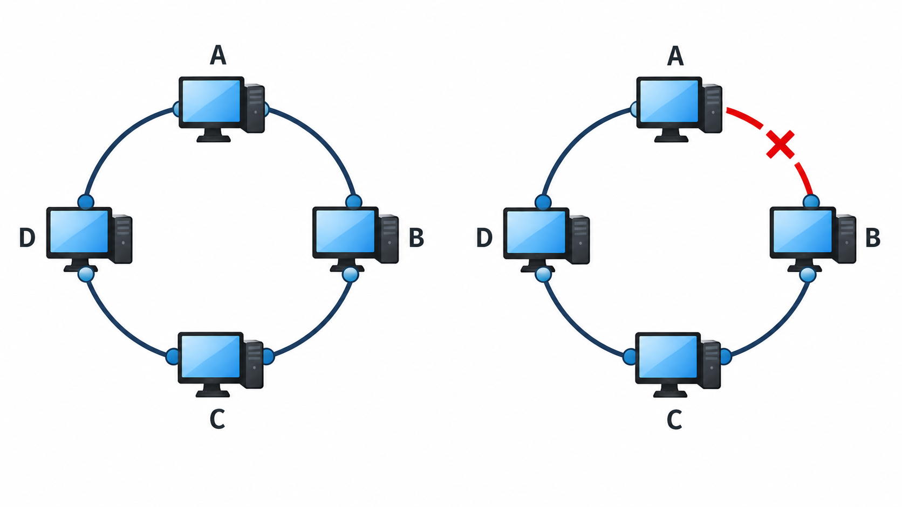{width="94%" fig-align="center"}

- Her düğüm halka üzerindeki komşularına bağlanır.
- Bağlantılar kapalı bir yol oluşturur.
- Tek kopma dolaşım yolunu kesebilir.

::: {.notes}
Halka topolojisinde her düğüm, halka üzerindeki iki komşusuna bağlanır ve bu bağlantılar kapalı bir yol oluşturur. Basit bir halkada veri veya gönderim hakkı bu yol üzerinde tek bir yönde belirli bir sırayla ilerler.

Tek bir bağlantı koptuğunda dolaşım yolu artık kapanmadığı için veri, kopma noktasının ötesindeki düğümlere ulaşamaz; örneğin dört düğümlü bir halkada bir bağlantının kopması, karşı taraftaki düğümleri birbirinden ayırabilir. Yedekli bağlantılar bu etkiyi azaltabilir, ancak gereken bağlantı ve yönetim düzenini karmaşıklaştırır.
:::

---

## Yıldız (Star) Topolojisi

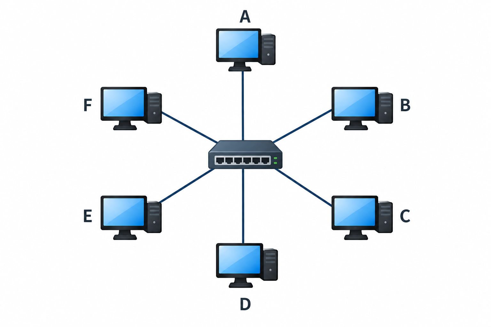{width="94%" fig-align="center"}

- Bütün uçlar merkezi noktaya bağlanır.
- Uç bağlantısındaki sorun yerel kalır.
- Merkez bütün uçların ortak bağımlılık noktasıdır.

::: {.notes}
Yıldız topolojisinde her uç merkezle ayrı bir fiziksel bağlantı kurar. Bir uç bağlantısındaki kopma yalnız o bağlantıyı devre dışı bırakır; örneğin dört uçlu bir yıldızda tek bir uç kablosunun kopması, diğer üç ucun merkezle olan bağlantısını etkilemez.

Merkezdeki cihazın arızalanması ise bütün uçları aynı anda etkiler, çünkü her uç iletişim için bu ortak noktaya bağımlıdır. Ağın genişletilmesi de aynı nedenle merkezin destekleyebildiği bağlantı sayısı ve kapasitesiyle sınırlıdır.
:::

---

## Örgü (Mesh) Topolojisi

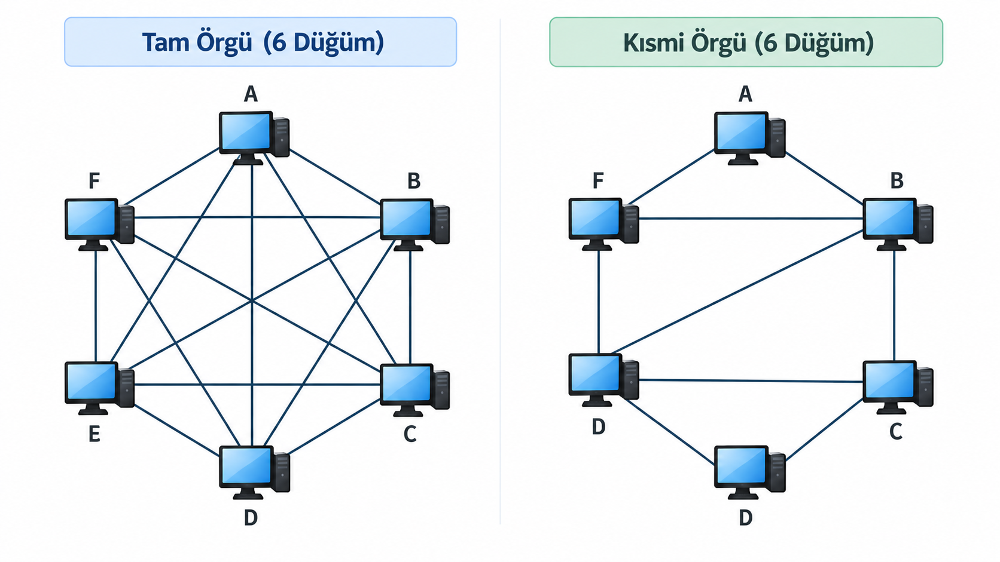{width="94%" fig-align="center"}

- Düğümler arasında birden fazla bağlantı yolu bulunabilir.
    
- Alternatif yollar bağlantı arızalarının etkisini azaltabilir.
    
- Bağlantı sayısı düğüm sayısıyla hızla büyür.
    

::: {.notes}

Örgü topolojisinde düğümler arasında birden fazla bağlantı yolu oluşturulur. Tam örgü yapıda her düğüm diğer bütün düğümlere doğrudan bağlanır. Kısmi örgüde ise yalnız belirli düğümler arasında ek bağlantılar bulunur.

Alternatif bağlantılar hata toleransını artırır. Bir bağlantı koptuğunda hedefe ulaşan başka bir yol varsa iletişim bu yol üzerinden sürdürülebilir. Bunun karşılığında gerekli bağlantı ve arayüz sayısı hızla artar.

Tam örgü yapıda nn düğüm için gereken bağlantı sayısı n(n−1)/2n(n-1)/2'dir. Örneğin 4 düğüm için 6, 10 düğüm için 45 bağlantı gerekir. Bu nedenle çok sayıda uç cihazın tamamını tam örgü biçiminde bağlamak pratik değildir.

:::


---


## Ağaç (Tree) Topolojisi

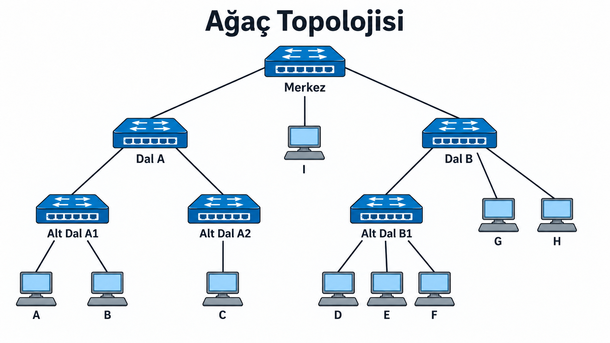{width="94%" fig-align="center"}
- Düğümler hiyerarşik düzeyler hâlinde bağlanır.
    
- Dallar ayrı ayrı genişletilebilir.
    
- Üst düzey bağlantı veya cihaz sorunları alt dalları etkileyebilir.
    

::: {.notes}

Ağaç topolojisi, bağlantıları üst ve alt düzeylerden oluşan hiyerarşik bir yapı içinde düzenler. Uç cihazlar alt düzey merkezlerde gruplanabilir; bu merkezler de daha üst düzey bağlantılar üzerinden birbirine bağlanır. Bu yapı, büyük ağların bölümler hâlinde düzenlenmesini ve kademeli olarak genişletilmesini kolaylaştırır.

Hiyerarşik yapı nedeniyle üst düzey bağlantılar ve cihazlar daha geniş bir bölüm için ortak bağımlılık noktaları oluşturabilir. Bir dalı üst seviyeye bağlayan bağlantı veya cihaz arızalandığında, o dala bağlı düğümler ağın geri kalanından ayrılabilir. Bu nedenle hata etkisi, sorunun hiyerarşinin hangi düzeyinde oluştuğuna bağlıdır.

:::


---

## Topolojilerde Arıza Etkisi

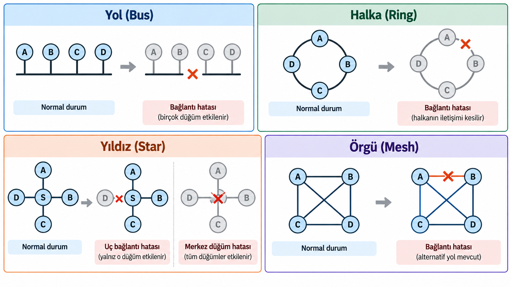{width="92%" fig-align="center"}

::: {.notes}
Bir arızanın etkisi, topolojinin ortak bağımlılık noktasına göre değişir. Yol topolojisindeki omurga ve halka topolojisindeki dolaşım yolu tek kopmadan geniş ölçüde etkilenebilir. Yıldız topolojisinde uç bağlantısındaki arıza yalnız ilgili düğümü ayırırken merkez arızası bütün düğümleri etkiler.

Örgü topolojisinde alternatif yollar bulunduğu için tek bir bağlantı arızası iletişimi bütünüyle kesmeyebilir. Bu dayanıklılık daha fazla bağlantı kurulmasını gerektirir; dolayısıyla arıza etkisi ile bağlantı maliyeti birlikte değerlendirilir.
:::

---

# Fiziksel ve Mantıksal Topoloji

::: {.notes}
Önceki bölümde tanıtılan yol, halka, yıldız, örgü ve ağaç topolojileri, düğümlerin ve bağlantıların gerçek yerleşimini tanımlar. Ancak aynı fiziksel yerleşim, iletişim sırasında farklı biçimlerde kullanılabilir: merkezdeki cihazın davranışı veya ağın izlediği kural, verinin ve gönderim hakkının düğümler arasında nasıl hareket ettiğini değiştirebilir.

Bu bölüm, ağ yapısına iki ayrı soruyla bakar: Kablolar ve bağlantı noktaları gerçekte nasıl düzenlenmiştir; iletişim sırasında bu düzen nasıl kullanılmaktadır? Aynı fiziksel yıldız örneği üzerinden gösterileceği gibi, birinci sorunun cevabı ikincisini tek başına belirlemez.
:::

---

## Fiziksel ve Mantıksal Topoloji

### Fiziksel topoloji

- Cihazların ve bağlantıların gerçek düzenini gösterir.
- “Cihazlar fiziksel olarak nasıl bağlanmıştır?” sorusuna cevap verir.

### Mantıksal topoloji

- Bağlantıların iletişim sırasında nasıl kullanıldığını gösterir.
- Verinin veya gönderim hakkının düğümler arasında nasıl hareket ettiğini açıklar.

> Aynı fiziksel topoloji, farklı mantıksal iletişim düzenleriyle çalışabilir.

::: {.notes}
Fiziksel topoloji, bir kabloyu takip ettiğimizde hangi cihaza ulaştığımızı gösterir; düğümlerin ve bağlantı noktalarının gerçek yerleşimidir. Mantıksal topoloji ise aynı bağlantıların iletişim sırasında nasıl kullanıldığını, verinin veya gönderim hakkının düğümler arasında hangi sırayla hareket ettiğini açıklar.

Bu iki boyut birbirinden bağımsız değerlendirilir, çünkü fiziksel çizim yalnız kabloların yerleşimini gösterir; iletişimin hangi düzende gerçekleştiğini belirlemez. Aynı fiziksel yıldız düzeni, ilerleyen örneklerde görüleceği gibi paylaşılan bir ortam, ayrı noktadan noktaya bağlantılar veya mantıksal bir halka olarak çalışabilir.
:::

---

## Aynı Fiziksel Yıldız, Farklı Mantıksal Davranışlar

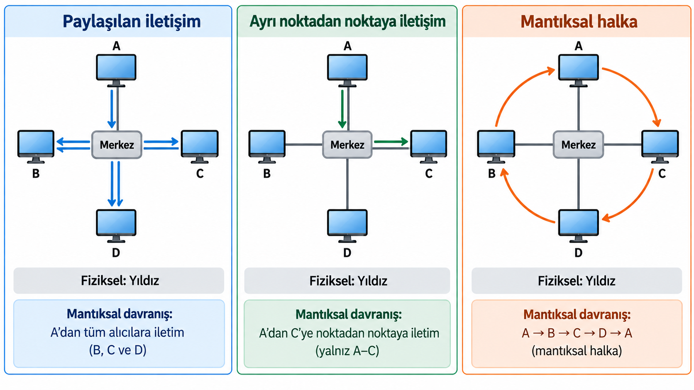{width="94%" fig-align="center"}

::: {.notes}
Aşağıdaki üç örnekte A, B, C ve D düğümlerinin merkeze bağlandığı fiziksel yıldız değişmeden kalır. Değişen, merkezdeki cihazın gelen sinyali nasıl işlediği ve buna bağlı olarak düğümler arasındaki iletişimin hangi düzeni izlediğidir.

Aynı fiziksel çizimin üç ayrı mantıksal okuması, fiziksel topolojinin iletişim davranışını tek başına belirlemediğini doğrudan gösterir.
:::

---

## Yıldızda Paylaşılan İletişim

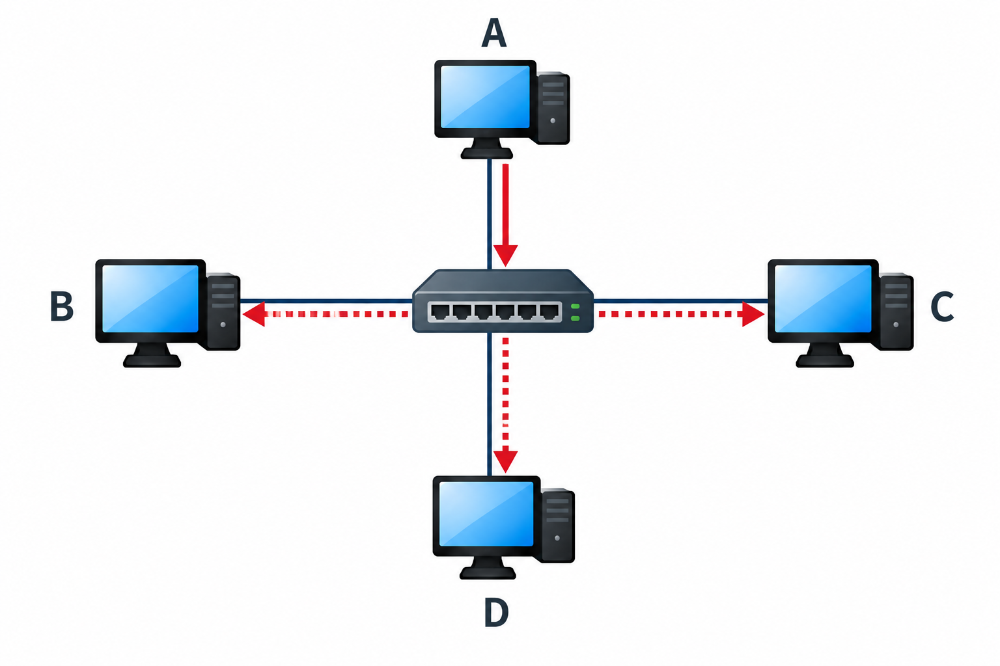{width="94%" fig-align="center"}

- Bir düğümün gönderdiği sinyal ortak iletişim yapısına yayılır.
- Bütün düğümler aynı iletimin parçası olur.

**Fiziksel topoloji:** Yıldız · **Mantıksal davranış:** Paylaşılan yol

::: {.notes}
Bu örnekte merkezdeki cihaz, bir bağlantıdan aldığı sinyali diğer bütün bağlantılarına aktarır. A gönderim yaptığında sinyal B, C ve D'ye aynı anda ulaşır; dört düğüm de aynı iletimin alıcısı konumundadır.

Fiziksel kablolar yıldız biçiminde olsa bile iletişim davranışı, bütün düğümlerin aynı ortak ortamı paylaştığı bir bus yapısına benzer. Bu nedenle fiziksel yıldız görünümü tek başına düğümlerin birbirinden bağımsız iletişim kurduğu anlamına gelmez.
:::

---

## Yıldızda Birden Fazla Mantıksal Halka


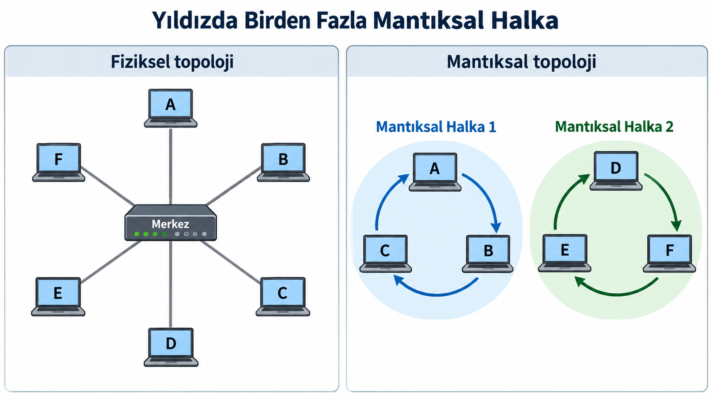{width="94%" fig-align="center"}

- Altı host fiziksel olarak aynı yıldız düzeninde bağlanmıştır.
    
- A, B ve C kendi mantıksal halkasını oluşturur.
    
- D, E ve F ikinci bir mantıksal halkayı oluşturur.
    
- Mantıksal komşuluk, fiziksel kablo konumundan bağımsızdır.
    

**Fiziksel topoloji:** Yıldız · **Mantıksal topoloji:** İki ayrı halka

::: {.notes}

Altı hostun her biri merkezi birime ayrı bir fiziksel bağlantıyla bağlıdır. Bu nedenle kablolama düzenine bakıldığında ağ yıldız topolojisindedir.

Mantıksal iletişim ise iki ayrı halka biçiminde düzenlenmiştir. A, B ve C düğümleri A → B → C → A sırasını; D, E ve F düğümleri ise D → E → F → D sırasını izler. Her düğümün mantıksal komşusu, fiziksel çizimde kendisine en yakın olan cihaz tarafından değil, halkadaki dolaşım sırası tarafından belirlenir.

Bu yapı, aynı fiziksel bağlantı düzeni üzerinde farklı bir mantıksal iletişim düzeninin kurulabileceğini gösterir. Fiziksel topoloji kabloların ve bağlantı noktalarının yerleşimini, mantıksal topoloji ise iletişimin düğümler arasında hangi sırayla gerçekleştiğini ifade eder.

:::


## Fiziksel ve Mantıksal Topolojinin Karşılaştırılması

| Fiziksel yapı | Mantıksal davranış |
|---|---|
| Yıldız | Paylaşılan yol |
| Yıldız | Ayrı noktadan noktaya bağlantılar |
| Yıldız | Halka |

**Fiziksel topoloji bağlantıların nasıl kurulduğunu, mantıksal topoloji ise bu bağlantıların iletişim sırasında nasıl kullanıldığını açıklar.**

::: {.notes}
Üç örnekte de fiziksel topoloji aynı kalırken mantıksal davranış üç farklı biçim almıştır. Bu tablo, fiziksel bağlantı sayısının veya düzeninin mantıksal davranışı belirlemediğini; mantıksal davranışın merkezdeki cihazın veya iletişim kuralının davranışından doğduğunu özetler.

Bu ayrım, ilerleyen bölümlerdeki bus, halka, yıldız, örgü ve ağaç topolojilerini değerlendirirken de korunur: her topolojinin fiziksel düzeni ile o düzende çalışabilecek mantıksal davranış ayrı sorulardır.
:::

---

# Karşılaştırma ve Sentez

::: {.notes}
Önceki bölümlerde ele alınan roller, hedefleme, bağlantı biçimi ve topoloji, bir ağı dört ayrı açıdan tanımlayan bağımsız sınıflandırmalardı. Bu bölüm, bu dört boyutu tek bir örnek üzerinden bir araya getirerek her birinin diğerini nasıl belirlemediğini gösterir.

Bir topolojiyi seçmek belirli bir rolü veya hedefleme biçimini zorunlu kılmaz; bir rolü üstlenmek de belirli bir topolojiyi veya bağlantı biçimini gerektirmez. Bu bölüm, notun başında sorulan dört soruyu aynı iletişim örneğine birlikte uygulayarak bu bağımsızlığı somutlaştırır.
:::

---

## Topolojilerin Karşılaştırılması {.smaller}

| Topoloji | Bağlantı düzeni | Temel bağımlılık | Genişleme sınırı |
|---|---|---|---|
| Yol | Ortak omurga | Omurga | Ortak yolun paylaşımı |
| Halka | Kapalı dolaşım yolu | Halka sürekliliği | Halkayı yeniden düzenleme |
| Yıldız | Uçlardan merkeze bağlantılar | Merkez | Merkezin bağlantı kapasitesi |
| Örgü | Birden fazla alternatif yol | Bağlantı sayısı | Artan bağlantı karmaşıklığı |
| Ağaç | Hiyerarşik dallar | Üst bağlantılar | Üst düzey kapasite |

::: {.notes}
Topolojiler tek bir ölçüte göre iyi veya kötü olarak sıralanamaz. Her topoloji farklı bir bağlantı ve bağımlılık örüntüsü oluşturur: yol ortak omurgaya, halka dolaşım yolunun sürekliliğine, yıldız merkeze, ağaç üst düzey bağlantılara bağımlıdır.

Örgü yapısı bu bağımlılıkların çoğunu alternatif yollarla azaltır, ancak bunun karşılığında bağlantı sayısını düğüm sayısıyla hızla büyütür. Seçim; kabul edilebilir arıza etkisi, düğüm sayısı ve yönetilebilir bağlantı miktarı birlikte değerlendirilerek yapılır.
:::

---

## Bir Ağı Dört Boyutla Okumak

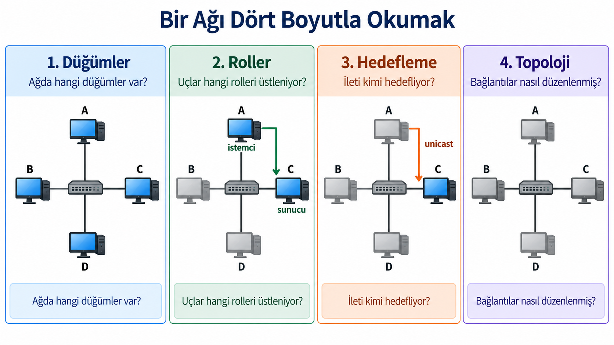{width="94%" fig-align="center" fig-alt="Aynı ağı düğümler, roller, hedefleme ve topoloji sorularıyla dört ayrı boyutta inceleyen şema"}

::: {.notes}
Bir iletişim örneği tek bir etiketle bütünüyle açıklanamaz. A ve B'nin istemci–sunucu rolleri, iletinin unicast hedeflenmesi, kullanılan bağlantının paylaşım biçimi ve ağın topolojisi ayrı özelliklerdir; her biri farklı bir soruya cevap verir ve diğerini belirlemez.

Bu ayrım, görünüşten işlev çıkarmayı önler. İstemci–sunucu ilişkisi belirli bir topolojiyi zorunlu kılmadığı gibi fiziksel yıldız düzeni de iletinin unicast, broadcast veya multicast olacağını belirlemez. Notun başında sorulan dört soru, aynı iletişim örneğine bu dört bağımsız açıdan bakmayı sağlar.
:::
