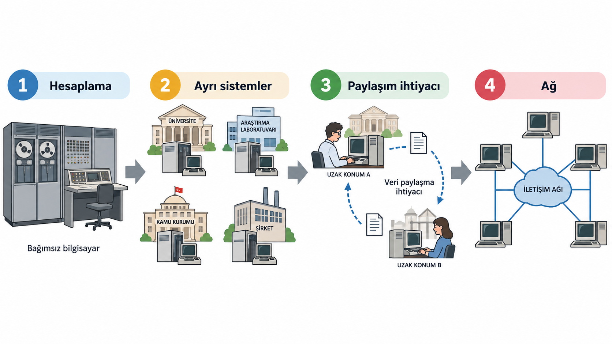

## İki Bilgisayar Nasıl Bilgi Alışverişi Yapar?

> Bir bilgisayardaki anlamlı veri, diğerine nasıl ulaşır?

- Cihazları birbirine bağlamak yeterli mi?
- Verinin anlamını iki taraf nasıl paylaşır?
- Bilgisayarın içindeki bit, ortamda nasıl taşınır?

::: {.notes}
Hafta 1 boyunca tek bir sorunun parçalarını kuruyoruz: İki bilgisayar nasıl anlamlı biçimde bilgi alışverişi yapabilir?

Bu soru, tanımlarla değil bir problemle başlıyor. Fiziksel bağlantı, verinin anlamı, ortak kurallar, bit ve sinyal — bunların hepsi bu sorunun farklı katmanlarıdır. Dersin ilerleyen bölümlerinde bu katmanları sırayla açacağız.

Anlatım hattı şöyle ilerleyecek: **hesaplama → iş birliği ihtiyacı → ağ → uzak iletişim problemi → fiziksel işaret → ortak anlam → protokol → veri → bit → sinyal → iletim biçimi.** Ağ türleri, topolojiler ve iletim ortamı karşılaştırmaları sonraki haftanın konusudur.
:::

---

## İlk Bilgisayarlar Ne Amaçla Kullanıldı?

{width="42%"}

- İlk büyük bilgisayarlar tek bir kuruma aitti.
- Kullanım amacı: sayısal hesaplama, tablo üretme, mühendislik.
- Makineler büyük, pahalı ve sınırlı erişilebilirdi.

::: {.notes}
1940'lı ve 1950'li yıllarda üretilen büyük bilgisayarlar, dönemin koşullarında son derece pahalı cihazlardı. Çoğunlukla askeri, bilimsel veya istatistiksel hesaplamaların yapıldığı ortamlarda bulunurlardı. Büyük odaları kaplarlar, kullanımları uzman operatörler gerektirirdi.

Bu tarihsel noktanın amacı belirli bir makinenin yılını ezberlettirmek değildir. Önemli olan şu: O dönemde bilgisayar kullanımı coğrafi ve kurumsal olarak tek bir noktanın etrafında örgütleniyordu. Bir bilgisayardaki veri, o cihazın başında kalırdı. Bu yapının doğurduğu sorun bir sonraki slayta taşınıyor.

Fotoğraf, ABD Kara Kuvvetleri arşivinden alınmış kamu malı bir ENIAC görüntüsüdür ([Wikimedia Commons](https://commons.wikimedia.org/wiki/File:Eniac_Aberdeen.jpg)).
:::

---

## Hesaplama Gücü Arttı; Sorun Değişti

- Bilgisayarlar 1950'lerden 1960'lara yayıldı.
- Üniversiteler, araştırma kurumları, büyük şirketler birer bilgisayar edindi.
- Hesaplama kapasitesi arttı; kullanım alanları genişledi.
- Yeni soru: Bu gücü nasıl birlikte kullanacağız?

::: {.notes}
Bilgisayarların kurumsal yayılması yeni bir sorun doğurdu. Farklı kurumlarda birbirinden bağımsız çalışan makineler vardı; ancak bu makinelerin ürettiği veriyi ya da kapasitesinin bir kısmını başkasıyla paylaşmanın yolu yoktu. Hesap gücü arttıkça paylaşım ihtiyacı da büyüdü.

Bu, teknik bir gelişmenin sosyal bir ihtiyacı nasıl tetikleyebileceğini gösteren iyi bir örnektir. Makinelerin kapasitesi artmıştı; eksik olan bu kapasiteyi coğrafi engel olmaksızın kullanabilecek bir yoldu.
:::

---

## Farklı Şehirlerdeki İki Uzman Nasıl Çalışır?

- Boston'daki araştırmacı, Los Angeles'taki veriye ihtiyaç duyuyor.
- Posta ile kart göndermek günler alır.
- Fiziksel taşıma yavaş, güvenilmez ve ölçeksiz.
- Ortak çalışmayı mümkün kılmak için başka bir yol gerekiyor.

::: {.notes}
Bu sahneyi somutlaştıralım: 1960'lı yıllarda iki araştırmacı farklı şehirlerdeki kurumlarda çalışıyor. Birinin elindeki veriye diğerinin erişmesi gerekiyor. Bunu başarmak için delgeçli kartları posta ile göndermek ya da bilgisayar çıktısını telgraf aracılığıyla iletmek gibi yöntemlere başvurulabilirdi. Bu yollar hem yavaştı hem de sürekli işbirliğine izin vermiyordu.

Sorun yalnızca veri paylaşımı değildi. Farklı şehirlerdeki pahalı hesaplama kaynaklarını uzaktan kullanabilmek, araştırma sonuçlarını eş zamanlı paylaşabilmek ve büyük projeleri birden fazla kurumla koordineli yürütebilmek de tablonun parçasıydı. Bu sorun, bilgisayarları birbirine bağlama fikrini kaçınılmaz hâle getirdi.
:::

---

## Bilgisayarları Birbirine Bağlama Fikri ve ARPANET

- Çözüm: Bilgisayarları iletişim ağlarıyla birbirine bağlamak.
- 1969 — ARPANET: ABD'de dört üniversite ilk bağlantıyı kurdu.
- Bu deney, zamanla bugünkü İnternet altyapısının temelini oluşturdu.

::: {.notes}
ARPANET, ABD Savunma Bakanlığı'nın araştırma ajansı ARPA tarafından finanse edilen ve 1969'da ilk dört düğümüyle çalışmaya başlayan deneysel bir ağdı. Başlangıçta UCLA, Stanford Research Institute, UC Santa Barbara ve Utah Üniversitesi birbirine bağlıydı.

Bu ağ, paket anahtarlama adı verilen tekniği büyük ölçekte test etti. Paket anahtarlamada mesaj küçük parçalara bölünür; her parça ağ üzerinde bağımsız olarak hedefe ulaşabilir. Bu yöntem, merkezi bir bağlantı noktasının devre dışı kalmasının iletişimi tamamen durdurmayacağı şekilde tasarlanmıştı.

ARPANET ilerleyen on yıllar boyunca genişledi. Farklı ağların ortak protokollerle birbirine bağlanmasıyla bugünkü İnternet'in temeli oluştu. Tarihsel bağlamın asıl önemi budur: ağ fikri bir ihtiyaca cevap olarak ortaya çıktı.

Slayttaki Mart 1977 haritası, ARPANET'in ilk dört düğümlü hâlinden daha geniş bir yapıya nasıl dönüştüğünü gösteren kamu malı bir belgedir ([Wikimedia Commons](https://commons.wikimedia.org/wiki/File:Arpanet_logical_map,_march_1977.png)).
:::

---

{width="62%" fig-align="center"}

---

## Bilgisayar Ağı Neden Gerekir?

- Veri yalnız bulunduğu cihazda kalır.
- Ortak yazıcı veya depolama ayrı ayrı yönetilir.
- Uzak bir hizmete doğrudan erişilemez.
- Bilgiyi harici bir ortamla taşımak sürdürülebilir değildir.

::: {.notes}
Bağımsız çalışan bir bilgisayar kendi işlemcisini, belleğini ve depolama alanını kullanabilir. Başka bir cihazdaki veriye ya da hizmete erişmesi gerektiğinde ise arada bir iletişim yolu yoktur.

Ağ ihtiyacı, bilgisayarın tek başına çalışamamasından değil; tek başına çalışmanın paylaşım ve iletişim sınırlarından doğar. Bir ağ, cihazların yerel yeteneklerini ortadan kaldırmaz; gerektiğinde başka cihazlardaki veri ve kaynaklarla iş birliği yapmalarını mümkün kılar.
:::

---

{width="100%" fig-align="center" fig-alt="Bağımsız bilgisayar sistemleri ile ağ üzerinden ortak kaynak kullanan bilgisayarların karşılaştırması"}

---

## Bilgisayar Ağı Nedir?

**Bilgisayar ağı**, iletişim kurabilen cihazların

- kablolu veya kablosuz yollarla bağlandığı,
- ortak kurallara göre veri alışverişi yaptığı,
- kaynak ve hizmetlere erişebildiği yapıdır.

::: {.notes}
Ağ sözcüğü yalnız bilgisayarları değil, iletişim kurabilen telefon, yazıcı, kamera, sensör ve sunucu gibi cihazları da kapsar. Bu cihazlar doğrudan birbirine bağlı olabilir ya da aradaki ağ cihazları üzerinden iletişim kurabilir.

Tanımın önemli kısmı, cihazların yalnızca fiziksel olarak yan yana gelmesi değil, veri alışverişi yapabilmesidir. Bunun için donanım ile yazılım birlikte çalışır. Ağın ayrıntılı yapısı, cihaz türleri ve topolojiler ilerleyen haftalarda ele alınacaktır.
:::

---

## Ağların Kullanım Amaçları

- **Kaynak paylaşımı:** yazıcı, depolama, hesaplama gücü
- **Veri ve bilgi paylaşımı:** dosya, kayıt, içerik
- **İletişim:** mesajlaşma, sesli veya görüntülü görüşme
- **Uzak kaynaklara erişim:** web sitesi, bulut hizmeti, kurumsal sistem

::: {.notes}
Kaynak paylaşımı, her kullanıcı için ayrı bir yazıcı ya da depolama sistemi kurmak yerine ortak kaynaklardan yararlanmayı sağlar. Veri paylaşımı, aynı dosyanın fiziksel olarak taşınması yerine yetkili cihazlar arasında aktarılmasını veya ortak bir veri kaynağına erişilmesini mümkün kılar.

İletişim amacı yalnız insanların mesajlaşmasını kapsamaz. Bir uygulamanın başka bir uygulamadan veri istemesi, bir sensörün ölçüm göndermesi veya bir sunucunun web sayfası iletmesi de ağ iletişimidir. Uzak erişim, kaynağın aynı odada bulunması gereğini azaltır. Bu dört amaç çoğu gerçek ağda birlikte görülür.
:::

---

## Tarihte Uzak Mesafe İletişimi

Uzak mesafeye haber göndermek, bilgisayarlardan önce de çözülen bir problemdi:

- Ulak / mektup
- Duman işaretleri
- Ateş ve bayrak sinyalleri
- Telegraf
- Mors alfabesi
- Sayısal iletişim

::: {.notes}
İnsanlar uzak noktalara bilgi ulaştırma problemini bilgisayarlardan çok önce çözmeye çalıştı. Bu yöntemlerin her biri aslında bir veri iletim sistemidir: Bilgi bir noktada üretilir, bir ortam üzerinden taşınır ve başka bir noktada alınır.

Yöntemler arasındaki temel fark, hız ile taşınabilecek bilgi miktarı arasındaki dengedir:

- **Ulak ve mektup:** Ayrıntılı bilgi taşınabilir; ancak fiziksel yolculuk zaman alır.
- **Duman ve ateş işaretleri:** Uzak mesafeden hızlı algılanabilir; fakat bir sinyalle aktarılabilecek bilgi miktarı çok sınırlıdır.
- **Telegraf ve Mors alfabesi:** Semboller kodlandığı için hem hızlı hem de görece fazla bilgi taşınabilir hâle geldi.
- **Sayısal iletişim:** Bilginin sayısal olarak temsil edilerek elektronik ortamda iletilmesi.

Bu liste, veri iletiminin bilgisayarlarla başlamadığını gösterir. Sonraki slayt bu yöntemlerden birini somut bir örnek üzerinden ele alıyor.
:::

---

## Örnek: İşaret Zinciri ile Haber

- İki yurt birbirinden çok uzakta.
- Elçiyle haber göndermek günler sürebilir.
- Dağdan dağa yakılan ateşlerle haber çok daha hızlı aktarılabilir.
- Her zirve bir aktarım noktası; hava ise sinyalin yayıldığı iletim ortamı.

::: {.notes}
İşaret zinciri, tek bir sinyalin ulaşamayacağı mesafeyi aşmak için ardışık aktarım noktaları kullanan bir yöntemdir. Her zirvede bulunan gözcü öncekinin işaretini görür ve bir sonrakine iletir.

Bu yapıyı fiziksel iletim açısından inceleyelim:

- **Gönderici:** İlk ateşi yakan taraf.
- **Sinyal:** Dağın zirvesinde görülebilen ateş — fiziksel bir değişim.
- **İletim ortamı:** Hava — ışığın yayıldığı fiziksel ortam.
- **Aktarım düğümleri:** Aradaki zirveler; sinyali alıp tekrarlıyorlar.
- **Alıcı:** Zincirin sonundaki gözcü.

Bu yapı, bilgisayar ağlarındaki aktarım mantığına sezgisel bir giriş sağlar: Veri her zaman doğrudan hedefe ulaşmaz; aradaki düğümler üzerinden aktarılır. Sinyal ne anlama geliyor sorusu bu slaytın konusu değil; buradaki soru yalnızca şu: Sinyal fiziksel olarak nasıl bir noktadan diğerine ulaştırılabilir?
:::

---

## LOTR — İşaret Ateşleri



> **Peki bilgisayarlar arasında veri iletimi nasıl çalışır?**

::: {.notes}
*Yüzüklerin Efendisi: Kralın Dönüşü* filminden bir sahne. Minas Tirith işaret ateşini yakar; bir dağ zirvesinden diğerine aktarılan bu fiziksel sinyal, sonunda çok uzaktaki Rohan'a ulaşır.

Sahneyi fiziksel iletim açısından izleyelim:

- Ateş bir fiziksel değişimdir — kablo yerine ışık kullanılıyor, ama aktarım mantığı aynı.
- Mesafe, ardışık düğümler sayesinde aşılıyor.
- Her düğüm sinyali algılayıp bir sonrakine iletiyor.

Sinyal, iletim ortamı ve aktarım düğümü — bu üç unsur modern ağlarda da aynı biçimde çalışır. 
:::

---

## Veri İletişiminin Temel Bileşenleri

{width="100%" fig-align="center" fig-alt="Protokolün mesaj sınırlarını, mesaj anlamını, iletişim sırasını ve cevap davranışını belirleyen ortak kurallarını gösteren şema"}

- **mesaj** — iletilmek istenen veri
- **gönderici** — veriyi iletime hazırlayan taraf
- **alıcı** — veriyi teslim alan taraf
- **iletim ortamı** — sinyalin izlediği fiziksel yol
- **protokol** — tarafların uyduğu iletişim kuralları

::: {.notes}
Forouzan'ın beş bileşenli modeli, bir veri iletişimini çözümlemek için kullanışlı bir öğretim aracıdır. "Kim, neyi, kime, hangi yol üzerinden ve hangi kurallarla gönderiyor?" sorularını görünür kılar.

Gerçek ağlar daha çok donanım, yazılım ve ara cihaz içerebilir. Beşli model bunların tamamını saymak için değil, iletişimin temel rollerini ayırmak için kullanılır. Bu bileşenler birbirinden bağımsız değildir: Mesajın biçimi protokolle, sinyalin türü iletim ortamıyla ilişkilidir.

Gönderici ve alıcı, iletişim süresince üstlenilen rollerdir. Aynı cihaz bir anda gönderici olup sonra alıcı konumuna geçebilir. Mesaj ise metin, sayı, görüntü, ses, video ya da sensör ölçümü olabilir.
:::

---

## Fiziksel Bağlantı Neden Yetmez?

İki cihaz birbirine bağlı olsa bile:

- Gelen bitler nerede başlar ve nerede biter?
- Bir mesajın anlamı nedir?
- Mesajlar hangi sırayla gönderilir?
- Yanıt gelmezse ne yapılır?

::: {.notes}
İşaret ateşleri sahnesine dönelim. Rohan ateşi görüyor; ancak o ateşin "yardım" mı, "tehlike geçti" mi yoksa yanlışlıkla çıkan bir yangın mı olduğunu nasıl anlayacak? Cevap: Önceden üzerinde uzlaşılmış bir anlam olması gerekir.

Bilgisayarlarda da aynı sorun geçerlidir. Bir iletim ortamı sinyali taşıyabilir; ancak sinyalin tek başına ortak bir anlamı yoktur. Alıcı, hangi değişimin hangi biti temsil ettiğini, bitlerin hangi mesajı oluşturduğunu ve mesajın nasıl ele alınacağını bilmelidir.

Kablo olması, anlamlı iletişim olduğu anlamına gelmez.
:::

---

## İnsanlar Nasıl Anlaşır?

<pre>
A: Merhaba          B: Merhaba
A: Saat kaç?        B: 10.30
</pre>

- Ortak ortam
- Ortak dil
- Mesajın anlamı
- İletişim sırası
- Ortak kurallar

::: {.notes}
İki insan aynı ortamda bulunup birbirini duyduğu hâlde ortak bir dil kullanmıyorsa anlamlı iletişim kuramaz. Aynı anda sürekli konuşmaları ya da bir soruya ilgisiz yanıt vermeleri de iletişimi bozar.

"Saat kaç?" sorusu belirli bir yanıt biçimi bekler. Karşı taraf saati değil de hava durumunu söylese iletişim bozulmuş sayılır — her ne kadar her iki taraf da konuşmuş olsa bile.

İnsanlar çoğu zaman fark etmeden selamlaşma, söz sırası, soru ve yanıt gibi ortak davranış kalıpları kullanır. Bu kalıplar doğal ve sezgisel görünür. Bilgisayar iletişiminde ise aynı kalıpların açık ve uygulanabilir biçimde tanımlanması gerekir.
:::

---

## Bilgisayarlar İçin de Aynı Sorun

Bilgisayarlar da aynı sorularla karşılaşır:

- Mesaj nasıl oluşturulacak?
- Mesaj ne anlama geliyor?
- Ne zaman gönderilecek?
- Alıcı ne yapacak?

**Bu ortak kurallara protokol denir.**

::: {.notes}
İnsan iletişimindeki ortak dil, mesaj anlamı ve iletişim sırası sezgisel ve doğaldır; büyük ölçüde örtük kurallarla yürür. Bilgisayarlar içinse bu kuralların açık, sayısal ve uygulanabilir biçimde tanımlanmış olması gerekir.

Bir protokol, iletişim kuran donanım veya yazılım bileşenlerinin üzerinde uzlaştığı kurallar bütünüdür. Bu yapının üç boyutu vardır:

- **Sözdizimi (syntax):** Mesajın yapısı ve biçimi nasıl olacak?
- **Anlambilim (semantics):** Alanlar ne anlama geliyor ve hangi davranışı tetikliyor?
- **Zamanlama (timing):** Ne zaman ve hangi sırayla iletişim kurulacak?

Bu terimler ilk bakışta soyut görünebilir. İşaret ateşleri örneğine bağlayalım: "tek ateş" ile "dizi ateş" arasındaki fark sözdizimini, "yardım çağrısı" anlamı semantiği ve "gündüz değil gece yakılır" koşulu zamanlama boyutunu temsil eder.
:::

---

## Bilgisayar Hangi Veriyi Taşır?

Bilgisayardaki her türlü veri sayısal olarak temsil edilir:

- Metin ve sayılar
- Görüntüler
- Ses
- Video

::: {.notes}
İnsan açısından bir harf ile bir ses kaydı çok farklıdır. Bilgisayar bunları saklayıp işleyebilmek için belirli sayısal gösterimlere dönüştürür. Metin karakterleri kod noktalarıyla, görüntüler piksellerin sayısal değerleriyle, ses örneklenmiş sayısal değerlerle ve video ardışık görüntü ile ses verisiyle temsil edilebilir.

Bu temsil yöntemlerinin ayrıntıları farklıdır; ancak ağ iletişimi açısından ortak sonuç şudur: Her türlü sayısal veri, bit örüntüleri olarak ifade edilebilir. İçeriğin türü kaybolmaz; bitlerin hangi kurala göre yorumlandığı, onların metin mi görüntü mü ses mi olduğunu belirler.
:::

---

## Veri → Bit

{width="100%" fig-align="center" fig-alt="A karakterinin sayısal değere ve bit örüntüsüne dönüştürülerek bakır, fiber ve kablosuz ortamlarda fiziksel sinyallerle temsil edilmesi"}

**Bit**, 0 veya 1 değerini alan temel sayısal temsil birimidir.

::: {.notes}
Tek bir karakter üzerinden ilerleyelim. Temel Latin alfabesindeki "A" karakteri ASCII'de 65 sayısıyla eşlenir; bu değer sekiz bitlik `01000001` örüntüsüyle gösterilebilir.

Bu küçük örnek, karakterin kablonun içinde harf biçiminde ilerlemediğini anlatır. Kabloda taşınan şey, o harfi temsil eden bit örüntüsünden üretilmiş fiziksel sinyaldir.

Güncel metin sistemleri Unicode kullanır ve Türkçe karakterler dâhil çok daha geniş bir karakter kümesini temsil eder; tek karakterin her zaman tek bayt olduğu sonucu çıkarılmamalıdır. Bu haftanın odağı bayt hesabı değil; anlamlı verinin belirli kurallarla bit örüntüsüne dönüştürüldüğünü kavramaktır.
:::

---

## Bit → Fiziksel Sinyal

- **Veri:** taşınmak istenen bilgi
- **Bit:** sayısal temsilde temel birim
- **Sinyal:** fiziksel ortam üzerinde bilgiyi taşıyan fiziksel değişim

::: {.notes}
İki ayırt edilebilir fiziksel durum — örneğin açık ve kapalı — bir biti temsil edebilir. Bu sezgi yerindedir; ancak "açık her zaman 0, kapalı her zaman 1'dir" gibi evrensel bir kural yoktur. Eşleme, sistemi tasarlayanlara bağlıdır.

Üç kavramı net biçimde ayırmak gerekir:

**Veri,** kullanıcı veya uygulama için anlam taşıyan içeriktir. **Bit,** sayısal veriyi temsil etmek için kullanılan 0 ya da 1 değeridir. **Sinyal** ise bu bit değerleriyle ilişkilendirilmiş bilginin fiziksel ortam üzerinde taşınmasını sağlayan değişimdir.

"Bit kablonun içinde ilerler" ifadesi sezgisel görünse de teknik olarak eksiktir. Kabloda ilerleyen şey, bitleri temsil edecek biçimde üretilmiş fiziksel sinyaldir. Bakır kabloda elektriksel değişimler, fiber optikte ışık, kablosuz ortamda elektromanyetik dalgalar kullanılır. Alıcı, ölçebildiği bu fiziksel değişimleri üzerinde uzlaşılan kurallara göre yorumlar. Ortamların ayrıntılı karşılaştırması Hafta 2'nin konusudur.
:::

---

## İletişim Yönleri: Simplex, Half-Duplex ve Full-Duplex {.smaller}

{width="62%" fig-align="center" fig-alt="Simplex, half-duplex ve full-duplex iletişim biçimlerinin yön ve eş zamanlılık bakımından karşılaştırması"}

:::: {.columns}

::: {.column width="33%"}
**Simplex — Tek yön**

Veri, tanımlanan iletişim kanalı üzerinde yalnız bir yönde akar.

**Eş zamanlılık:** Uygulanmaz  
**Örnek:** tek yönlü yayın akışı
:::

::: {.column width="34%"}
**Half-Duplex — İki yön, sırayla**

İki taraf da gönderebilir; aynı anda yalnız biri gönderir.

**Eş zamanlılık:** Hayır  
**Örnek:** bas-konuş telsiz
:::

::: {.column width="33%"}
**Full-Duplex — Aynı anda iki yön**

İki taraf aynı anda hem gönderebilir hem alabilir.

**Eş zamanlılık:** Evet  
**Örnek:** iki yönlü telefon görüşmesi
:::

::::

::: {.notes}
Üç iletişim biçimini ayırmak için iki soru yeterlidir: Veri kaç yönde akabilir ve iki yön aynı anda kullanılabilir mi?

Yalnız bir yön varsa simplex; iki yön olup sırayla kullanılıyorsa half-duplex; iki yön aynı anda kullanılabiliyorsa full-duplex söz konusudur.

Bu sınıflandırma, bağlantı veya iletişim kanalındaki veri akış yeteneğini açıklar; bir uygulamanın istek-yanıt sırasını değil. Bir web istemcisinin önce istek gönderip sonra yanıt alması, alttaki bağlantının half-duplex olduğu anlamına gelmez. Uygulama davranışı ile fiziksel kanalın yön yeteneği ayrı değerlendirilmelidir.

Simplex iletişimde bir uç gönderici, diğer uç alıcı rolündedir. Aynı iletişim kanalı üzerinden ters yönde veri akışı yoktur.

Alıcı cihazın başka bir teknolojiyle geri bildirim gönderebilmesi, incelenen tek yönlü kanalın simplex niteliğini değiştirmez; değerlendirme belirli bağlantı veya kanal için yapılır.

Simplex sözcüğü, mesajın yalnız bir defa gönderildiği anlamına gelmez. Gönderici art arda birçok mesaj iletebilir. Belirleyici özellik, akışın yön değiştirmemesidir.

Half-duplex iletişim iki yönlüdür, fakat iki yön aynı anda kullanılmaz. Bir taraf gönderirken diğeri dinler; rol değiştiğinde ters yönde iletişim gerçekleşir.

Bas-konuş telsizlerde konuşmak için kanalı alan kişi gönderir, diğerleri dinler. Konuşma bittiğinde başka biri kanalı alabilir. Tek şeritli ve iki yönden sırayla kullanılan yol benzetmesi bu yapıyı açıklar.

Half-duplex, simplex ile karıştırılmamalıdır: Simplex'te ters yön hiç yoktur; half-duplex'te iki yön de vardır, ancak zaman paylaşılır.

Full-duplex iletişimde iki taraf aynı zaman aralığında veri gönderebilir ve alabilir. Telefon görüşmesinde iki kişinin aynı anda konuşup birbirini duyabilmesi günlük bir örnektir.

Ağlarda bu özellik, ayrı iletim yolları kullanılarak ya da kanal kapasitesi iki yön arasında uygun biçimde paylaştırılarak sağlanabilir. Bir bağlantının full-duplex çalışıp çalışmadığı, kullanılan teknolojiye ve iki uç arasındaki yapılandırmaya bağlıdır. Kavram, belirli bir bağlantıda eş zamanlı iki yönlü aktarım yeteneğini tanımlar.
:::

---

## Seri ve Paralel İletim

{width="100%" fig-align="center" fig-alt="Paralel iletimde bitlerin birden çok hat üzerinden eş zamanlı, seri iletimde tek hat üzerinden ardışık gönderilmesi"}

::: {.notes}
Paralel iletimde birden fazla bit, birden fazla fiziksel hat üzerinden aynı zaman aralığında taşınır. Seri iletimde ise bitler aynı iletim yolu üzerinden art arda gönderilir.

Paralel iletim her zaman daha hızlı, seri iletim her zaman daha yavaş değildir. Paralel hatlarda hatlar arası elektriksel etkileşim (crosstalk) ve bitlerin hedefe aynı anda ulaşmasını sağlama güçlüğü, mesafe ve hız arttıkça önem kazanır. Bu nedenle Ethernet, USB ve benzeri birçok modern yüksek hızlı bağlantı seri iletim tekniklerinden yararlanır.

Bu haftanın amacı ayrıntılı karşılaştırma yapmak değil; birden fazla bitin fiziksel aktarımda iki temel düzende gönderilebileceğini kavramaktır.
:::

---

## Hafta 1'in Ana Düşünce Zinciri

{width="100%" fig-align="center" fig-alt="Bilgisayarların bağımsız hesaplama sistemlerinden paylaşım ve iletişim sağlayan ağlara doğru kavramsal gelişimi"}

::: {.notes}
Hafta 1'in kavramsal omurgası şudur:

Bilgisayarlar başlangıçta bağımsız çalıştı. Paylaşım ve uzak iş birliği ihtiyacı, bu cihazları birbirine bağlama fikrini doğurdu. Bağlantı kurmak yeni sorular getirdi: İki taraf nasıl anlamlı iletişim kuracak?

LOTR örneğindeki gibi fiziksel bir işaret anlam taşıyabilir — ama yalnızca taraflar bu anlamı önceden paylaşmışsa. Bu ortak kurallara protokol denir.

Bilgisayarlardaki veri bit örüntüleriyle temsil edilir; fiziksel ortamda ise bu örüntüleri temsil eden sinyaller taşınır. İletişim kanalı tek yönlü, sırayla iki yönlü veya aynı anda iki yönlü çalışabilir; bitler seri ya da paralel düzende aktarılabilir.

Bir sonraki problem, iki cihazdan daha büyük bir yapıya geçtiğimizde ortaya çıkar: Cihazları hangi ağ yapısıyla bağlayacağız ve bakır, fiber ya da kablosuz ortamlar arasından nasıl seçim yapacağız? LAN/WAN sınıflandırması, topolojiler ve iletim ortamlarının ayrıntılı karşılaştırması Hafta 2'de bu soruyla başlayacaktır.
:::
