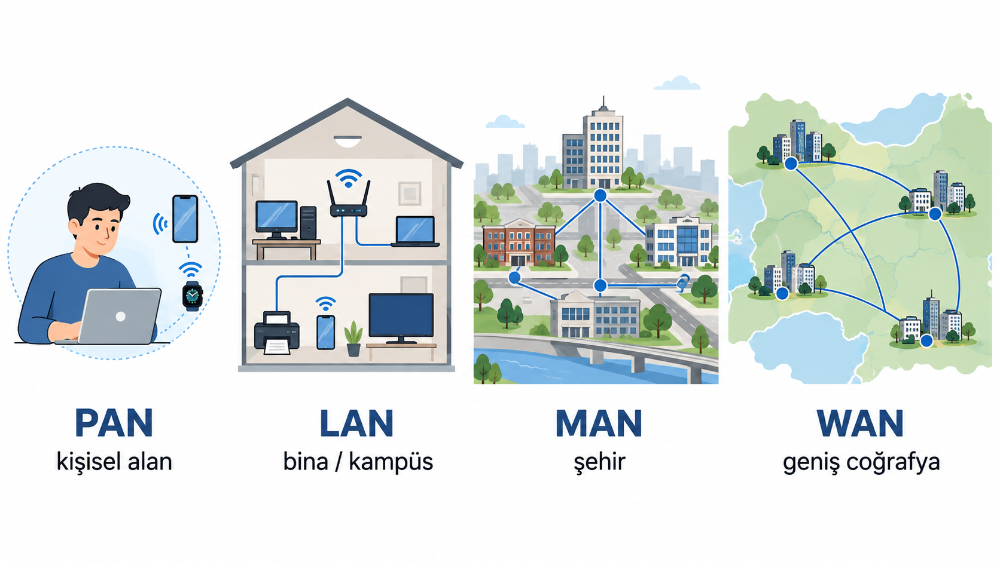
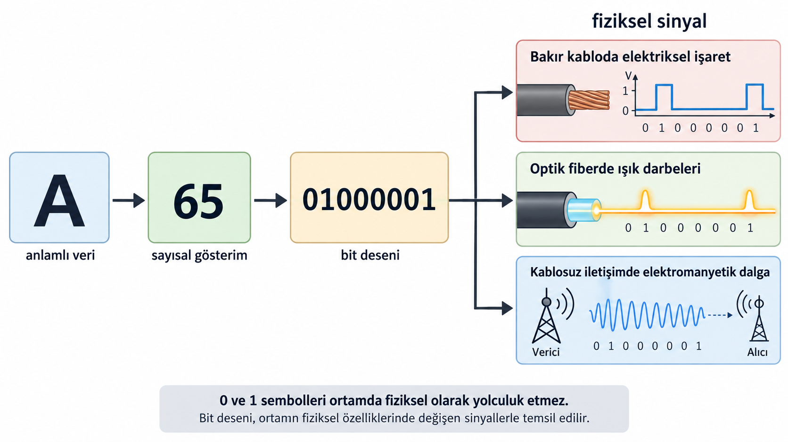
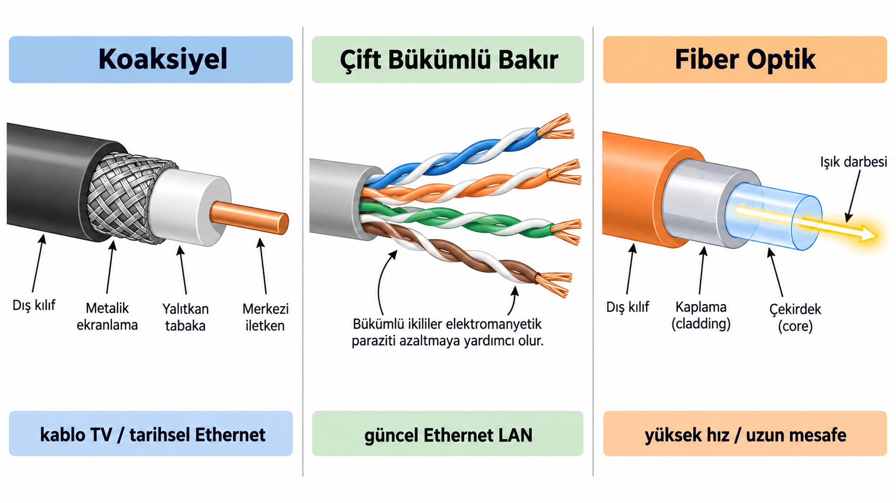
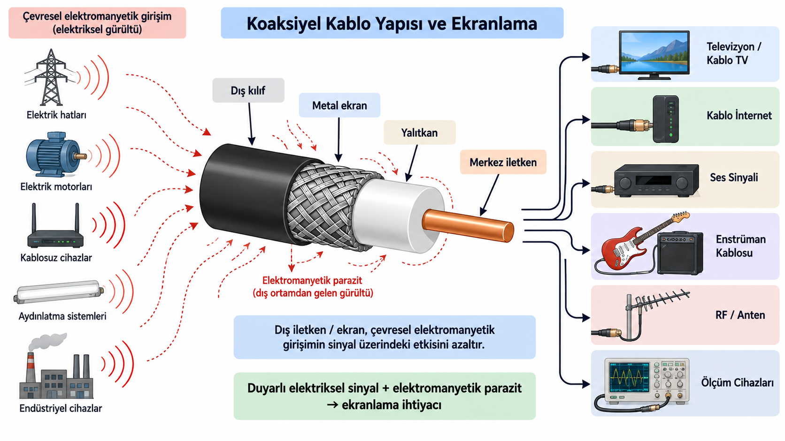
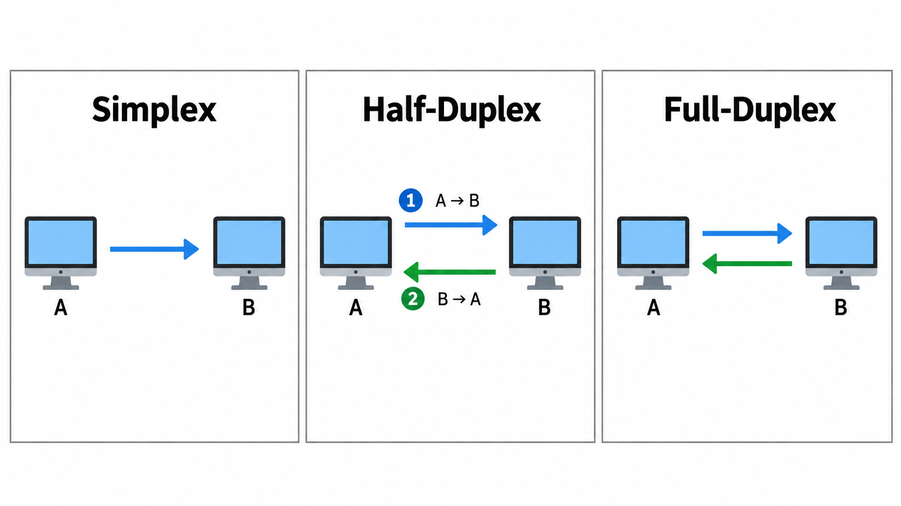
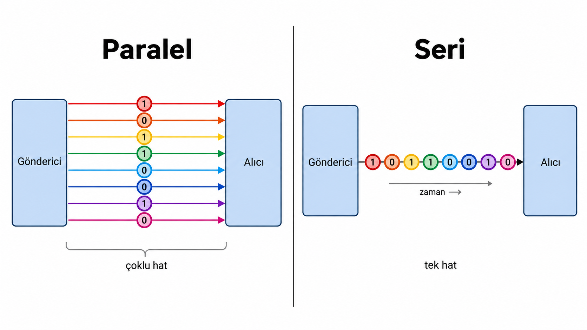
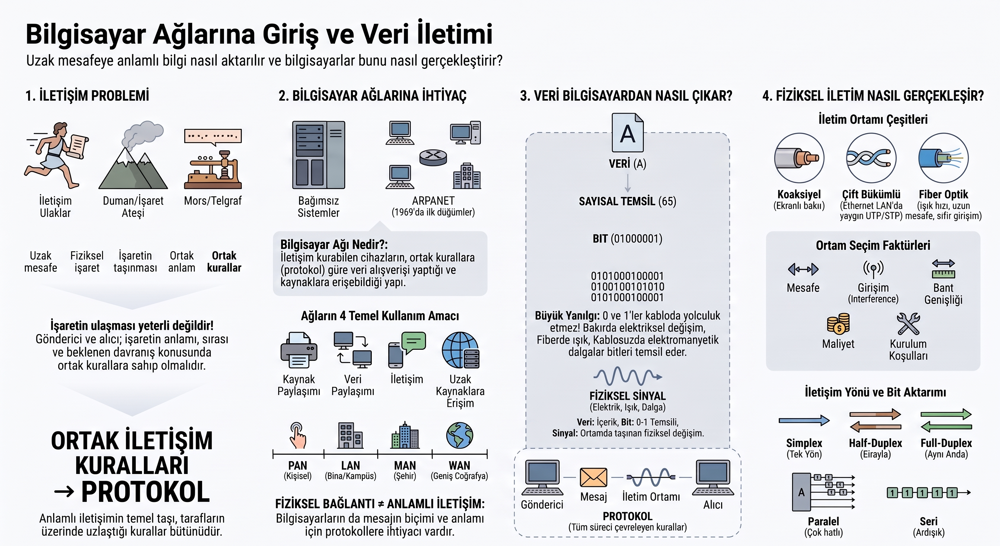

## Tarihte Uzak Mesafe İletişimi

Uzak mesafeye haber göndermek insanlık tarihinin tüm dönemlerinde büyük bir problemdi:

- Ulak / mektup
- Duman işaretleri
- Ateş ve bayrak sinyalleri
- Telegraf
- Mors alfabesi
- Sayısal iletişim

::: {.notes}
İnsanlar uzak noktalara bilgi ulaştırma problemini bilgisayarlardan çok önce çözmeye çalıştı. Bu yöntemlerin her biri aslında bir veri iletim sistemidir: Bilgi bir noktada üretilir, bir ortam üzerinden taşınır ve başka bir noktada alınır.

Yöntemler arasındaki temel fark, hız ile taşınabilecek bilgi miktarı arasındaki dengedir:

- **Ulak ve mektup:** Ayrıntılı bilgi taşınabilir; ancak fiziksel yolculuk zaman alır.
- **Duman ve ateş işaretleri:** Uzak mesafeden hızlı algılanabilir; fakat bir sinyalle aktarılabilecek bilgi miktarı çok sınırlıdır.
- **Telegraf ve Mors alfabesi:** Semboller kodlandığı için hem hızlı hem de görece fazla bilgi taşınabilir hâle geldi.
- **Sayısal iletişim:** Bilginin sayısal olarak temsil edilerek elektronik ortamda iletilmesi.

Bu liste, veri iletiminin bilgisayarlarla başlamadığını gösterir.
:::

---

## Orduları beraber harekete geçirme

Eski çağlarda iki askeri birlik ile taarruza kalkacağız. Plan şu:

- İki birlik arasında mesaj iletimi günler sürebiliyor.
- Bir kanat **aldatma taarruzu** yaparak düşmanın dikkatini ve kuvvetlerini üzerine çekecek.
- Diğer kanat uygun anda **asıl taarruzu** başlatacak.
- Asıl taarruz erken başlarsa aldatma taarruzu amacına ulaşmaz.
- Asıl taarruz geç başlarsa aldatma kanadı önce etkisiz hâle getirilebilir.
- Bu nedenle iki birliğin **doğru zamanda ve koordineli biçimde harekete geçmesi** gerekir.

> Peki Nasıl?

::: {.notes}

Bir saldırı yapmamız gerekiyor; ancak düşmanın bütün kuvvetleri tek bölgede toplanmış durumda. Bu kuvvetleri dağıtmadan doğrudan saldırırsak güçlü bir savunmayla karşılaşacağız. Bu nedenle planı iki ayrı kanat üzerinden yürütmek istiyoruz. (bkz. Büyük Taarruz)

Birinci birlik aldatma taarruzu yaparak düşmanın dikkatini ve kuvvetlerinin bir bölümünü üzerine çekecek. İkinci birlik ise düşman kuvvetleri dağıldıktan sonra başka bir yönden asıl taarruzu başlatacak. Sorun şu ki bu iki birlik birbirinden çok uzakta ve doğrudan haberleşmeleri kolay değil.

Asıl birlik erken harekete geçerse düşman henüz aldatma kanadına yönelmemiş olur. Bu durumda aldatma taarruzu etkisini gösteremez ve ana kuvvet yine düşmanın büyük bölümüyle karşılaşır. Asıl birlik geç kalırsa bu kez düşman önce aldatma kanadını etkisiz hâle getirir, ardından kuvvetlerini yeniden düzenleyerek asıl saldırıyı karşılar.

Dolayısıyla saldırının başarısı yalnızca iki ayrı birliğin bulunmasına değil, bu birliklerin doğru sırada ve doğru zamanda harekete geçmesine bağlıdır. Uzak mesafedeki birliklere hangi anda saldıracaklarını bildirecek, iki tarafın da anlamını önceden bildiği ve güvenilir biçimde algılayabileceği bir iletişim yöntemi gerekir.

:::


---

## LOTR — İşaret Ateşleri

::: {.lotr-video}

:::

> **Peki bu fiziksel işaret nasıl ortak bir anlam taşır?**

::: {.notes}

*Yüzüklerin Efendisi: Kralın Dönüşü* filminde buna benzer bir sahne. Minas Tirith saldırı altındadır ve çok uzaktaki Rohan'dan yardım istemesi gerekir. Ancak iki bölge arasında doğrudan ve hızlı bir haberleşme yolu yoktur.

Çözüm olarak dağ zirvelerine yerleştirilmiş işaret ateşleri kullanılır. Minas Tirith yakınındaki ilk ateş yakıldığında, uzaktaki bir sonraki gözcü bu işareti görür ve kendi ateşini yakar. Aynı işlem diğer zirvelerde de tekrarlanır. Böylece tek bir ateşin görülebileceği mesafeden çok daha uzağa haber ulaştırılabilir.

Burada ateş fiziksel bir işarettir; ışık ise bu işaretin uzaktan algılanmasını sağlar. Dağ zirvelerindeki gözcüler de işareti alıp yeniden oluşturan aktarım noktaları gibi davranır.

Fakat Rohan'ın yalnızca uzakta bir ateş görmesi yeterli değildir. Bu ateşin “Minas Tirith yardım istiyor” anlamına geldiğinin önceden bilinmesi gerekir. Aynı fiziksel işaret farklı bir anlam taşısaydı, karşı tarafın vereceği tepki de değişirdi.

Dolayısıyla başarılı iletişim için işaretin yalnızca uzak mesafeye ulaştırılması değil, gönderici ve alıcının bu işarete aynı anlamı vermesi de gerekir.

:::

---

## İnsanlar Nasıl Anlaşır?

```text
A: Merhaba          B: Merhaba
A: Saat kaç?        B: 10.30
```

- Aynı iletişim ortamını kullanırlar.
- Ortak bir dili paylaşırlar.
- Mesajlara aynı anlamı verirler.
- Konuşma sırasını bilirler.
- Ortak iletişim kurallarına uyarlar.

::: {.notes}

Bir işaretin karşı tarafa ulaşması, tek başına iletişimin gerçekleştiği anlamına gelmez. Karşı tarafın bu işareti göndericinin amaçladığı biçimde yorumlayabilmesi gerekir. İnsanlar arasındaki günlük iletişimde bunun birçok koşulu farkında olmadan yerine getirilir.

İki kişinin birbirini duyabilmesi için öncelikle ortak bir iletişim ortamına ihtiyaç vardır. Ancak aynı ortamda bulunmaları da yeterli değildir. Ortak bir dil kullanmıyorlarsa söylenen sesler karşı tarafa ulaşsa bile anlamlı bir mesaj oluşmaz.

Ortak dil de tek başına yeterli değildir. “Saat kaç?” sorusuna “10.30” yanıtı verilmesi, iki tarafın hem kullanılan sözcüklerin anlamını hem de soru ile beklenen yanıt arasındaki ilişkiyi bilmesine dayanır. Aynı soruya hava durumuyla ilgili bir yanıt verilmesi durumunda sözcüklerin hepsi anlaşılır olabilir, ancak iletişim amacına ulaşmaz.

İletişimin bir sırası da vardır. Bir kişi soru sorarken diğerinin dinlemesi, ardından yanıt vermesi beklenir. İki tarafın sürekli aynı anda konuşması durumunda ortak dil ve doğru mesajlar bulunsa bile iletişim bozulabilir.

İnsanlar selamlaşma, soru sorma, yanıt verme, söz sırası ve mesajların anlamı gibi birçok ortak kuralı çoğu zaman sezgisel biçimde uygular. Anlamlı iletişim, yalnızca bir işaretin taşınmasına değil, iletişim kuran tarafların bu ortak kuralları paylaşmasına dayanır.

:::

---

## Günümüze — Hatta Dersimize — Yaklaşalım

> Bir bilgisayardaki veri, başka bir bilgisayara nasıl ulaşır ve doğru biçimde nasıl yorumlanır?

**Bu dersin kapsamı, veri iletiminin bilgisayarlar arasında nasıl gerçekleştirildiğini anlamaktır.**

- Cihazları birbirine bağlamak yeterli mi?
- Verinin anlamını iki taraf nasıl paylaşır?
- Bilgisayarın içindeki bit, ortamda nasıl taşınır?

::: {.notes}

İnsanlar arasında iletişimde karşılaştığımız temel problem bilgisayarlar için de geçerlidir: Bir bilginin yalnızca karşı tarafa ulaşması yeterli değildir; alıcının gelen bilgiyi doğru biçimde yorumlayabilmesi gerekir.

Bilgisayarlar arasında bu süreç kendiliğinden gerçekleşmez. Cihazların nasıl haberleşeceği, verinin nasıl temsil edileceği ve bir noktadan diğerine nasıl taşınacağı belirli kurallara dayanır. Bilgisayarın içinde sayısal olarak temsil edilen veri, fiziksel bir ortam üzerinden taşınabilecek bir biçime dönüştürülmeli; alıcı da gelen bilgiyi yeniden doğru biçimde yorumlayabilmelidir.

Bu noktada temel soru şudur: Bilgisayarları neden birbirine bağlama ihtiyacı doğdu? Bilgisayarların yaygınlaşması, farklı konumlardaki veri ve hesaplama kaynaklarının paylaşılmasını gerekli hâle getirdi ve bilgisayar ağları bu ihtiyacın sonucu olarak ortaya çıktı.

:::

---

## İlk Bilgisayarlar Ne Amaçla Kullanıldı?

{width="42%"}


- İlk bilgisayarlar çoğunlukla bağımsız çalışıyordu.
- Temel amaç hesaplama yapmaktı.
- Makineler büyük, pahalı ve sınırlı erişilebilirdi.
- Bilgisayarlar arası veri paylaşımı henüz temel bir ihtiyaç değildi.

::: {.notes}

İlk bilgisayarlarda temel problem, veriyi başka bilgisayarlara aktarmaktan çok hesaplamayı gerçekleştirebilmekti. Bunun önemli nedenlerinden biri, bu makinelerin çok az sayıda bulunması ve çoğunlukla birbirinden bağımsız biçimde kullanılmasıydı. Bilgisayarlar arası sürekli veri alışverişini gerektirecek yaygın bir teknik altyapı ve kullanım ortamı henüz oluşmamıştı.

1940'lı ve 1950'li yıllardaki büyük bilgisayarlar son derece pahalıydı. Genellikle askeri, bilimsel veya istatistiksel hesaplamalar için belirli kurumlarda bulunuyor, büyük odaları kaplıyor ve uzman operatörler tarafından kullanılıyordu.

Bu nedenle bilgisayar kullanımı büyük ölçüde tek bir makinenin çevresinde örgütleniyordu. Veri o sisteme getirilir, hesaplama yapılır ve sonuç yine aynı ortamda alınırdı. Bilgisayarların sayısı ve kullanım alanları arttıkça ise farklı makinelerde bulunan veri ve hesaplama kaynaklarını paylaşma ihtiyacı giderek daha görünür hâle geldi.

Fotoğraf, ABD Kara Kuvvetleri arşivinden alınmış kamu malı bir ENIAC görüntüsüdür ([Wikimedia Commons](https://commons.wikimedia.org/wiki/File:Eniac_Aberdeen.jpg)).

:::

---

## Bilgisayarlar Yaygınlaştı; Sorun Değişti

- Bilgisayarların sayısı ve kullanım alanları arttı.
- Üniversiteler, araştırma kurumları ve büyük şirketler kendi sistemlerini kullanmaya başladı.
- Veri ve hesaplama kaynakları farklı noktalara dağıldı.
- Yeni soru: Bu sistemler birbirleriyle nasıl veri paylaşacak?

::: {.notes}

Bilgisayarların sayısı arttıkça kullanım biçimi de değişmeye başladı. Artık tek bir kurumda tek bir büyük bilgisayarın bulunmasından ziyade, farklı üniversitelerde, araştırma merkezlerinde ve şirketlerde birbirinden bağımsız sistemler vardı.

Bu makineler kendi verilerini işleyebiliyor ve kendi hesaplamalarını gerçekleştirebiliyordu; ancak bir bilgisayarda bulunan verinin başka bir bilgisayara aktarılması veya uzaktaki bir hesaplama kaynağının kullanılması hâlâ kolay değildi.

Böylece temel problem değişti. Artık yalnızca daha fazla hesaplama yapmak değil, farklı konumlardaki bilgisayarlar arasında veri ve kaynak paylaşabilmek de önemli hâle geldi. Bilgisayarlar birbirinden bağımsız çalışabildiği sürece bu paylaşım fiziksel taşıma, posta veya benzeri dolaylı yöntemlere bağlı kalıyordu.

Bu ihtiyaç, bilgisayarları birbirine bağlayacak iletişim yollarının geliştirilmesini gerekli hâle getirdi.

:::

---

## Farklı Şehirlerdeki İki Uzman Nasıl Çalışır?

- Boston'daki araştırmacı, Los Angeles'taki veriye ihtiyaç duyuyor.
- Veriyi fiziksel olarak göndermek günler sürebilir.
- Bu yöntem, sürekli veri paylaşımı için uygun değildir.
- Başka bir yol gerekiyor: Bilgisayarlar doğrudan haberleşebilir mi?

::: {.notes}

Bilgisayarlar farklı kurumlara ve şehirlere yayıldıkça veri paylaşımı somut bir probleme dönüştü. Örneğin 1960'lı yıllarda Boston'daki bir araştırmacının Los Angeles'taki bir bilgisayarda bulunan veriye ihtiyaç duyduğunu düşünelim.

Bilgisayarlar arasında doğrudan bir iletişim yolu yoksa verinin fiziksel olarak taşınması gerekir. Delikli kartların, manyetik ortamların veya basılı çıktıların başka bir şehre gönderilmesi mümkündür; ancak bu işlem saatler veya günler sürebilir. Araştırmacı yeni bir veriye ihtiyaç duyduğunda aynı süreç yeniden başlar.

Üstelik ihtiyaç yalnızca bir dosyanın başka bir yere gönderilmesi değildir. Uzaktaki bir bilgisayarda bulunan veriye erişmek, başka bir sistemin hesaplama kapasitesinden yararlanmak veya farklı kurumlardaki araştırmacıların sürekli birlikte çalışabilmesi gerekir.

Bilgisayarların sayısı ve aralarındaki mesafe arttıkça veriyi fiziksel olarak taşıma yaklaşımı yetersiz kalır. Daha kullanışlı çözüm, bilgisayarların veriyi doğrudan birbirlerine iletebildiği bir iletişim sistemi kurmaktır.

:::

---

## Bilgisayarları Birbirine Bağlama Fikri ve ARPANET

- Çözüm: Bilgisayarları bir iletişim ağı üzerinden bağlamak.
- 1969 — ARPANET'in ilk dört düğümü birbirine bağlandı.
- Uzak bilgisayarlar arasında veri ve kaynak paylaşımı mümkün hâle geldi.
- ARPANET, İnternet'in gelişimindeki önemli adımlardan biri oldu.

::: {.notes}

Bu ihtiyacın erken ve önemli örneklerinden biri ARPANET'tir. ABD Savunma Bakanlığı'nın araştırma ajansı ARPA tarafından finanse edilen ağ, 1969 yılında dört merkez arasında çalışmaya başladı: UCLA, Stanford Research Institute, UC Santa Barbara ve Utah Üniversitesi.

Temel fikir, farklı konumlardaki bilgisayarların ortak bir iletişim ağı üzerinden veri alışverişi yapabilmesiydi. Böylece bir bilgisayardaki bilgiye erişmek için veriyi fiziksel olarak başka bir kuruma taşımak yerine, veri ağ üzerinden iletilebilirdi.

ARPANET aynı zamanda paket anahtarlama yaklaşımının büyük ölçekli ilk uygulamalarından biri oldu. İletilecek veri daha küçük parçalara ayrılarak ağ üzerinden taşınabiliyor, böylece ortak iletişim altyapısı birden fazla bilgisayar ve kullanıcı tarafından paylaşılabiliyordu.

Ağ zamanla daha fazla merkezin bağlanmasıyla genişledi. Daha sonra farklı ağların ortak iletişim kuralları kullanarak birbirine bağlanması, günümüzdeki İnternet'in gelişimine uzanan sürecin önemli bir parçasını oluşturdu.

Mart 1977 tarihli harita, ARPANET'in ilk dört düğümlü yapıdan çok daha geniş bir ağa nasıl dönüştüğünü gösterir ([Wikimedia Commons](https://commons.wikimedia.org/wiki/File:Arpanet_logical_map,_march_1977.png)).

:::

---

{width="62%" fig-align="center"}

---

## Bilgisayar Ağı Neden Gerekir?

- Veri yalnız bulunduğu cihazda kalır.
- Ortak yazıcı veya depolama ayrı ayrı yönetilir.
- Uzak bir hizmete doğrudan erişilemez.
- Bilgiyi harici bir ortamla taşımak sürdürülebilir değildir.

::: {.notes}
Bağımsız çalışan bir bilgisayar kendi işlemcisini, belleğini ve depolama alanını kullanabilir. Başka bir cihazdaki veriye ya da hizmete erişmesi gerektiğinde ise arada bir iletişim yolu yoktur.

Ağ ihtiyacı, bilgisayarın tek başına çalışamamasından değil; tek başına çalışmanın paylaşım ve iletişim sınırlarından doğar. Bir ağ, cihazların yerel yeteneklerini ortadan kaldırmaz; gerektiğinde başka cihazlardaki veri ve kaynaklarla iş birliği yapmalarını mümkün kılar.
:::

---

{width="100%" fig-align="center" fig-alt="Bağımsız bilgisayar sistemleri ile ağ üzerinden ortak kaynak kullanan bilgisayarların karşılaştırması"}

---

## Bilgisayar Ağı Nedir?

**Bilgisayar ağı**, iletişim kurabilen cihazların

- kablolu veya kablosuz yollarla bağlandığı,
- ortak kurallara göre veri alışverişi yaptığı,
- kaynak ve hizmetlere erişebildiği yapıdır.

::: {.notes}
Ağ sözcüğü yalnız bilgisayarları değil, iletişim kurabilen telefon, yazıcı, kamera, sensör ve sunucu gibi cihazları da kapsar. Bu cihazlar doğrudan birbirine bağlı olabilir ya da aradaki ağ cihazları üzerinden iletişim kurabilir.

Tanımın önemli kısmı, cihazların yalnızca fiziksel olarak yan yana gelmesi değil, veri alışverişi yapabilmesidir. Bunun için donanım ile yazılım birlikte çalışır.
:::

---

## Ağların Kullanım Amaçları

- **Kaynak paylaşımı:** yazıcı, depolama, hesaplama gücü
- **Veri ve bilgi paylaşımı:** dosya, kayıt, içerik
- **İletişim:** mesajlaşma, sesli veya görüntülü görüşme
- **Uzak kaynaklara erişim:** web sitesi, bulut hizmeti, kurumsal sistem

::: {.notes}
Kaynak paylaşımı, her kullanıcı için ayrı bir yazıcı ya da depolama sistemi kurmak yerine ortak kaynaklardan yararlanmayı sağlar. Veri paylaşımı, aynı dosyanın fiziksel olarak taşınması yerine yetkili cihazlar arasında aktarılmasını veya ortak bir veri kaynağına erişilmesini mümkün kılar.

İletişim amacı yalnız insanların mesajlaşmasını kapsamaz. Bir uygulamanın başka bir uygulamadan veri istemesi, bir sensörün ölçüm göndermesi veya bir sunucunun web sayfası iletmesi de ağ iletişimidir. Uzak erişim, kaynağın aynı odada bulunması gereğini azaltır. Bu dört amaç çoğu gerçek ağda birlikte görülür.
:::

---

## Ağlar Ne Kadar Büyük Olabilir?

Bir kişinin yanındaki cihazları bağlamakla bir binayı, şehri veya farklı şehirleri bağlamak aynı ölçekte bir problem değildir.

{width="72%" fig-align="center" fig-alt="Bir kişinin yakınındaki cihazlardan bina, şehir ve geniş coğrafyalara uzanan PAN, LAN, MAN ve WAN ağ kapsamları"}

::: {.notes}
Ağları kapsadıkları coğrafi alana göre ayırmak, bağlantının fiziksel kapsamını ve cihazların ne kadar dağınık yerleştiğini ifade etmeyi sağlar. Bir kişinin birkaç cihazını yakın çevrede bağlaması ile farklı şehirlerdeki kurumları bağlaması aynı planlama sorunu değildir. Kapsanan alan büyüdükçe bağlanan sistemler daha geniş bir alana yayılır; bu sınıflandırma kesin kilometre sınırları koymaz.

**PAN (kişisel alan ağı),** bir kişinin yakın çevresindeki cihazları kapsar. Örneğin telefon, akıllı saat ve kulaklık arasındaki bağlantılar kişisel ölçekte düşünülebilir.

**LAN (yerel alan ağı),** ev, laboratuvar, ofis ya da bina gibi sınırlı bir alandaki cihazları bir araya getirir. Bir laboratuvardaki bilgisayarların aynı LAN içinde olması buna örnektir.

**MAN (metropol alan ağı),** şehir ölçeğindeki bağlantıyı anlatır. Örneğin aynı şehirdeki kurumsal yerleşkeleri bağlayan ağ bu ölçekte değerlendirilebilir.

**WAN (geniş alan ağı),** şehirler, ülkeler veya daha geniş coğrafyalar arasında uzanır. Farklı şehirlerdeki kurum şubeleri arasındaki bağlantı buna örnektir. İnternet'i yalnızca tek bir büyük WAN olarak düşünmemek gerekir: İnternet, çok sayıda farklı ağın birbirine bağlandığı bir **ağlar ağıdır (internetwork)**.

Bu adlar bir ağın fiziksel yayılımını anlamaya yarar; ağın nasıl düzenlendiğini ya da cihazların hangi görevleri üstlendiğini açıklamaz. Görseldeki bina/kampüs ifadesi LAN'ın yerel ölçeğini sezdirir; kampüsün gerçek ağ düzeni birden fazla yerel ağ içerebilir.
:::

---

## Fiziksel Bağlantı Neden Yetmez?

İki cihaz birbirine bağlı olsa bile:

- Gelen bitler nerede başlar ve nerede biter?
- Bir mesajın anlamı nedir?
- Mesajlar hangi sırayla gönderilir?
- Yanıt gelmezse ne yapılır?

::: {.notes}
İşaret ateşleri sahnesine dönelim. Rohan ateşi görüyor; ancak o ateşin "yardım" mı, "tehlike geçti" mi yoksa yanlışlıkla çıkan bir yangın mı olduğunu nasıl anlayacak? Cevap: Önceden üzerinde uzlaşılmış bir anlam olması gerekir.

Bilgisayarlarda da aynı sorun geçerlidir. Bir iletim ortamı sinyali taşıyabilir; ancak sinyalin tek başına ortak bir anlamı yoktur. Alıcı, hangi değişimin hangi biti temsil ettiğini, bitlerin hangi mesajı oluşturduğunu ve mesajın nasıl ele alınacağını bilmelidir.

Kablo olması, anlamlı iletişim olduğu anlamına gelmez.
:::

---

## Bilgisayarlar İçin de Aynı Sorun

Bilgisayarlar da aynı sorularla karşılaşır:

- Mesaj nasıl oluşturulacak?
- Mesaj ne anlama geliyor?
- Ne zaman gönderilecek?
- Alıcı ne yapacak?

**Bu ortak kurallara protokol denir.**

::: {.notes}
İnsan iletişimindeki ortak dil, mesaj anlamı ve iletişim sırası sezgisel ve doğaldır; büyük ölçüde örtük kurallarla yürür. Bilgisayarlar içinse bu kuralların açık, sayısal ve uygulanabilir biçimde tanımlanmış olması gerekir.

Bir protokol, iletişim kuran donanım veya yazılım bileşenlerinin üzerinde uzlaştığı kurallar bütünüdür. Bu yapının üç boyutu vardır:

- **Sözdizimi (syntax):** Mesajın yapısı ve biçimi nasıl olacak?
- **Anlambilim (semantics):** Alanlar ne anlama geliyor ve hangi davranışı tetikliyor?
- **Zamanlama (timing):** Ne zaman ve hangi sırayla iletişim kurulacak?

Bu terimler ilk bakışta soyut görünebilir. İşaret ateşleri örneğine bağlayalım: "tek ateş" ile "dizi ateş" arasındaki fark sözdizimini, "yardım çağrısı" anlamı semantiği ve "gündüz değil gece yakılır" koşulu zamanlama boyutunu temsil eder.
:::

---

## Veri İletişiminin Temel Bileşenleri

{width="100%" fig-align="center" fig-alt="Protokolün mesaj sınırlarını, mesaj anlamını, iletişim sırasını ve cevap davranışını belirleyen ortak kurallarını gösteren şema"}


- **mesaj** — iletilmek istenen veri
- **gönderici** — veriyi iletime hazırlayan taraf
- **alıcı** — veriyi teslim alan taraf
- **iletim ortamı** — sinyalin izlediği fiziksel yol
- **protokol** — tarafların uyduğu iletişim kuralları

::: {.notes}
Forouzan'ın beş bileşenli modeli, bir veri iletişimini çözümlemek için kullanışlı bir öğretim aracıdır. "Kim, neyi, kime, hangi yol üzerinden ve hangi kurallarla gönderiyor?" sorularını görünür kılar.

Gerçek ağlar daha çok donanım, yazılım ve ara cihaz içerebilir. Beşli model bunların tamamını saymak için değil, iletişimin temel rollerini ayırmak için kullanılır. Bu bileşenler birbirinden bağımsız değildir: Mesajın biçimi protokolle, sinyalin türü iletim ortamıyla ilişkilidir.

Gönderici ve alıcı, iletişim süresince üstlenilen rollerdir. Aynı cihaz bir anda gönderici olup sonra alıcı konumuna geçebilir. Mesaj ise metin, sayı, görüntü, ses, video ya da sensör ölçümü olabilir.
:::

---

## Bilgisayar Hangi Veriyi Taşır?

Bilgisayardaki her türlü veri sayısal olarak temsil edilir:

- Metin ve sayılar
- Görüntüler
- Ses
- Video

::: {.notes}
İnsan açısından bir harf ile bir ses kaydı çok farklıdır. Bilgisayar bunları saklayıp işleyebilmek için belirli sayısal gösterimlere dönüştürür. Metin karakterleri kod noktalarıyla, görüntüler piksellerin sayısal değerleriyle, ses örneklenmiş sayısal değerlerle ve video ardışık görüntü ile ses verisiyle temsil edilebilir.

Bu temsil yöntemlerinin ayrıntıları farklıdır; ancak ağ iletişimi açısından ortak sonuç şudur: Her türlü sayısal veri, bit örüntüleri olarak ifade edilebilir. İçeriğin türü kaybolmaz; bitlerin hangi kurala göre yorumlandığı, onların metin mi görüntü mü ses mi olduğunu belirler.
:::

---

## Veri → Bit

{width="100%" fig-align="center" fig-alt="A karakterinin sayısal değere ve bit örüntüsüne dönüştürülerek bakır, fiber ve kablosuz ortamlarda fiziksel sinyallerle temsil edilmesi"}

**Bit**, 0 veya 1 değerini alan temel sayısal temsil birimidir.

::: {.notes}
Tek bir karakter üzerinden ilerleyelim. Temel Latin alfabesindeki "A" karakteri ASCII'de 65 sayısıyla eşlenir; bu değer sekiz bitlik `01000001` örüntüsüyle gösterilebilir.

Bu küçük örnek, karakterin kablonun içinde harf biçiminde ilerlemediğini anlatır. Kabloda taşınan şey, o harfi temsil eden bit örüntüsünden üretilmiş fiziksel sinyaldir.

Güncel metin sistemleri Unicode kullanır ve Türkçe karakterler dâhil çok daha geniş bir karakter kümesini temsil eder. Tek bir karakterin her zaman tek bayt ile temsil edildiği sonucu çıkarılamaz. Ağ iletişimi açısından temel nokta, anlamlı verinin belirli kurallara göre bit örüntüleriyle temsil edilmesidir.
:::

---

## Bit → Fiziksel Sinyal

- **Veri:** taşınmak istenen bilgi
- **Bit:** sayısal temsilde temel birim
- **Sinyal:** fiziksel ortam üzerinde bilgiyi taşıyan fiziksel değişim

::: {.notes}
İki ayırt edilebilir fiziksel durum — örneğin açık ve kapalı — bir biti temsil edebilir. Bu sezgi yerindedir; ancak "açık her zaman 0, kapalı her zaman 1'dir" gibi evrensel bir kural yoktur. Eşleme, sistemi tasarlayanlara bağlıdır.

Üç kavramı net biçimde ayırmak gerekir:

**Veri,** kullanıcı veya uygulama için anlam taşıyan içeriktir. **Bit,** sayısal veriyi temsil etmek için kullanılan 0 ya da 1 değeridir. **Sinyal** ise bu bit değerleriyle ilişkilendirilmiş bilginin fiziksel ortam üzerinde taşınmasını sağlayan değişimdir.

"Bit kablonun içinde ilerler" ifadesi sezgisel görünse de teknik olarak eksiktir. Kabloda ilerleyen şey, bitleri temsil edecek biçimde üretilmiş fiziksel sinyaldir. Bakır kabloda elektriksel değişimler, fiber optikte ışık, kablosuz ortamda elektromanyetik dalgalar kullanılır. Alıcı, ölçebildiği bu fiziksel değişimleri üzerinde uzlaşılan kurallara göre yorumlar.
:::

---

## Sinyal Hangi Yoldan Gider?

> Sinyal oluştu; peki bu fiziksel sinyal bir cihazdan diğerine hangi ortam üzerinden ulaşacak?

- **Kablolu ortam:** Sinyal, fiziksel bir kablo boyunca taşınır.
- **Kablosuz ortam:** Sinyal, elektromanyetik dalgalarla yayılır.

::: {.notes}
Bitin fiziksel bir sinyalle temsil edilmesi, o sinyalin alıcıya ulaştığını henüz göstermez. Gönderici ile alıcı arasında sinyalin izlediği fiziksel yola **iletim ortamı** deriz. İşaret ateşi örneğinde ışık havada ilerliyordu; bilgisayar ağlarında sinyal kabloyla da kablosuz olarak da taşınabilir.

Kablosuz ortamda sinyal, fiziksel kablo olmadan elektromanyetik dalgalarla taşınır. Kablolu ortamların fiziksel yapısı ise kullanım koşullarına göre farklılık gösterir.
:::

---

## Sinyali Hangi Kablo Üzerinden Taşıyacağız?

**Aynı bit dizisi, farklı ortamlarda farklı fiziksel sinyallerle taşınabilir.**

{width="70%" fig-align="center" fig-alt="Koaksiyel, çift bükümlü bakır ve fiber optik kabloların katmanları ve yaygın kullanım alanları"}

::: {.notes}
Üç temel kablolu ortam koaksiyel kablo, çift bükümlü bakır kablo ve fiber optiktir. Aynı bit örüntüsü bakır kablolarda elektriksel değişimlerle, fiberde ise ışık darbeleriyle temsil edilerek taşınabilir. Bu nedenle iletim ortamı yalnız bir bağlantı çizgisi değildir; sinyalin fiziksel biçimini ve bağlantıdan beklenebilecek özellikleri etkiler.

Ortam seçerken **mesafe**, dışarıdan gelen **elektromanyetik girişim**, gereken **bant genişliği**, **maliyet** ve **kurulum koşulları** birlikte düşünülür. Bant genişliği bu bağlamda bağlantının veri taşıma kapasitesini ifade eder; tek başına bir kablo adından kesin hız sonucu çıkarılamaz. Görsel, kabloların yapı farkını gösterir.
:::

---

## Koaksiyel Kablo: Ekran Neyi Korur?

{width="72%" fig-align="center" fig-alt="Koaksiyel kablonun merkez iletken, yalıtkan, metal ekran ve dış kılıf katmanları ile elektromanyetik girişime karşı ekranlama düşüncesi"}

::: {.notes}
Koaksiyel kablonun ortasında **merkez iletken** bulunur. Onu **yalıtkan katman**, yalıtkanı çevreleyen **dış iletken veya metal ekran** ve en dışta koruyucu **kaplama** izler. Merkez iletkenin çevresindeki iletken ekran, dış ortamdan gelen elektromanyetik girişimin sinyal üzerindeki etkisini azaltmaya yardımcı olur. Ekran uygun biçimde topraklandığında istenmeyen akımların uzaklaştırılmasına da katkı sağlar. Bu, iletken bir çevrelemenin dış elektromanyetik etkiyi zayıflatması bakımından Faraday kafesi fikrine benzer; koruma her frekansta ve her kurulumda mutlak değildir.

Örneğin alüminyum folyoya sarılan bir telefonun çekimi zayıflayabilir; metal bir asansör kabininde de telefon sinyali kimi zaman güçlükle ulaşır. Bunlar iletken çevrelemenin elektromanyetik dalgalar üzerindeki etkisini sezdirir. Telefonun radyo bağlantısı ile koaksiyel kablodaki elektriksel sinyal aynı uygulama değildir; örnek yalnız ekranlama düşüncesini somutlaştırır.

Koaksiyel kablo **eski Ethernet uygulamalarında** kullanılmıştır. Günümüzde bilgisayar LAN'larının temel kablosu değildir; buna karşılık **kablo TV ve kablo internet** altyapılarında hâlâ görülür. Elektriksel gürültüye duyarlı ölçüm ve ses cihazları gibi uygulamalarda da uygun ekranlaması nedeniyle etkin biçimde kullanılır.
:::

---

## Çift Bükümlü Bakır: Neden Bükülür?

- Bakır iletkenler çiftler hâlinde birbirine bükülür.
- Büküm, elektromanyetik girişimin etkisini azaltır.
- Güncel Ethernet LAN'larında yaygındır.
- **UTP:** ek ekran yok · **STP:** ek ekran var

::: {.notes}
Çift bükümlü kabloda bilgi, birbirine eşlenen bakır iletken çiftleri üzerinden elektriksel sinyallerle taşınır. Tellerin birbirine bükülmesi, dış elektromanyetik girişimin iki tel üzerinde benzer etki bırakmasına yardımcı olur; alıcı bu ortak etkiyi büyük ölçüde ayırabilir. Büküm, komşu çiftlerin birbirini etkilemesini de azaltır. Böylece kablo, güncel Ethernet yerel ağlarında pratik bir fiziksel ortam sağlar.

**UTP (Unshielded Twisted Pair)**, bükümlü çiftlere ek bir metal ekranlama katmanı içermeyen kablodur. **STP (Shielded Twisted Pair)** ise elektromanyetik girişime karşı ek ekranlama içerir. STP'nin varlığı her ortamda zorunlu olduğu anlamına gelmez; seçimi çevredeki girişim ve kurulum koşulları belirler. Ekranlama, uygun bağlantı ve kurulumla birlikte değerlendirilir.

Laboratuvarda bilgisayar ile ağ bağlantı noktası arasında görülen ve gündelik dilde RJ-45 bağlantısı diye anılan uç tanıdık bir örnektir. Cat5e, Cat6 ve Cat6a gibi farklı performans kategorileri vardır.
:::

---

## Fiber Optik: Elektrik Yerine Işık

- Bakırda **elektriksel sinyal**, fiberde **ışık darbeleri** taşınır.
- **Çekirdek:** ışığın ilerlediği bölüm · **Kaplama:** ışığın çekirdekte kalmasına yardımcı olur.
- Uzun mesafe, yüksek bant genişliği, elektromanyetik girişimden etkilenmeme.

::: {.notes}
Fiber optik kablo, bitleri temsil eden bilgiyi elektriksel değişimlerle değil, ışık darbeleriyle taşır. Işık **çekirdek** içinde ilerler. Çekirdeği saran optik **kaplama**, ışığın çekirdek içinde yönlendirilmesine yardımcı olur; bunun dışında fiziksel koruma sağlayan katmanlar bulunabilir.

Sinyal elektriksel olmadığı için fiber, dış elektromanyetik girişimden bakır kablolar gibi etkilenmez. Uzun bağlantılarda kaybın düşük olması ve yüksek bant genişliği sağlayabilmesi, onu binalar arası veya daha geniş mesafeli bağlantılarda güçlü bir seçenek yapar. Yine de gereken cihazlar, fiberin döşenmesi ve uçlarının sonlandırılması bakıra göre farklı uzmanlık ve çoğu durumda daha yüksek maliyet gerektirir. Bu yüzden yalnız en yüksek kapasiteye bakarak seçim yapılmaz.
:::

---

## Hangi Ortamı Seçerdik?

1. **Aynı laboratuvardaki bilgisayarlar → switch:** çift bükümlü bakır.
2. **İki bina arası, uzun hat ve yoğun girişim:** fiber optik.
3. **Mevcut kablo TV hattından internet:** koaksiyel.

**Seçim, bağlantının ihtiyacına ve kurulum koşullarına bağlıdır.**

::: {.notes}
Birinci durumda kısa veya orta mesafeli güncel Ethernet LAN bağlantısı kuruluyor. Laboratuvar bilgisayarlarını switch'e bağlamak için çift bükümlü bakır yaygın ve pratik tercihtir. Switch, bu bağlantının diğer ucundaki ağ cihazıdır.

İkinci durumda binalar arasındaki uzun yol ve yüksek elektromanyetik girişim belirleyicidir. Fiber optik, elektromanyetik girişimden etkilenmediği, uzun mesafede düşük kayıp ve yüksek bant genişliği sağlayabildiği için güçlü adaydır. Gerçek seçimde gerekli kapasite, mevcut altyapı ve kurulum maliyeti de incelenir.

Üçüncü durumda hazır kablo TV altyapısı kullanılıyor. Bu altyapıda koaksiyel kabloyla karşılaşırız; bu, yeni bir laboratuvar Ethernet LAN'ı için de koaksiyelin seçileceği anlamına gelmez. Üç örnekten çıkarılacak sonuç, bir kablonun her zaman diğerlerinden üstün olduğu değil, fiziksel ortamın **mesafe, girişim, bant genişliği, maliyet ve kurulum koşullarına** göre seçildiğidir.
:::

---

## İletişim Yönleri: Simplex, Half-Duplex ve Full-Duplex {.smaller}

{width="62%" fig-align="center" fig-alt="Simplex, half-duplex ve full-duplex iletişim biçimlerinin yön ve eş zamanlılık bakımından karşılaştırması"}

:::: {.columns}

::: {.column width="33%"}
**Simplex — Tek yön**

Veri, tanımlanan iletişim kanalı üzerinde yalnız bir yönde akar.

**Eş zamanlılık:** Uygulanmaz  
**Örnek:** tek yönlü yayın akışı
:::

::: {.column width="34%"}
**Half-Duplex — İki yön, sırayla**

İki taraf da gönderebilir; aynı anda yalnız biri gönderir.

**Eş zamanlılık:** Hayır  
**Örnek:** bas-konuş telsiz
:::

::: {.column width="33%"}
**Full-Duplex — Aynı anda iki yön**

İki taraf aynı anda hem gönderebilir hem alabilir.

**Eş zamanlılık:** Evet  
**Örnek:** iki yönlü telefon görüşmesi
:::

::::

::: {.notes}
Üç iletişim biçimini ayırmak için iki soru yeterlidir: Veri kaç yönde akabilir ve iki yön aynı anda kullanılabilir mi?

Yalnız bir yön varsa simplex; iki yön olup sırayla kullanılıyorsa half-duplex; iki yön aynı anda kullanılabiliyorsa full-duplex söz konusudur.

Bu sınıflandırma, bağlantı veya iletişim kanalındaki veri akış yeteneğini açıklar; bir uygulamanın istek-yanıt sırasını değil. Bir web istemcisinin önce istek gönderip sonra yanıt alması, alttaki bağlantının half-duplex olduğu anlamına gelmez. Uygulama davranışı ile fiziksel kanalın yön yeteneği ayrı değerlendirilmelidir.

Simplex iletişimde bir uç gönderici, diğer uç alıcı rolündedir. Aynı iletişim kanalı üzerinden ters yönde veri akışı yoktur.

Alıcı cihazın başka bir teknolojiyle geri bildirim gönderebilmesi, incelenen tek yönlü kanalın simplex niteliğini değiştirmez; değerlendirme belirli bağlantı veya kanal için yapılır.

Simplex sözcüğü, mesajın yalnız bir defa gönderildiği anlamına gelmez. Gönderici art arda birçok mesaj iletebilir. Belirleyici özellik, akışın yön değiştirmemesidir.

Half-duplex iletişim iki yönlüdür, fakat iki yön aynı anda kullanılmaz. Bir taraf gönderirken diğeri dinler; rol değiştiğinde ters yönde iletişim gerçekleşir.

Bas-konuş telsizlerde konuşmak için kanalı alan kişi gönderir, diğerleri dinler. Konuşma bittiğinde başka biri kanalı alabilir. Tek şeritli ve iki yönden sırayla kullanılan yol benzetmesi bu yapıyı açıklar.

Half-duplex, simplex ile karıştırılmamalıdır: Simplex'te ters yön hiç yoktur; half-duplex'te iki yön de vardır, ancak zaman paylaşılır.

Full-duplex iletişimde iki taraf aynı zaman aralığında veri gönderebilir ve alabilir. Telefon görüşmesinde iki kişinin aynı anda konuşup birbirini duyabilmesi günlük bir örnektir.

Ağlarda bu özellik, ayrı iletim yolları kullanılarak ya da kanal kapasitesi iki yön arasında uygun biçimde paylaştırılarak sağlanabilir. Bir bağlantının full-duplex çalışıp çalışmadığı, kullanılan teknolojiye ve iki uç arasındaki yapılandırmaya bağlıdır. Kavram, belirli bir bağlantıda eş zamanlı iki yönlü aktarım yeteneğini tanımlar.
:::

---

## Seri ve Paralel İletim

{width="100%" fig-align="center" fig-alt="Paralel iletimde bitlerin birden çok hat üzerinden eş zamanlı, seri iletimde tek hat üzerinden ardışık gönderilmesi"}

::: {.notes}
Paralel iletimde birden fazla bit, birden fazla fiziksel hat üzerinden aynı zaman aralığında taşınır. Seri iletimde ise bitler aynı iletim yolu üzerinden art arda gönderilir.

Paralel iletim her zaman daha hızlı, seri iletim her zaman daha yavaş değildir. Paralel hatlarda hatlar arası elektriksel etkileşim (crosstalk) ve bitlerin hedefe aynı anda ulaşmasını sağlama güçlüğü, mesafe ve hız arttıkça önem kazanır. Bu nedenle Ethernet, USB ve benzeri birçok modern yüksek hızlı bağlantı seri iletim tekniklerinden yararlanır.

Paralel ve seri iletim, birden fazla bitin fiziksel aktarımda kullanılabildiği iki temel düzendir.
:::

---

## Genel Durum

{width="100%" fig-align="center" fig-alt="Bilgisayarların bağımsız hesaplama sistemlerinden paylaşım ve iletişim sağlayan ağlara doğru kavramsal gelişimi"}


::: {.notes}

Uzak mesafeye bilgi ulaştırmak, bilgisayarlardan çok önce çözülmesi gereken bir iletişim problemiydi. İşaret ateşleri gibi yöntemler, fiziksel bir işaretin ardışık aktarım noktaları kullanılarak çok uzak mesafelere ulaştırılabileceğini gösterir. Ancak işaretin ulaşması tek başına yeterli değildir; gönderici ve alıcının işarete aynı anlamı vermesi gerekir.

Bilgisayarların yaygınlaşmasıyla benzer problem bilgisayarlar arasında ortaya çıktı. Farklı konumlardaki veri ve hesaplama kaynaklarını paylaşabilmek için bilgisayarların birbirleriyle iletişim kurması gerekti. Bu cihazların birbirine bağlanması bilgisayar ağlarını oluşturdu; anlamlı iletişim kurabilmeleri ise ortak iletişim kurallarını, yani protokolleri gerektirdi.

Bilgisayarlardaki veri bit örüntüleriyle temsil edilir. Fiziksel ortamda doğrudan 0 ve 1 değerleri değil, bu bitleri temsil eden fiziksel sinyaller taşınır. Kullanılan ortama göre bu sinyal elektriksel değişim, ışık veya elektromanyetik dalga biçiminde olabilir.

Ağlar kapsadıkları alana göre farklı ölçeklerde kurulabilir. Bir kişinin yakınındaki cihazları kapsayan PAN ile şehirler veya daha geniş coğrafyalar arasında kurulan WAN aynı fiziksel kapsamda değildir. Benzer biçimde sinyali taşıyacak çift bükümlü bakır, koaksiyel veya fiber optik ortam; mesafe, girişim, kapasite ve kurulum koşullarına göre seçilir.

İletişimin fiziksel biçimi de farklı olabilir. Veri yalnız bir yönde, iki yönde sırayla veya iki yönde aynı anda aktarılabilir; bitler ise seri ya da paralel düzenlerde iletilebilir.

:::
