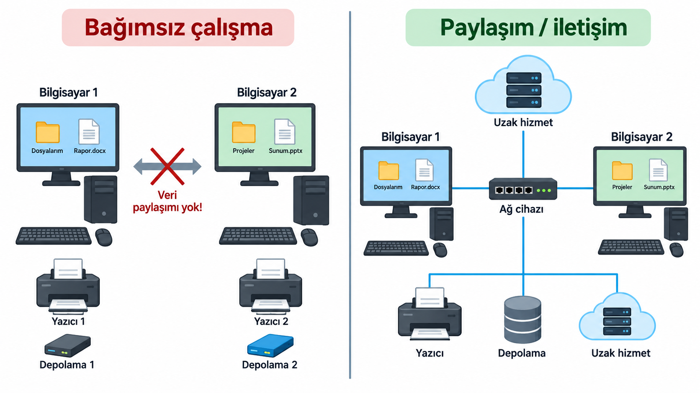

## İlk Bilgisayarlar Ne Amaçla Kullanıldı?

{width="42%"}

- İlk bilgisayarlar çoğunlukla bağımsız çalışıyordu.
- Temel amaç hesaplama yapmaktı.
- Makineler büyük, pahalı ve sınırlı erişilebilirdi.
- Bilgisayarlar arası veri paylaşımı henüz temel bir ihtiyaç değildi.

::: {.notes}
İlk bilgisayarlarda temel problem, veriyi başka bilgisayarlara aktarmaktan çok hesaplamayı gerçekleştirebilmekti. Bunun önemli nedenlerinden biri, bu makinelerin çok az sayıda bulunması ve çoğunlukla birbirinden bağımsız biçimde kullanılmasıydı. Bilgisayarlar arası sürekli veri alışverişini gerektirecek yaygın bir teknik altyapı ve kullanım ortamı henüz oluşmamıştı.

1940'lı ve 1950'li yıllardaki büyük bilgisayarlar son derece pahalıydı. Genellikle askeri, bilimsel veya istatistiksel hesaplamalar için belirli kurumlarda bulunuyor, büyük odaları kaplıyor ve uzman operatörler tarafından kullanılıyordu.

Bu nedenle bilgisayar kullanımı büyük ölçüde tek bir makinenin çevresinde örgütleniyordu. Veri o sisteme getirilir, hesaplama yapılır ve sonuç yine aynı ortamda alınırdı. Bilgisayarların sayısı ve kullanım alanları arttıkça ise farklı makinelerde bulunan veri ve hesaplama kaynaklarını paylaşma ihtiyacı giderek daha görünür hâle geldi.

Fotoğraf, ABD Kara Kuvvetleri arşivinden alınmış kamu malı bir ENIAC görüntüsüdür ([Wikimedia Commons](https://commons.wikimedia.org/wiki/File:Eniac_Aberdeen.jpg)).
:::

---

## Bilgisayarlar Yaygınlaştı; Sorun Değişti

- Bilgisayarların sayısı ve kullanım alanları arttı.
- Üniversiteler, araştırma kurumları ve büyük şirketler kendi sistemlerini kullanmaya başladı.
- Veri ve hesaplama kaynakları farklı noktalara dağıldı.
- Yeni soru: Bu sistemler birbirleriyle nasıl veri paylaşacak?

::: {.notes}
Bilgisayarların sayısı arttıkça kullanım biçimi de değişmeye başladı. Artık tek bir kurumda tek bir büyük bilgisayarın bulunmasından ziyade, farklı üniversitelerde, araştırma merkezlerinde ve şirketlerde birbirinden bağımsız sistemler vardı.

Bu makineler kendi verilerini işleyebiliyor ve kendi hesaplamalarını gerçekleştirebiliyordu; ancak bir bilgisayarda bulunan verinin başka bir bilgisayara aktarılması veya uzaktaki bir hesaplama kaynağının kullanılması hâlâ kolay değildi.

Böylece temel problem değişti. Artık yalnızca daha fazla hesaplama yapmak değil, farklı konumlardaki bilgisayarlar arasında veri ve kaynak paylaşabilmek de önemli hâle geldi. Bilgisayarlar birbirinden bağımsız çalışabildiği sürece bu paylaşım fiziksel taşıma, posta veya benzeri dolaylı yöntemlere bağlı kalıyordu.

Bu ihtiyaç, bilgisayarları birbirine bağlayacak iletişim yollarının geliştirilmesini gerekli hâle getirdi.
:::

---

## Farklı Şehirlerdeki İki Uzman Nasıl Çalışır?

- Boston'daki araştırmacı, Los Angeles'taki veriye ihtiyaç duyuyor.
- Veriyi fiziksel olarak göndermek günler sürebilir.
- Bu yöntem, sürekli veri paylaşımı için uygun değildir.
- Başka bir yol gerekiyor: Bilgisayarlar doğrudan haberleşebilir mi?

::: {.notes}
Bilgisayarlar farklı kurumlara ve şehirlere yayıldıkça veri paylaşımı somut bir probleme dönüştü. Örneğin 1960'lı yıllarda Boston'daki bir araştırmacının Los Angeles'taki bir bilgisayarda bulunan veriye ihtiyaç duyduğunu düşünelim.

Bilgisayarlar arasında doğrudan bir iletişim yolu yoksa verinin fiziksel olarak taşınması gerekir. Delikli kartların, manyetik ortamların veya basılı çıktıların başka bir şehre gönderilmesi mümkündür; ancak bu işlem saatler veya günler sürebilir. Araştırmacı yeni bir veriye ihtiyaç duyduğunda aynı süreç yeniden başlar.

Üstelik ihtiyaç yalnızca bir dosyanın başka bir yere gönderilmesi değildir. Uzaktaki bir bilgisayarda bulunan veriye erişmek, başka bir sistemin hesaplama kapasitesinden yararlanmak veya farklı kurumlardaki araştırmacıların sürekli birlikte çalışabilmesi gerekir.

Bilgisayarların sayısı ve aralarındaki mesafe arttıkça veriyi fiziksel olarak taşıma yaklaşımı yetersiz kalır. Daha kullanışlı çözüm, bilgisayarların veriyi doğrudan birbirlerine iletebildiği bir iletişim sistemi kurmaktır.
:::

---

## Bilgisayarları Birbirine Bağlama Fikri ve ARPANET

- Çözüm: Bilgisayarları bir iletişim ağı üzerinden bağlamak.
- 1969 — ARPANET'in ilk dört düğümü birbirine bağlandı.
- Uzak bilgisayarlar arasında veri ve kaynak paylaşımı mümkün hâle geldi.
- ARPANET, İnternet'in gelişimindeki önemli adımlardan biri oldu.

::: {.notes}
Bu ihtiyacın erken ve önemli örneklerinden biri ARPANET'tir. ABD Savunma Bakanlığı'nın araştırma ajansı ARPA tarafından finanse edilen ağ, 1969 yılında dört merkez arasında çalışmaya başladı: UCLA, Stanford Research Institute, UC Santa Barbara ve Utah Üniversitesi.

Temel fikir, farklı konumlardaki bilgisayarların ortak bir iletişim ağı üzerinden veri alışverişi yapabilmesiydi. Böylece bir bilgisayardaki bilgiye erişmek için veriyi fiziksel olarak başka bir kuruma taşımak yerine, veri ağ üzerinden iletilebilirdi.

ARPANET aynı zamanda paket anahtarlama yaklaşımının büyük ölçekli ilk uygulamalarından biri oldu. İletilecek veri daha küçük parçalara ayrılarak ağ üzerinden taşınabiliyor, böylece ortak iletişim altyapısı birden fazla bilgisayar ve kullanıcı tarafından paylaşılabiliyordu.

Ağ zamanla daha fazla merkezin bağlanmasıyla genişledi. Daha sonra farklı ağların ortak iletişim kuralları kullanarak birbirine bağlanması, günümüzdeki İnternet'in gelişimine uzanan sürecin önemli bir parçasını oluşturdu.
:::

---

{width="62%" fig-align="center"}

---

## Bilgisayar Ağı Neden Gerekir?

- Veri yalnız bulunduğu cihazda kalır.
- Ortak yazıcı veya depolama ayrı ayrı yönetilir.
- Uzak bir hizmete doğrudan erişilemez.
- Bilgiyi harici bir ortamla taşımak sürdürülebilir değildir.

::: {.notes}
Bağımsız çalışan bir bilgisayar kendi işlemcisini, belleğini ve depolama alanını kullanabilir. Başka bir cihazdaki veriye ya da hizmete erişmesi gerektiğinde ise arada bir iletişim yolu yoktur.

Ağ ihtiyacı, bilgisayarın tek başına çalışamamasından değil; tek başına çalışmanın paylaşım ve iletişim sınırlarından doğar. Bir ağ, cihazların yerel yeteneklerini ortadan kaldırmaz; gerektiğinde başka cihazlardaki veri ve kaynaklarla iş birliği yapmalarını mümkün kılar.
:::

---

{width="100%" fig-align="center" fig-alt="Bağımsız bilgisayar sistemleri ile ağ üzerinden ortak kaynak kullanan bilgisayarların karşılaştırması"}

---

## Bilgisayar Ağı Nedir?

**Bilgisayar ağı**, iletişim kurabilen cihazların

- kablolu veya kablosuz yollarla bağlandığı,
- ortak kurallara göre veri alışverişi yaptığı,
- kaynak ve hizmetlere erişebildiği yapıdır.

::: {.notes}
Ağ sözcüğü yalnız bilgisayarları değil, iletişim kurabilen telefon, yazıcı, kamera, sensör ve sunucu gibi cihazları da kapsar. Bu cihazlar doğrudan birbirine bağlı olabilir ya da aradaki ağ cihazları üzerinden iletişim kurabilir.

Tanımın önemli kısmı, cihazların yalnızca fiziksel olarak yan yana gelmesi değil, veri alışverişi yapabilmesidir. Bunun için donanım ile yazılım birlikte çalışır.
:::

---

## Ağların Kullanım Amaçları

- **Kaynak paylaşımı:** yazıcı, depolama, hesaplama gücü
- **Veri ve bilgi paylaşımı:** dosya, kayıt, içerik
- **İletişim:** mesajlaşma, sesli veya görüntülü görüşme
- **Uzak kaynaklara erişim:** web sitesi, bulut hizmeti, kurumsal sistem

::: {.notes}
Kaynak paylaşımı, her kullanıcı için ayrı bir yazıcı ya da depolama sistemi kurmak yerine ortak kaynaklardan yararlanmayı sağlar. Veri paylaşımı, aynı dosyanın fiziksel olarak taşınması yerine yetkili cihazlar arasında aktarılmasını veya ortak bir veri kaynağına erişilmesini mümkün kılar.

İletişim amacı yalnız insanların mesajlaşmasını kapsamaz. Bir uygulamanın başka bir uygulamadan veri istemesi, bir sensörün ölçüm göndermesi veya bir sunucunun web sayfası iletmesi de ağ iletişimidir. Uzak erişim, kaynağın aynı odada bulunması gereğini azaltır. Bu dört amaç çoğu gerçek ağda birlikte görülür.
:::

