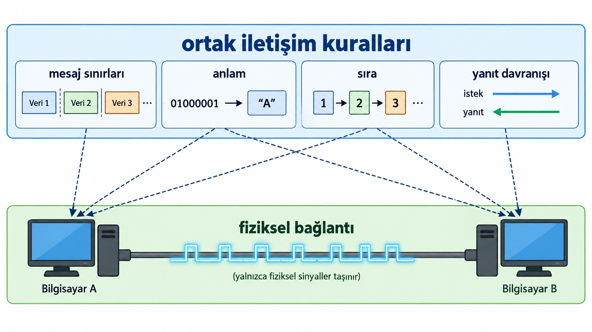

## Tarihte Uzak Mesafe İletişimi

Uzak mesafeye haber göndermek insanlık tarihinin tüm dönemlerinde büyük bir problemdi:

- Ulak / mektup
- Duman işaretleri
- Ateş ve bayrak sinyalleri
- Telegraf
- Mors alfabesi
- Sayısal iletişim

::: {.notes}
İnsanlar uzak noktalara bilgi ulaştırma problemini bilgisayarlardan çok önce çözmeye çalıştı. Bu yöntemlerin her biri aslında bir veri iletim sistemidir: Bilgi bir noktada üretilir, bir ortam üzerinden taşınır ve başka bir noktada alınır.

Yöntemler arasındaki temel fark, hız ile taşınabilecek bilgi miktarı arasındaki dengedir:

- **Ulak ve mektup:** Ayrıntılı bilgi taşınabilir; ancak fiziksel yolculuk zaman alır.
- **Duman ve ateş işaretleri:** Uzak mesafeden hızlı algılanabilir; fakat bir sinyalle aktarılabilecek bilgi miktarı çok sınırlıdır.
- **Telegraf ve Mors alfabesi:** Semboller kodlandığı için hem hızlı hem de görece fazla bilgi taşınabilir hâle geldi.
- **Sayısal iletişim:** Bilginin sayısal olarak temsil edilerek elektronik ortamda iletilmesi.

Bu liste, veri iletiminin bilgisayarlarla başlamadığını gösterir.
:::

---

## Orduları Beraber Harekete Geçirme

Eski çağlarda iki askeri birlik ile taarruza kalkacağız. Plan şu:

- İki birlik arasında mesaj iletimi günler sürebiliyor.
- Bir kanat **aldatma taarruzu** yaparak düşmanın dikkatini ve kuvvetlerini üzerine çekecek.
- Diğer kanat uygun anda **asıl taarruzu** başlatacak.
- Asıl taarruz erken başlarsa aldatma taarruzu amacına ulaşmaz.
- Asıl taarruz geç başlarsa aldatma kanadı önce etkisiz hâle getirilebilir.
- Bu nedenle iki birliğin **doğru zamanda ve koordineli biçimde harekete geçmesi** gerekir.

> Peki Nasıl?

::: {.notes}
Bir saldırı yapmamız gerekiyor; ancak düşmanın bütün kuvvetleri tek bölgede toplanmış durumda. Bu kuvvetleri dağıtmadan doğrudan saldırırsak güçlü bir savunmayla karşılaşacağız. Bu nedenle planı iki ayrı kanat üzerinden yürütmek istiyoruz.

Birinci birlik aldatma taarruzu yaparak düşmanın dikkatini ve kuvvetlerinin bir bölümünü üzerine çekecek. İkinci birlik ise düşman kuvvetleri dağıldıktan sonra başka bir yönden asıl taarruzu başlatacak. Sorun şu ki bu iki birlik birbirinden çok uzakta ve doğrudan haberleşmeleri kolay değil.

Asıl birlik erken harekete geçerse düşman henüz aldatma kanadına yönelmemiş olur. Bu durumda aldatma taarruzu etkisini gösteremez ve ana kuvvet yine düşmanın büyük bölümüyle karşılaşır. Asıl birlik geç kalırsa bu kez düşman önce aldatma kanadını etkisiz hâle getirir, ardından kuvvetlerini yeniden düzenleyerek asıl saldırıyı karşılar.

Dolayısıyla saldırının başarısı yalnızca iki ayrı birliğin bulunmasına değil, bu birliklerin doğru sırada ve doğru zamanda harekete geçmesine bağlıdır. Uzak mesafedeki birliklere hangi anda saldıracaklarını bildirecek, iki tarafın da anlamını önceden bildiği ve güvenilir biçimde algılayabileceği bir iletişim yöntemi gerekir.
:::

---

## LOTR — İşaret Ateşleri

::: {.lotr-video}

:::

> **Peki bu fiziksel işaret nasıl ortak bir anlam taşır?**

::: {.notes}
*Yüzüklerin Efendisi: Kralın Dönüşü* filminde buna benzer bir sahne bulunur. Minas Tirith saldırı altındadır ve çok uzaktaki Rohan'dan yardım istemesi gerekir. Ancak iki bölge arasında doğrudan ve hızlı bir haberleşme yolu yoktur.

Çözüm olarak dağ zirvelerine yerleştirilmiş işaret ateşleri kullanılır. Minas Tirith yakınındaki ilk ateş yakıldığında, uzaktaki bir sonraki gözcü bu işareti görür ve kendi ateşini yakar. Aynı işlem diğer zirvelerde de tekrarlanır. Böylece tek bir ateşin görülebileceği mesafeden çok daha uzağa haber ulaştırılabilir.

Burada ateş fiziksel bir işarettir; ışık ise bu işaretin uzaktan algılanmasını sağlar. Dağ zirvelerindeki gözcüler de işareti alıp yeniden oluşturan aktarım noktaları gibi davranır.

Fakat Rohan'ın yalnızca uzakta bir ateş görmesi yeterli değildir. Bu ateşin “Minas Tirith yardım istiyor” anlamına geldiğinin önceden bilinmesi gerekir. Aynı fiziksel işaret farklı bir anlam taşısaydı, karşı tarafın vereceği tepki de değişirdi.

Dolayısıyla başarılı iletişim için işaretin yalnızca uzak mesafeye ulaştırılması değil, gönderici ve alıcının bu işarete aynı anlamı vermesi de gerekir.
:::

---

## İnsanlar Nasıl Anlaşır?

```text
A: Merhaba          B: Merhaba
A: Saat kaç?        B: 10.30
```

- Aynı iletişim ortamını kullanırlar.
- Ortak bir dili paylaşırlar.
- Mesajlara aynı anlamı verirler.
- Konuşma sırasını bilirler.
- Ortak iletişim kurallarına uyarlar.

::: {.notes}
Bir işaretin karşı tarafa ulaşması, tek başına iletişimin gerçekleştiği anlamına gelmez. Karşı tarafın bu işareti göndericinin amaçladığı biçimde yorumlayabilmesi gerekir. İnsanlar arasındaki günlük iletişimde bunun birçok koşulu farkında olmadan yerine getirilir.

İki kişinin birbirini duyabilmesi için öncelikle ortak bir iletişim ortamına ihtiyaç vardır. Ancak aynı ortamda bulunmaları da yeterli değildir. Ortak bir dil kullanmıyorlarsa söylenen sesler karşı tarafa ulaşsa bile anlamlı bir mesaj oluşmaz.

Ortak dil de tek başına yeterli değildir. “Saat kaç?” sorusuna “10.30” yanıtı verilmesi, iki tarafın hem kullanılan sözcüklerin anlamını hem de soru ile beklenen yanıt arasındaki ilişkiyi bilmesine dayanır. Aynı soruya hava durumuyla ilgili bir yanıt verilmesi durumunda sözcüklerin hepsi anlaşılır olabilir, ancak iletişim amacına ulaşmaz.

İletişimin bir sırası da vardır. Bir kişi soru sorarken diğerinin dinlemesi, ardından yanıt vermesi beklenir. İki tarafın sürekli aynı anda konuşması durumunda ortak dil ve doğru mesajlar bulunsa bile iletişim bozulabilir.

İnsanlar selamlaşma, soru sorma, yanıt verme, söz sırası ve mesajların anlamı gibi birçok ortak kuralı çoğu zaman sezgisel biçimde uygular. Anlamlı iletişim, yalnızca bir işaretin taşınmasına değil, iletişim kuran tarafların bu ortak kuralları paylaşmasına dayanır.
:::

---

## Bilgisayarlar Arasındaki İletişim

> Bir bilgisayardaki veri, başka bir bilgisayara nasıl ulaşır ve doğru biçimde nasıl yorumlanır?

- Cihazları birbirine bağlamak yeterli mi?
- Verinin anlamını iki taraf nasıl paylaşır?
- Bilgisayarın içindeki bit, ortamda nasıl taşınır?

::: {.notes}
İnsanlar arasında iletişimde karşılaştığımız temel problem bilgisayarlar için de geçerlidir: Bir bilginin yalnızca karşı tarafa ulaşması yeterli değildir; alıcının gelen bilgiyi doğru biçimde yorumlayabilmesi gerekir.

Bilgisayarlar arasında bu süreç kendiliğinden gerçekleşmez. Cihazların nasıl haberleşeceği, verinin nasıl temsil edileceği ve bir noktadan diğerine nasıl taşınacağı belirli kurallara dayanır. Bilgisayarın içinde sayısal olarak temsil edilen veri, fiziksel bir ortam üzerinden taşınabilecek bir biçime dönüştürülmeli; alıcı da gelen bilgiyi yeniden doğru biçimde yorumlayabilmelidir.
:::

---

## Fiziksel Bağlantı Neden Yetmez?

İki cihaz birbirine bağlı olsa bile:

- Gelen bitler nerede başlar ve nerede biter?
- Bir mesajın anlamı nedir?
- Mesajlar hangi sırayla gönderilir?
- Yanıt gelmezse ne yapılır?

::: {.notes}
İşaret ateşleri sahnesine dönelim. Rohan ateşi görüyor; ancak o ateşin "yardım" mı, "tehlike geçti" mi yoksa yanlışlıkla çıkan bir yangın mı olduğunu nasıl anlayacak? Cevap: Önceden üzerinde uzlaşılmış bir anlam olması gerekir.

Bilgisayarlarda da aynı sorun geçerlidir. Bir iletim ortamı sinyali taşıyabilir; ancak sinyalin tek başına ortak bir anlamı yoktur. Alıcı, hangi değişimin hangi biti temsil ettiğini, bitlerin hangi mesajı oluşturduğunu ve mesajın nasıl ele alınacağını bilmelidir.

Kablo olması, anlamlı iletişim olduğu anlamına gelmez.
:::

---

## Bilgisayarlar İçin de Aynı Sorun

Bilgisayarlar da aynı sorularla karşılaşır:

- Mesaj nasıl oluşturulacak?
- Mesaj ne anlama geliyor?
- Ne zaman gönderilecek?
- Alıcı ne yapacak?

**Bu ortak kurallara protokol denir.**

::: {.notes}
İnsan iletişimindeki ortak dil, mesaj anlamı ve iletişim sırası sezgisel ve doğaldır; büyük ölçüde örtük kurallarla yürür. Bilgisayarlar içinse bu kuralların açık, sayısal ve uygulanabilir biçimde tanımlanmış olması gerekir.

Bir protokol, iletişim kuran donanım veya yazılım bileşenlerinin üzerinde uzlaştığı kurallar bütünüdür. Bu yapının üç boyutu vardır:

- **Sözdizimi (syntax):** Mesajın yapısı ve biçimi nasıl olacak?
- **Anlambilim (semantics):** Alanlar ne anlama geliyor ve hangi davranışı tetikliyor?
- **Zamanlama (timing):** Ne zaman ve hangi sırayla iletişim kurulacak?

Bu terimler ilk bakışta soyut görünebilir. İşaret ateşleri örneğine bağlayalım: "tek ateş" ile "dizi ateş" arasındaki fark sözdizimini, "yardım çağrısı" anlamı semantiği ve "gündüz değil gece yakılır" koşulu zamanlama boyutunu temsil eder.
:::

---

## Veri İletişiminin Temel Bileşenleri

{width="100%" fig-align="center" fig-alt="Protokolün mesaj sınırlarını, mesaj anlamını, iletişim sırasını ve cevap davranışını belirleyen ortak kurallarını gösteren şema"}

- **mesaj** — iletilmek istenen veri
- **gönderici** — veriyi iletime hazırlayan taraf
- **alıcı** — veriyi teslim alan taraf
- **iletim ortamı** — sinyalin izlediği fiziksel yol
- **protokol** — tarafların uyduğu iletişim kuralları

::: {.notes}
Forouzan'ın beş bileşenli modeli, bir veri iletişimini çözümlemek için kullanışlı bir öğretim aracıdır. "Kim, neyi, kime, hangi yol üzerinden ve hangi kurallarla gönderiyor?" sorularını görünür kılar.

Gerçek ağlar daha çok donanım, yazılım ve ara cihaz içerebilir. Beşli model bunların tamamını saymak için değil, iletişimin temel rollerini ayırmak için kullanılır. Bu bileşenler birbirinden bağımsız değildir: Mesajın biçimi protokolle, sinyalin türü iletim ortamıyla ilişkilidir.

Gönderici ve alıcı, iletişim süresince üstlenilen rollerdir. Aynı cihaz bir anda gönderici olup sonra alıcı konumuna geçebilir. Mesaj ise metin, sayı, görüntü, ses, video ya da sensör ölçümü olabilir.
:::
