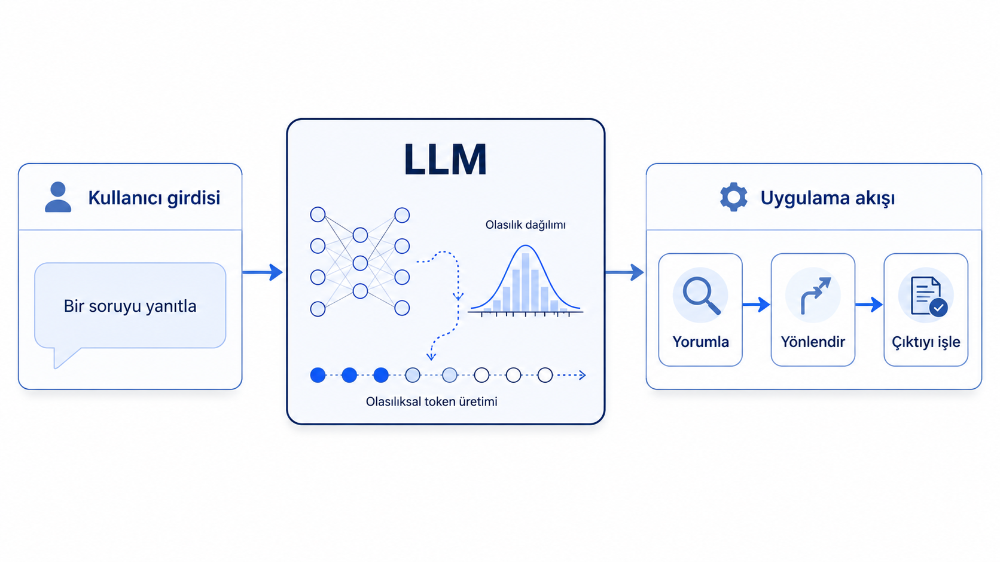
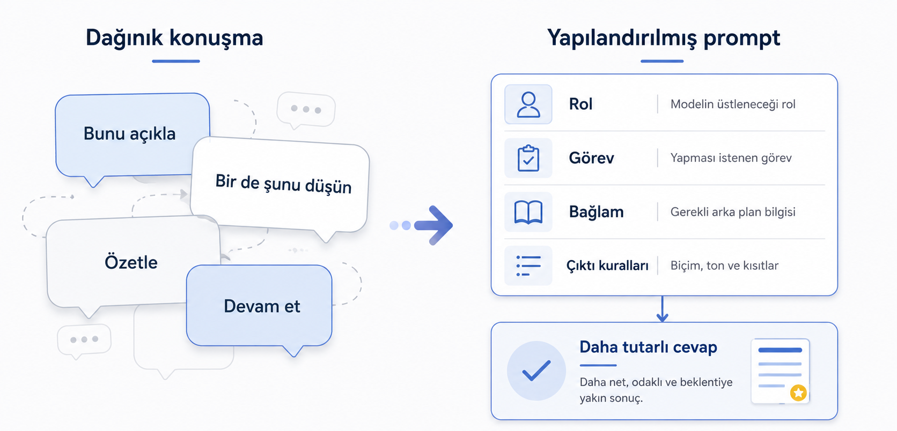
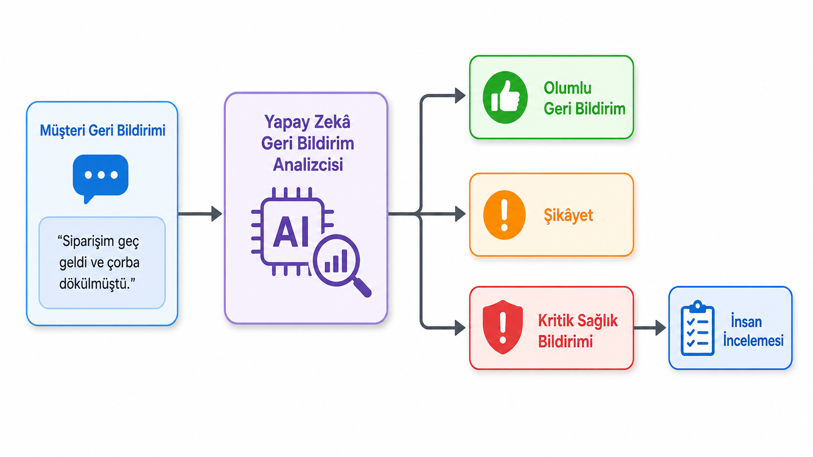

LLM orkestrasyonu, ajanlar ve benzeri kavramlardan sıkça bahsedilir. Fakat burada programlama bilen insanların kafasına takılabilecek temel bir durum vardır: Programlama çoğu zaman daha belirgin kurallar, beklenen çıktı biçimleri ve hata durumları üzerinden ilerlediğinde düzgün çalışır. Gelgelelim dil modelleri çoğu durumda aynı soruya çok benzer cevaplar verse bile her zaman birebir aynı cevabı üretmeyebilir. Her adımda bir sonraki tokeni tahmin etme üzerine kurulu bir yapıya sahiptirler. Benzer cevaplar verseler bile çıktının biçimi, kelime seçimi veya ayrıntı düzeyi değişebilir. Peki bu durumda dil modellerini bir yazılım akışının içine nasıl dahil edeceğiz?

::: {.text-center}
{width=85%}
:::

## Dil Modelleriyle Neler Yapılabilir?

Bunun için önce dil modellerinin neleri yapabildiğini bilmemiz gerekir. Çoğu zaman anlık ihtiyaçlarda ChatGPT, Claude veya yerel bir model ile bir sohbete girdiğimizde konuşma bir süre sonra bağlamdan kopabilir, anlamsız cevaplar gelebilir veya konuşma ana odak noktasının dışına kayabilir. Bu konularla biraz uğraşmış birisi, basit prompt şablonları kullanarak bu dağınık görünen yapının çoğu durumda oldukça tutarlı cevaplar verebildiğini bilir. Bunun için bir miktar prompt yazma tekniği bilmek gerekir. Eğer düzgün yapılandırılmış bir istek verirseniz dil modeli çoğu durumda istediğiniz formata yakın ve tutarlı cevaplar verebilir.

Fakat hâlâ bir akış içinde, örneğin bir Python betiğinde, bunu nasıl kullanabileceğimiz tam olarak net değildir. İstekleri ne ölçüde kendi istediğimiz biçime çekebiliriz? Modelden gelen cevabı uygulama kodu güvenilir biçimde nasıl okuyabilir? Cevap beklediğimiz biçimde gelmezse ne yapacağız?

Bunu bir örnek üzerinden aktaralım. Bir chatbot yazdık ve bu chatbot kullanıcıyla etkileşime giriyor. Güncel dil modelleri genellikle aldığı metni tamamlama eğilimindedir. Siz bir metin yazarsınız, model de bunu anlamlı şekilde devam ettirerek size cevap verir. Fakat bizim uygulamamızın bundan daha fazlasını yapmasını istiyoruz.

## Örnek: Chatbot Yönlendirme

::: {.text-center}
{width=80%}
:::

Elimizde üç farklı araç olduğunu düşünelim: Bunlardan biri klasik bir dil modeli, diğeri web araması yapıp sonuçları özetleyen bir uygulama, üçüncüsü ise gelen isteğe göre görsel oluşturan bir difüzyon modeli olsun. Sohbetin devam ettirilmesi zaten LLM'lerin doğal yeteneklerinden biridir. Kullanıcı bu üç işlem için üç farklı arayüz kullanabilir: sohbet için bir arayüz, web araması için başka bir arayüz, görsel oluşturmak için başka bir arayüz. Tahmin edileceği üzere bu durumda arayüzler arasında sürekli geçiş yapılır ve çalışma kolayca dağılır.

Bizim istediğimiz şey şudur: Chatbotumuz bir istek geldiğinde, bu istek bir soru ya da sohbetin devamıysa konuşmayı sürdürecek; kullanıcı bir konuda web araması yapmak istiyorsa arama servisine geçip sonucu döndürecek; kullanıcı görsel oluşturmak istiyorsa görsel üretim modülünü çalıştıracak. Bütün bunlar tek bir yerden yapılacak. Aslına bakarsanız 2026 yılı itibarıyla kullandığımız ChatGPT, Gemini ve Claude gibi uygulamalar bu tür işlemleri zaten yapmaktadır. Bizim burada anlamaya çalıştığımız şey, bu mantığı kendi uygulamamızda nasıl kurabileceğimizdir.

### Kullanıcıdan gelen

::: {.text-center}
{width=80%}
:::

Öncelikle kullanıcının isteğinin ne olduğunun tespit edilmesi, elimizdeki üç araçtan hangisine yönelik bir istek geldiğinin belirlenmesi gerekir. Bunu yalnızca klasik koşul ifadeleri, anahtar kelime kontrolleri veya sabit kurallarla yapmak çoğu durumda kırılgan ve bakımı zor bir çözüme dönüşür. Kullanıcı "bana kedi resmi çiz" de diyebilir, "şöyle bir sahne hayal et ve görselleştir" de diyebilir. Web araması için "bunu internette araştır" diyebilir, "son gelişmeleri bul" diyebilir veya doğrudan güncel bir olay hakkında soru sorabilir. Bu çeşitliliği yalnızca kelime eşleştirme ile yakalamak zordur.

Burada yine dil modelleri işimize yarayabilir. Bir dil modeline şunu yaptırabiliriz: Kullanıcıdan gelen metni incele ve bu metnin sohbet devamı mı, web araması isteği mi yoksa görsel oluşturma talebi mi olduğunu belirle. Bugün kullanılan küçük modeller bile açık ve sınırlı sınıflandırma görevlerinde çoğu zaman yeterince başarılı sonuçlar verebilir.

Örneğin modelden yalnızca "Sohbet", "Arama" veya "Görsel" kelimelerinden birini döndürmesini isteyebiliriz. Bu ilk aşamada yeterince sade bir denemedir. Amacımız kullanıcının isteğini üç temel kategoriye ayırıp uygulama akışında hangi modülün çalışacağını belirlemektir.

Bu durumda dil modelini, kullanıcının isteğini yorumlayan bir ön kontrol bileşeni gibi kullanmış oluruz. Model nihai cevabı üretmez; yalnızca gelen isteğin hangi yöne gönderileceğini belirler. Uygulama kodu da modelden gelen bu kısa cevaba göre sohbet modülünü, arama modülünü veya görsel oluşturma modülünü çalıştırır.

### Örnek prompt

Aşağıdaki prompt, bu fikri basit düzeyde denemek için kullanılabilir:

::: {.callout-note title="Prompt"}

```default
Rol: Sen bir chatbot sisteminin ön kontrol bileşenisin.

Görev: Kullanıcıdan gelen isteği incele ve bu isteğin hangi modüle yönlendirilmesi gerektiğini belirle.

Bağlam: Sistemde üç modül vardır:

1. Sohbet
   Kullanıcının isteği genel bir soru, açıklama talebi veya sohbetin devamı ise bu modül seçilmelidir.

2. Arama
   Kullanıcı güncel bilgi, web araması, kaynak bulma veya internette araştırma gerektiren bir istekte bulunuyorsa bu modül seçilmelidir.

3. Görsel
   Kullanıcı bir görsel, çizim, resim, sahne, afiş, tasarım veya benzeri bir görsel çıktı oluşturmak istiyorsa bu modül seçilmelidir.

Çıktı kuralları:
- Yalnızca tek kelime döndür.
- Açıklama yazma.
- Cümle kurma.
- Sadece aşağıdaki üç değerden birini kullan:
  - Sohbet
  - Arama
  - Görsel

Kullanıcı isteği: {bla bla bla}
```

:::

Buradan gelen isteği basit bir if-else bloğuyla doğrudan ilgili modüle çok rahatlıkla yönlendirebiliriz.

Aşağıda örnek olarak oluşturulmuş 10 tane kullanıcı isteği bulunmaktadır;

|#|Kullanıcı isteği|Beklenen çıktı|
|---|---|---|
|1|Bana Python'da liste ile tuple arasındaki farkı açıklar mısın?|Sohbet|
|2|Bugün yapay zekâ regülasyonlarıyla ilgili son gelişmeleri araştır.|Arama|
|3|Bir kedinin uzay gemisinde oturduğu çizgi film tarzında bir görsel oluştur.|Görsel|
|4|Bu metni daha sade bir dille yeniden yazar mısın?|Sohbet|
|5|LangChain'in en güncel sürümünde ajan yapısı nasıl değişmiş, webde araştır.|Arama|
|6|Bir banka şubesinin fütüristik iç mekân tasarımını görselleştir.|Görsel|
|7|RAG ile fine-tuning arasındaki farkı kısaca anlat.|Sohbet|
|8|2026 yılında Türkiye'de açık bankacılık alanındaki güncel haberleri bul.|Arama|
|9|Minimalist tarzda bir yapay zekâ eğitimi afişi üret.|Görsel|
|10|Bu sohbet boyunca anlattıklarımızı üç maddede özetle.|Sohbet|

Yukarıdaki örneklerde olduğu gibi, açık ve sınırlı sınıflandırma görevlerinde küçük modellerle bile çoğu zaman düzgün cevaplar alınabilir. Modelden yalnızca "Sohbet", "Arama" veya "Görsel" gibi tek kelimelik bir cevap istemek, ilk deneme için yeterince anlaşılırdır. Bu cevap daha sonra basit bir `if-else` bloğu ile ilgili modüle yönlendirilebilir.

### Yapılandırılmış Çıktıya Geçiş

Fakat bu noktadan sonra sistemi biraz daha biçimsel hâle getirmek gerekir. Çünkü tek kelimelik cevap insan için okunabilir olsa da uygulama açısından sınırlı bir temsil sunar. Modelin verdiği kararın hangi alana karşılık geldiği, bu kararın başka bir modele veya modüle nasıl aktarılacağı ve çıktının kod içinde nasıl işleneceği daha açık biçimde tanımlanmalıdır.

Bunun için hemen her yazılım sisteminde karşımıza çıkan JSON biçimini kullanabiliriz. JSON, hem insanlar tarafından okunabilir hem de programlama dilleri tarafından kolayca işlenebilir. Böylece modelden gelen cevap yalnızca tek bir kelime olmaktan çıkar; alan adı ve değer içeren küçük bir veri yapısına dönüşür.

::: {.text-center}
{width=85%}
:::

Bu aşamada görev hâlâ aynıdır: Kullanıcı isteği üç kategoriden birine ayrılacaktır. Fakat çıktı kısmı aşağıdaki gibi düzenlenerek artık doğrudan şu şekilde istenebilir:

::: {.callout-note title="Prompt"}


```default
Çıktı kuralları:
- Yalnızca geçerli bir JSON nesnesi döndür.
- JSON dışında açıklama yazma.
- Cümle kurma.
- JSON içinde sadece şu alanlar olsun:
  - route
  - normalized_request
  - reason
- route alanı sadece şu üç değerden birini alabilir:
  - "sohbet"
  - "arama"
  - "gorsel"
- normalized_request alanı, kullanıcı isteğinin ilgili modüle aktarılabilecek daha açık ve düzenli hâli olmalıdır.
- reason alanı, yönlendirme kararının kısa gerekçesini içermelidir.

Çıktı biçimi:

{
  "route": "<sohbet | arama | gorsel>",
  "normalized_request": "<kullanıcı isteğinin ilgili modüle aktarılacak düzenlenmiş hâli>",
  "reason": "<yönlendirme kararının kısa gerekçesi>"
}
```


:::


## Örnek: Siparişten yapılandırılmış çıktıya

Yukarıdaki örnek, konunun ilk adımı olduğu için gerçek bir uygulama durumunu temsil etme açısından sınırlı kaldı. Şimdi biraz daha akış mantığına uygun bir örnekle devam edelim.

Bir yemek sipariş uygulamasında kullanıcılar siparişlerinden sonra serbest metinle geri bildirim yazabilir. Bu geri bildirimler kimi zaman teslimat süresi, lezzet veya paketleme ile ilgili bir şikâyet; kimi zaman doğrudan bir memnuniyet ifadesi; kimi zaman da ciddi bir sağlık bildirimi olabilir. Elbette gerçek bir sistemde eksik ürün, yanlış sipariş, ödeme problemi, kurye davranışı, iptal talebi veya iade isteği gibi daha fazla durum da bulunur. Ancak burada konuyu dağıtmamak için üç temel durumla sınırlı kalacağız: şikâyet, memnuniyet ve ciddi sağlık bildirimi.

Bu tür geri bildirimler doğrudan lokantaya iletildiğinde hem takip edilmesi zorlaşır hem de acil durumların sıradan yorumlardan ayrılması güçleşir. Ayrıca bu durum yalnızca lokanta açısından değil, sipariş uygulaması açısından da kritiktir. Şikâyetlerin kayıt altına alınması, geçmiş bildirimlerle ilişkilendirilmesi, çözüm sürecinin izlenmesi ve gerektiğinde insan denetimine aktarılması gerekir. Aksi hâlde ciddi bildirimler basit müşteri yorumları arasında kaybolabilir.

::: {.text-center}
{width=85%}
:::

::: {.callout-note title="Prompt"}

```default
Rol: Sen bir yemek sipariş uygulamasında çalışan geri bildirim analiz bileşenisin.

Görev: Kullanıcıdan gelen yemek siparişi geri bildirimini incele ve lokantaya aktarılabilecek yapılandırılmış bir çıktı üret.

Bağlam:
Kullanıcılar sipariş teslim süresi, kurye deneyimi, yemek lezzeti, paketleme, eksik ürün, memnuniyet veya sağlık sorunu gibi konularda geri bildirim verebilir.

Kurallar:
- Yalnızca verilen kullanıcı metnine dayan.
- Kullanıcının söylemediği bilgileri uydurma.
- Sağlık riski, hastaneye gitme, zehirlenme şüphesi veya ciddi fiziksel rahatsızlık varsa `requires_human_review` değerini true yap.
- JSON dışında açıklama yazma.
- Yalnızca geçerli bir JSON nesnesi döndür.

Çıktı alanları:
- feedback_type: Geri bildirimin genel türü. Sadece şu değerlerden biri olabilir: "sikayet", "memnuniyet", "ciddi_saglik_bildirimi".
- main_topics: Geri bildirimin ilgili olduğu konuların listesi. Örnek değerler: "teslimat_suresi", "kurye", "lezzet", "paketleme", "eksik_urun", "memnuniyet", "saglik_sorunu".
- sentiment: Kullanıcının genel duygu durumu. Sadece şu değerlerden biri olabilir: "olumlu", "olumsuz", "karisik".
- priority: Bildirimin öncelik seviyesi. Sadece şu değerlerden biri olabilir: "dusuk", "orta", "yuksek", "kritik".
- restaurant_feedback: Lokantaya iletilebilecek kısa ve düzenli geri bildirim metni.
- requires_human_review: İnsan denetimi gerekip gerekmediğini gösteren true/false değeri.
- reason: Sınıflandırma kararının kısa gerekçesi.

Çıktı biçimi:

{
  "feedback_type": "sikayet | memnuniyet | ciddi_saglik_bildirimi",
  "main_topics": ["string"],
  "sentiment": "olumlu | olumsuz | karisik",
  "priority": "dusuk | orta | yuksek | kritik",
  "restaurant_feedback": "string",
  "requires_human_review": true,
  "reason": "string"
}

Kullanıcı geri bildirimi:
{kullanici_geri_bildirimi}
```

:::

Burada yapılandırılmış çıktının neden gerekli olduğu daha açık hâle gelir. Modelden beklenen şey, kullanıcıya serbest bir cevap yazması değil; geri bildirimi uygulamanın işleyebileceği alanlara ayırmasıdır. Böylece sistem, hangi bildirimin olumlu yorum olarak kaydedileceğini, hangisinin lokantaya olumsuz geri bildirim olarak iletileceğini ve hangisinin acil inceleme gerektirdiğini daha düzenli biçimde belirleyebilir.

Bu çıktılar daha sonra veri tabanına kaydedilebilir, lokantanın sistem içindeki değerlendirmesinde kullanılabilir, şikâyet geçmişiyle ilişkilendirilebilir ve çözüm sürecinin takibine dahil edilebilir. Böylece LLM çıktısı yalnızca okunacak bir metin olmaktan çıkar; uygulama akışında kullanılan, saklanabilen ve denetlenebilen bir veri parçasına dönüşür.

### Örnek 1: Kurye süresi ve lezzet şikâyeti

Kullanıcı geri bildirimi:

```default
Siparişim neredeyse bir buçuk saatte geldi. Yemek geldiğinde soğumuştu ve tadı da beklediğim gibi değildi. Özellikle patatesler bayattı, hamburger de kuru olmuştu.
```

Beklenen çıktı:

```json
{
  "feedback_type": "sikayet",
  "main_topics": ["teslimat_suresi", "lezzet"],
  "sentiment": "olumsuz",
  "priority": "orta",
  "restaurant_feedback": "Kullanıcı siparişin çok geç teslim edildiğini, yemek geldiğinde soğumuş olduğunu ve özellikle patates ile hamburgerin lezzetinden memnun kalmadığını belirtmiştir.",
  "requires_human_review": false,
  "reason": "Geri bildirim teslimat süresi ve yemek kalitesiyle ilgili olumsuz bir şikâyet içeriyor."
}
```

### Örnek 2: Memnuniyet bildirimi

Kullanıcı geri bildirimi:

```default
Siparişim zamanında geldi. Yemekler sıcaktı, paketleme düzgündü. Özellikle tavuk çok lezzetliydi. Genel olarak çok memnun kaldım.
```

Beklenen çıktı:

```json
{
  "feedback_type": "memnuniyet",
  "main_topics": ["teslimat_suresi", "paketleme", "lezzet", "memnuniyet"],
  "sentiment": "olumlu",
  "priority": "dusuk",
  "restaurant_feedback": "Kullanıcı siparişin zamanında geldiğini, yemeklerin sıcak olduğunu, paketlemenin düzgün yapıldığını ve özellikle tavuğun lezzetinden memnun kaldığını belirtmiştir.",
  "requires_human_review": false,
  "reason": "Geri bildirim teslimat, paketleme ve lezzet açısından olumlu memnuniyet bildirimi içeriyor."
}
```

### Örnek 3: Yemek sonrası rahatsızlık bildirimi

Kullanıcı geri bildirimi:

```default
Dün akşam buradan tavuk dürüm söyledim. Yedikten birkaç saat sonra şiddetli mide bulantısı ve kusma başladı. Gece hastaneye gitmek zorunda kaldım. Bu siparişin mutlaka incelenmesini istiyorum.
```

Beklenen çıktı:

```json
{
  "feedback_type": "ciddi_saglik_bildirimi",
  "main_topics": ["saglik_sorunu", "lezzet"],
  "sentiment": "olumsuz",
  "priority": "kritik",
  "restaurant_feedback": "Kullanıcı tavuk dürüm siparişinden birkaç saat sonra mide bulantısı ve kusma yaşadığını, hastaneye gitmek zorunda kaldığını ve siparişin incelenmesini istediğini belirtmiştir.",
  "requires_human_review": true,
  "reason": "Kullanıcı yemek sonrası ciddi sağlık sorunu ve hastane başvurusu bildirdiği için kayıt insan denetimine alınmalıdır."
}
```

Yemek siparişi, pazaryeri, taksi hizmeti sağlayan bu şekildeki aracı uygulamaların her birinin kendine has bir puanlama ve gelen olumsuz bildirimlere istinaden gerekli durumda uyarı sistemi elbette vardır. Bu üç örnek incelendiğinde her biri için farklı işlemler yapılması, her birinin farklı süreçlere dahil edilmesi gerektiği de açıktır. İlk iki örnekteki olumlu ve olumsuz bildirimler buraya işlenecektir; duruma göre lokanta öne çıkarılacak veya uyarı verilecektir. Fakat üçüncü bildirim bu şekilde incelenmemesi, doğrudan müdahale edilmesi gereken kritik bir durumdur.
