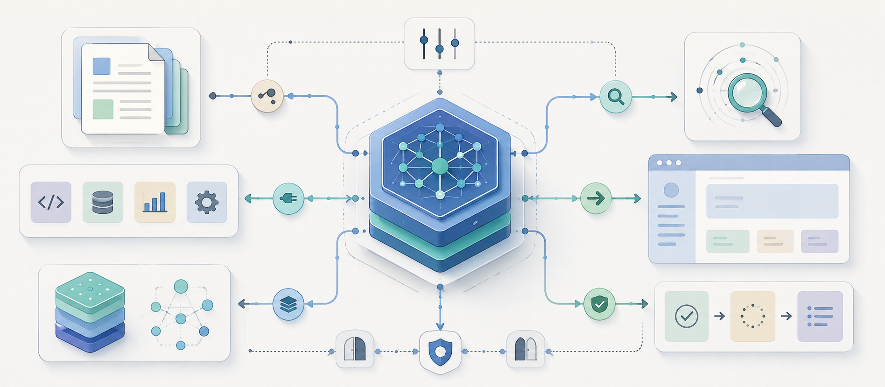
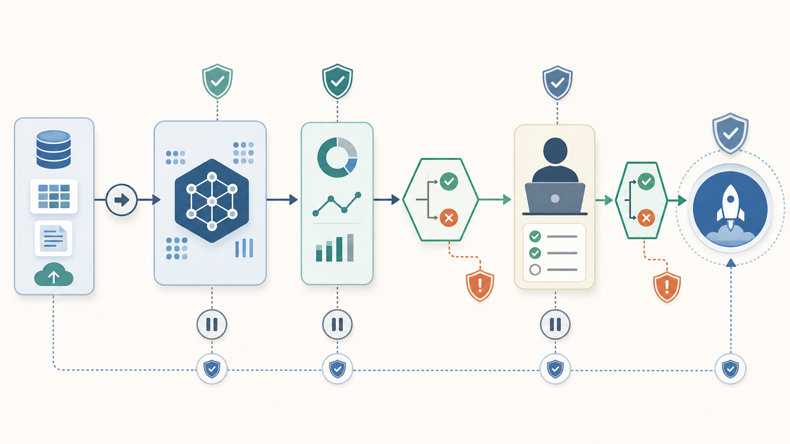

Makine öğrenmesi ve derin öğrenme yöntemleri özünde bize kısıtlı tahminler sunan modellerdir. Bu yöntemlerin asıl gücü belirli bir sistem içinde kullanıldıklarında ortaya çıkar — buna daha önce [Byte Way to Hell](#) yazısında değindik. [^1]

Bugün elimizde bundan çok daha güçlü bir araç var: büyük dil modelleri. Basit bir tahminin ötesinde fikir sunabiliyor, düşüncelerimizi sorgulayabiliyor, hatalarımızı gösterebiliyor. Peki aynı soru burada da geçerli değil mi — bu araçları tek başına mı kullanalım, yoksa bir sistem içinde mi?

Tek başına kullanıldığında büyük dil modeli metin alır, metin üretir. Güçlüdür, ama sınırlıdır. Bugün ChatGPT, Claude, Gemini gibi sistemlerin web araması yapabilmesi, dosya okuyabilmesi, kaynakları özetleyebilmesi bunun ötesine geçildiğinin göstergesi. Ve bu sefer ilginç olan şu: bu güç yalnızca büyük firmaların ya da veriyi elinde tutanların tekelinde değil. Bilgisayarına format atabilen, temel araçlarla çalışabilen ortalama bir kullanıcının erişebileceği bir alan haline geldi.

::: {.text-center}
{width=85%}
:::

Bu noktada küçük bir parantez açıp yapay zeka literatürünün tozlu raflarına bir göz atabiliriz. Bugün çok havalı terimler gibi görünen bu şeylerin, alanın çoğu uygulayıcısının pek güncel bulmadığı 1980-90'ların yapay zeka yaklaşımıyla görmezden gelinemez bir ilişkisi vardır. Burada ele aldığımız yapılar bu alanın mihenk taşı sayılan ama üzerlerinde tozların biriktiği düşünülen rasyonel ajan ve arama problemi kavramlarına, YouTube ya da Udemy'deki popüler yapay zeka eğitimlerinden çok daha yakın konumdadır. Bu kısım başlı başına bir dönemlik bir ders konusu olduğundan sadece ilişkiden bahsedip devam edeceğiz. Ama aradaki ilişkinin kuvvetini vurgulamak için son bir şeyi belirtmeliyim: bugün dillerden düşmeyen "yapay zeka ajanı" kavramındaki "ajan" tanımlaması, tozlu raflardan çıkan bir tabirdir.

Bu noktadan sonra biraz daha sezgisel tarafta kalacağız. Problem şu: bu dil modellerini nasıl daha etkili kullanabiliriz? Bir yapay zeka ajanında kaba haliyle beklediğimiz görevler aşağıdaki gibi listelenebilir:

- **Anlama ve bağlam kurma**
- **Analiz ve teşhis**
- **Problem çözme ve karar desteği**
- **Üretim ve dönüştürme**
- **Tekrarlı işleri üstlenme**
- **Araç kullanarak eyleme geçme**
- **Denetim ve güvence**
- **Koordinasyon ve süreç yönetimi**

Eskiden şirketlerde, organizasyonlarda veya bireysel çalışmalarda bu tip görevlerin çoğunu insanlar yapardı. Bir işi yapmanın onlarca farklı yöntemi bulunmaktadır. Bunların bir kısmını başlıklar halinde inceleyelim.

## Şef Bageti ile Doğaçlama

::: {.text-center}
{width=85%}
:::

Bir yönetici olduğumuzu ve farklı çalışanlara görev verdiğimizi düşünelim. İş hayatında sık karşılaştığımız iki yönetici tipi vardır: biri çalışanına alan açar, hedefi söyler ve nasıl yapacağını büyük ölçüde ona bırakır; diğeri ise her adımı tarif eder, sık sık kontrol eder ve sürecin kendi belirlediği şekilde ilerlemesini ister. İlk bakışta çoğumuza birinci yönetici daha sempatik gelir. Sonuçta kim sürekli kontrol edilmek, her adımı tarif edilmiş bir işin içinde sıkışmak ister?

Bu sezgi tamamen yanlış değildir. Bir araştırma-geliştirme mühendisine, tasarımcıya veya deneyimli bir uzmana iş verirken ona hareket alanı tanımak gerekir. Çünkü bazı işler doğası gereği keşif ister. Çalışan farklı yolları dener, bazı fikirleri eler, beklenmedik bağlantılar kurar ve işi ilerledikçe daha iyi bir çözüm yolu bulabilir. Böyle bir durumda her adımı baştan belirlemek, çalışanın bilgisini ve yaratıcılığını kullanmasını engellediği gibi iş süreçlerinin dinamik yapısını da takip edemez.

Gel gelelim her iş serbestliğe bu kadar toleranslı değildir. Hatta bazıları için bu durum doğrudan risk kaynağıdır. Kimyasal üretim tesisindeki iş güvenliği kontrollerinde, uçuş öncesi kontrol listelerinde veya ambulansta yapılan ilk müdahalede çalışanın "ben bunu biraz farklı deneyeyim" demesini istemeyiz. Bu tür işlerde adımların sırası, kontrol noktaları ve durma koşulları önceden bellidir; çünkü küçük bir ihmalin bile sonucu ağır olabilir.

Dolayısıyla mesele "çalışanı serbest bırakmak mı, sıkı yönetmek mi?" ikilemi değildir. Asıl mesele, işin doğasına uygun kontrol düzeyini belirlemektir. Bir filarmoni orkestrasında herkesin aynı anda, aynı tempoda ve aynı partisyona sadık kalarak ilerlemesini bekleriz. Buna karşılık küçük bir caz sahnesinde müzisyenlerin birbirini dinleyerek, alan açarak ve gerektiğinde doğaçlama yaparak ilerlemesi daha doğaldır. Belirsizliği yüksek, keşif gerektiren ve hata maliyeti düşük işlerde daha geniş serbestlik verilebilir. Kritik, denetlenmesi gereken veya geri alınması zor sonuçlar doğuran işlerde ise akış daha sıkı tanımlanır. İyi tasarlanmış bir sistem, hangi adımların çalışana bırakılacağını, hangi adımların prosedürle belirleneceğini ve hangi durumda sürecin duracağını açıkça tarif eder. Olmaması gereken şey, elimizdeki şef bagetiyle bir caz barındaki üçlüyü yönetmeye çalışmak; ya da tam tersine, filarmoni orkestrasından herkesin kafasına göre çalmasını beklemektir.

## Eski Defterleri Kurcalamak

Bir yöneticinin asistanını düşünelim. Göreve yeni başlayan bir asistan, yöneticinin çalışma biçimini, hangi toplantıların öncelikli olduğunu, hangi konuların ertelenebileceğini, hangi kişilere daha hızlı dönüş yapılması gerektiğini henüz bilmez. Bu nedenle aynı talimatı yerine getirse bile daha fazla soru sorar, daha fazla hata yapar veya karar vermesi gereken yerde duraksar.

Daha tecrübeli bir asistan ise yöneticisi ile ilgili, sektör ile ilgili, kurum ile ilgili bazı bilgilere sahiptir ve bu geçmişten bazı örüntüler çıkardığı için daha verimli çalışır. Yöneticinin hangi saatlerde toplantı yapmak istemediğini, hangi müşterilerin kritik olduğunu, hangi dosyaların bekleyemeyeceğini bilir. Buradaki "tecrübe", basit bir kayıt tutma işi değildir; geçmiş bilgi, bağlam sezgisi, önceliklendirme alışkanlığı ve karar verme pratiğinin birleşimidir.

Bu tecrübenin farklı katmanları vardır. Son bir haftadır üzerinde çalışılan bir işle ilgili ayrıntılar hâlâ zihninde canlıdır; bu yüzden o işle ilgili küçük görevleri hızlıca tamamlayabilir. Daha önce yapılmış ama artık aktif olmayan bir işe dönmesi gerektiğinde ise yalnızca hafızasına güvenmez; kendi notlarına, eski yazışmalara veya kurumun arşivine bakar. Masasının üzerinde de bu ayrımın izleri görülür: bazı notlar aktif işler için sürekli önündedir, bazı dosyalar kapanmıştır ama gerektiğinde tekrar açılmak üzere saklanır.

Geçmiş bilgilerin nasıl saklandığı da önemlidir. Asistan gün içinde çok sayıda not alabilir; fakat bunların büyük kısmı rutin işlerin ayrıntılarıdır. Geçmişe dönüp kontrol etmek gerektiğinde bütün notları tek tek okumak verimsiz olur. Bu yüzden konu başlıklarının, önemli kararların ve tekrar kullanılabilecek bilgilerin ayrı bir kayıt düzeninde tutulması işi kolaylaştırır.

Buradan şu ayrım çıkar: Bazı işler yalnızca açık bir talimatla yürütülebilir; bazı işler ise ön bilgi, bağlam ve tecrübe gerektirir. Sadece gelen telefonları ilgili kişiye aktaran bir asistan için sınırlı bir yönerge yeterli olabilir. Buna karşılık yöneticinin takvimini, önceliklerini ve devam eden dosyalarını düzenleyen bir asistanın geçmiş bağlama ve seçici hatırlamaya ihtiyacı vardır.

## Yetkili Bir Abi

Çalışanın kapasitesi yalnızca bilgisiyle sınırlı değildir; hangi araçlara erişebildiği de yaptığı işi değiştirir. Bir bankacılık çalışanı müşteri geçmişini görebiliyorsa daha sağlıklı değerlendirme yapabilir. Bir teknisyen ölçüm cihazlarına erişebiliyorsa arızayı tahmin etmek yerine test edebilir. Bir hukuk birimi çalışanı eski sözleşme örneklerine ve kurum içi görüşlere ulaşabiliyorsa daha tutarlı bir metin hazırlayabilir. Araçlar, çalışanı yalnızca hızlandırmaz; onun yapabileceği iş türünü genişletir.

Ancak araç erişimi aynı zamanda yetki ve risk meselesidir. Bir çağrı merkezi çalışanının müşteri bilgilerini yalnızca görüntülemesi ile hesap üzerinde işlem yapabilmesi aynı şey değildir. Bir üretim operatörünün arıza kaydı açması ile üretim hattını durdurması aynı düzeyde sonuç doğurmaz. Bu yüzden kurumlarda araçlara erişim genellikle kademeli verilir: bazı araçlar yalnızca bilgi almak içindir, bazıları kayıt oluşturur, bazıları işlem başlatır, bazıları ise ancak onayla kullanılabilir. İyi bir sistem, aracın varlığını değil, aracın hangi sınırlar içinde kullanılacağını tasarlar.

## Önce Plan

Bazı işler tek adımda yürütülebilir. Bir metni kısaltmak, bir formu belirli alanlara göre doldurmak, gelen talebi ilgili birime aktarmak veya basit bir listeyi düzenlemek için karmaşık bir plana ihtiyaç yoktur. İş açıkça tarif edilir ve kişi bu talimatı uygular.

Buna karşılık bazı işlerde önce işin kendisinin parçalanması gerekir. Bir yazılım ekibinden "bu modüldeki performans problemini çözün" istendiğinde ekip doğrudan koda müdahale etmez. Önce problemin nerede ortaya çıktığını anlamaya çalışır, ölçüm yapar, günlük kayıtlarını inceler, darboğazı belirler, olası çözümleri dener ve değişikliğin başka yerleri bozup bozmadığını kontrol eder. Burada iş, tek bir eylem değil, birbirine bağlı adımlar dizisidir.

Planlama ihtiyacı işin belirsizlik düzeyine göre artar. Eğer süreç iyi biliniyorsa sabit bir adım listesi yeterli olabilir. Fakat problem açık uçluysa plan yürütme sırasında değişebilir. İlk bakışta teknik hata gibi görünen bir sorun, veri kalitesi probleminden kaynaklanabilir. Eksik belge sanılan bir durum, aslında farklı birimlerin kullandığı kayıt formatı farkından doğabilir. Böyle durumlarda çalışan yalnızca adımları uygulamaz; gerektiğinde önceki adıma döner, yeni bilgi toplar veya işi başka bir uzmanlığa taşır.

Bu yüzden planlama yalnızca "adım listesi çıkarmak" değildir. Hangi adımların zorunlu olduğu, hangi adımların koşula bağlı olduğu, hangi durumda geri dönüleceği, hangi durumda durulacağı ve hangi durumda başka bir kişiye başvurulacağı da planın parçasıdır.

## Ekip İşi

Karmaşık işler çoğu zaman tek kişinin üzerinden tamamlanmaz. Bir rapor hazırlanırken biri veri toplar, biri analiz eder, biri metni yazar, biri de son kontrolü yapar. Bir yazılım projesinde gereksinim analizi, geliştirme, test, güvenlik incelemesi ve devreye alma farklı roller gerektirir. Burada başarı, yalnızca her kişinin kendi işini iyi yapmasına değil, işlerin birbirine nasıl bağlandığına bağlıdır.

Ekip işlerinde farklı yöntemler seçilebilir. Bazen hiyerarşik bir yapı vardır: bir koordinatör işi böler, görevleri dağıtır, sonuçları toplar ve nihai kararı verir. Bazen eş düzeyli bir yapı vardır: farklı uzmanlar aynı probleme farklı açılardan bakar ve çözüm tartışmayla oluşur. Bazen de denetleyici rol ayrıdır: bir kişi veya birim üretilen çıktıyı bağımsız biçimde kontrol eder.

Daha çok kişinin sürece katılması ise kendiliğinden daha iyi sonuç üretmez; hatta çoğu durumda ters teper. Roller belirsizse aynı iş iki kez yapılabilir, bazı işler ortada kalabilir veya karar sorumluluğu dağılıp görünmez hale gelebilir. Bu nedenle çok çalışanlı yapılarda kimin neyi üreteceği, kimin neyi kontrol edeceği, ara çıktının kime devredileceği ve nihai kararın kimde olduğu açık olmalıdır.

## Müdahale ve Kontrol Noktaları

Bazı işler çalışan ya da sistem tarafından baştan sona yürütülebilir. Hata maliyeti düşükse ve sonuç kolayca düzeltilebiliyorsa sonradan kontrol yeterli olabilir. Bir toplantı notunun düzenlenmesi, bir taslak metnin hazırlanması veya bir tablonun biçimlendirilmesi bu tür işlere örnektir. Yanlışlık varsa geri dönülür, düzeltilir ve süreç devam eder.

Fakat bazı işlerde sürecin belirli noktalarda durması gerekir. Üretim hattında ölçüm değeri tolerans dışına çıkarsa ürün bir sonraki aşamaya gönderilmez. Bankacılıkta belirli tutarın üzerindeki işlem ek onay gerektirir. Sağlıkta kritik bir bulgu görüldüğünde karar otomatik akışa bırakılmaz. Bu örneklerde insan müdahalesi sürecin dışında duran genel bir kontrol değildir; sürecin içine yerleştirilmiş güvenlik mekanizmasıdır. İyi tasarlanmış bir çalışma düzeni, yalnızca işin nasıl ilerleyeceğini değil, nerede duracağını ve hangi durumda insan kararına başvuracağını da tanımlar.

::: {.text-center}
{width=85%}
:::

## LLM Bunun Neresinde?

Bu örneklerin ortak noktası şudur: Bir işin nasıl yürütüleceği yalnızca işi yapan kişinin becerisiyle açıklanamaz. Aynı işi yapan iki kişi, içinde bulundukları ortam, erişebildikleri bilgi, kullanabildikleri araçlar, sahip oldukları yetki ve uymaları gereken kontrol noktalarına göre çok farklı biçimlerde çalışabilir. Her yiğit farklı ortamlarda, farklı ruh hallerinde, elindeki kaşığa-kaseye göre farklı şekillerde yoğurt yer. Benzer şekilde kurum içindeki bir görev de serbestlik düzeyi, geçmiş bilgiye erişim, araç kullanımı, planlama biçimi, iş bölümü ve denetim noktalarına göre bambaşka yapılara dönüşebilir.

Yazının başında yapay zekâ sistemlerinden ne beklediğimizi sormuştuk: anlaması, analiz yapması, destek olması, üretmesi, tekrarlı işleri üstlenmesi, araç kullanması, denetlemesi ve bazı süreçleri koordine etmesi. Bunların önemli bir kısmı daha önce insan çalışanlar, uzman ekipler veya kurumsal iş akışları tarafından yürütülüyordu. Bu yüzden LLM tabanlı sistemleri anlamak için önce bu işlerin nasıl örgütlendiğine bakmak gerekir.

Buradaki amaç insan çalışmasını bütünüyle açıklayan kapsamlı bir yönetim modeli kurmak değildir. İnsanların çalışma biçimleri çok daha karmaşık, bağlama duyarlı ve sosyal olarak belirlenmiş yapılardır. Ancak elimizde büyük dil modelleriyle kurulacak sistemler varsa, yukarıdaki başlıklar pratik bir tasarım çerçevesi sunar. Bir görevin ne kadar serbest bırakılacağı, hangi bilgilere erişeceği, hangi araçları kullanacağı, nasıl planlanacağı, başka bileşenlerle nasıl koordine olacağı ve nerede insan denetimine ihtiyaç duyacağı bu sistemleri tasarlarken yanıtlanması gereken temel sorulardır.

Bu nedenle akıllı bir sistem tasarlarken ilk soru "bu sistem ne kadar zeki?" olmamalıdır. Daha doğru soru şudur: Bu sistem hangi işi, hangi sınırlar içinde, hangi bilgiyle, hangi araçlarla, hangi planlama biçimiyle ve hangi denetim düzeniyle yürütecek? LLM orkestrasyonu tam olarak bu sorulara verilen teknik ve mimari cevaptır.

[^1]: Bu yazı daha eklenmedi ivedi şekilde o da eklenecek.
