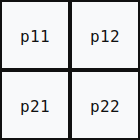
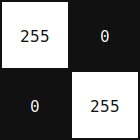

FRQI (Flexible Representation of Quantum Images), klasik piksel tabanlı görüntüleri kuantum durumlarına kodlamak için geliştirilmiş uygulama-özgü bir [kuantum veri kodlama](art-quantum-data-encoding.md) yöntemidir. Kübitlerin süperpozisyon durumlarını kullanarak $2^n \times 2^n$ boyutundaki bir görüntüyü $2n + 1$ kübit ile temsil etmeye çalışır. $2n$ kübit konum bilgisini, $1$ kübit renk/yoğunluk bilgisini taşır.

## 2×2'lik Bir Gösterim

İşlemimize pikselleri kübitler ile temsil ederek başlayalım. Elimizde dört piksellik bir görsel olsun:

::: {style="auto; text-align: center;"}
{#fig-symbolic width=140px}
:::

Bu dört pikseli klasik olarak ayrı ayrı tutmak yerine, iki konum kübiti ile dört farklı konumu aynı anda temsil ederiz:

$$ |00\rangle,\ |01\rangle,\ |10\rangle,\ |11\rangle $$

Bu durumları piksellerle şu şekilde eşleyelim:

$$ p_{11}\rightarrow |00\rangle,\quad p_{12}\rightarrow |01\rangle,\quad p_{21}\rightarrow |10\rangle,\quad p_{22}\rightarrow |11\rangle $$

Başlangıçta iki konum kübiti $|00\rangle$ durumundadır. Bu iki kübite Hadamard kapısı uygulandığında dört konumun eşit süperpozisyonu elde edilir:

$$ |00\rangle \xrightarrow{H\otimes H} \frac{1}{2}\left(|00\rangle + |01\rangle + |10\rangle + |11\rangle\right) $$

Bu ifade, görüntüdeki dört piksel konumunun aynı kuantum durumunda birlikte temsil edildiğini gösterir. Ancak bu aşamada yalnızca piksel konumları oluşturulmuştur; her konuma ait piksel yoğunluğu henüz kodlanmamıştır.

Piksel yoğunluklarını doğrudan konum durumlarının genliklerine yazmak mümkündür. Bu durumda bir $2\times2$ görüntü

$$ |I\rangle = a_0|00\rangle + a_1|01\rangle + a_2|10\rangle + a_3|11\rangle $$

biçiminde temsil edilebilir. Fakat bir kuantum durumunda genliklerin normalize edilmesi gerektiğinden, $a_i$ değerleri doğrudan piksel yoğunluklarını değil, görüntü içindeki göreli yoğunluk dağılımını ifade eder. Örneğin

$$ [255,0,0,0] \quad \text{ve} \quad [128,0,0,0] $$

$$ [128,64,32,16] \quad \text{ve} \quad [64,32,16,8] $$

görüntüleri doğrudan genlik kodlamasında normalizasyon sonrasında aynı duruma karşılık gelir:

$$ |I\rangle = |00\rangle $$

Bu, görüntü işlemede önemli bir sınırlamadır. İki görüntünün parlaklık düzeyi farklı olduğu halde, yalnızca parlaklığın konumlara göre dağılımı aynıysa bu fark temsil içinde kaybolabilir. Oysa amaç, bir pikselin yalnızca diğer piksellere göre ağırlığını değil, kendi gri-seviye değerini de konumuyla birlikte koruyabilmektir.

FRQI fikri bu noktada ortaya çıkar. FRQI, konum durumlarının genliklerini piksel değerleriyle değiştirmek yerine, konum kübitlerini dört piksel adresini temsil eden eşit süperpozisyon durumunda bırakır. Piksel yoğunluklarını ise ek bir renk kübitinin, her konuma bağlı olarak belirlenen dönme açısında kodlar. Böylece aynı konumda bulunan $128$ ve $255$ değerli iki piksel farklı açı değerleriyle temsil edilir; yalnızca göreli dağılım değil, piksel yoğunluğundaki fark da kuantum durumuna işlenmiş olur.

Bu yaklaşımın karşılığında FRQI bir ek renk kübiti gerektirir ve yoğunlukların ölçüm yoluyla elde edilmesi yine olasılıksal bir süreçtir. Dolayısıyla FRQI, doğrudan genlik kodlamasının her bakımdan üstün bir alternatifi değil; konum bilgisini korurken piksel yoğunluğunu ayrıca temsil etmeyi amaçlayan görüntüye özgü bir kodlama tasarımıdır.

## Renk Kübiti ve Açı Kodlaması

FRQI'de yoğunluk bilgisi için ek bir renk kübiti kullanılır. Böylece sistem toplam üç kübitten oluşur: iki konum kübiti ve bir renk kübiti.

Bir piksel değeri $p_i \in [0,255]$ için dönme açısı şu şekilde tanımlanır:

$$ \theta_i = \frac{p_i}{255}\cdot \frac{\pi}{2} $$

Buna göre siyah piksel ($p_i = 0$) için $\theta_i = 0$, beyaz piksel ($p_i = 255$) için $\theta_i = \frac{\pi}{2}$ olur. Her pikselin renk kübiti bu açıya karşılık gelen duruma döndürülür:

$$ |\theta_i\rangle = \cos(\theta_i)|0\rangle + \sin(\theta_i)|1\rangle $$

Bu kısaltmayı aklınızda tutun: metnin geri kalanında $|\theta_i\rangle$ her yerde bu açılımı ifade eder.

Renk kübitini başlangıçta her pikselin yanına eklenmiş boş bir renk alanı gibi düşünebiliriz. İki konum kübiti dört piksel adresini oluştururken, renk kübiti başlangıçta bu adreslerin her birinde $|0\rangle$ durumundadır:

$$ \frac{1}{2} \left( |0\rangle|00\rangle+ |0\rangle|01\rangle+ |0\rangle|10\rangle+ |0\rangle|11\rangle \right) $$

Burada ikinci kısım piksel adresini, ilk kısım ise o adrese ait renk bilgisini gösterecektir. Başlangıçta bütün renk durumları aynıdır; yani henüz hiçbir pikselin yoğunluğu yazılmamıştır.

## Kontrollü Dönme İşlemleri

Her pikselin yoğunluğunu yazmak için renk kübitine kontrollü dönme işlemleri uygulanır. Kullanılan kapı $R_y$ dönmesidir ve tanımı şöyledir:

$$ R_y(\alpha)|0\rangle = \cos\left(\frac{\alpha}{2}\right)|0\rangle + \sin\left(\frac{\alpha}{2}\right)|1\rangle $$

Renk kübitinin $|\theta_i\rangle = \cos(\theta_i)|0\rangle + \sin(\theta_i)|1\rangle$ durumuna ulaşması için $\alpha/2 = \theta_i$ olması gerekir, yani $\alpha = 2\theta_i$. Bu yüzden devrede $R_y(2\theta_i)$ kullanılır.

Örneğin ilk piksel $|00\rangle$ adresinde bulunuyorsa, yalnızca konum kübitleri $|00\rangle$ durumundayken çalışan kontrollü bir dönme kapısı uygulanır:

$$ |0\rangle|00\rangle \longrightarrow |\theta_0\rangle|00\rangle $$

Standart kontrollü kapılar yalnızca kontrol kübiti $|1\rangle$ olduğunda etkinleştiğinden, $|00\rangle$ gibi sıfır içeren adresleri hedeflemek için ek bir adım gerekir. İlgili konum kübitlerinin $|0\rangle$ bitleri geçici olarak $X$ kapısıyla $|1\rangle$'e çevrilir, kontrollü dönme uygulanır, ardından geri çevrilir:

$$ X \otimes X \longrightarrow \text{kontrollü } R_y(2\theta_0) \longrightarrow X \otimes X $$

Aynı işlem diğer adresler için de tekrarlanır. Bütün işlemler tamamlandığında durum şu hale gelir:

$$ |I\rangle = \frac{1}{2} \left( |\theta_0\rangle|00\rangle+ |\theta_1\rangle|01\rangle+ |\theta_2\rangle|10\rangle+ |\theta_3\rangle|11\rangle \right) $$

Konum kübitleri hangi pikselden söz edildiğini, renk kübiti ise o pikselin yoğunluğunu belirtir. Kontrollü dönme kapısı, her yoğunluk değerinin yalnızca kendisine ait piksel adresine yazılmasını sağlar.

## Örnek: Köşegen Beyaz Görüntü

Elimizde şu $2\times2$ gri tonlu görüntü olsun:

::: {style="text-align: center;"}
{#fig-bw width=140px fig-align="center"}
:::

Piksel değerleri ve karşılık gelen açılar:

$$ [p_0,p_1,p_2,p_3] = [255,0,0,255] \qquad \theta_0=\frac{\pi}{2},\quad \theta_1=0,\quad \theta_2=0,\quad \theta_3=\frac{\pi}{2} $$

Dolayısıyla FRQI durumu:

$$ |I\rangle = \frac{1}{2} \left( |\theta_0\rangle|00\rangle + |\theta_1\rangle|01\rangle + |\theta_2\rangle|10\rangle + |\theta_3\rangle|11\rangle \right) $$

Beyaz piksellere ($\theta = \pi/2$) karşılık gelen konumlarda renk kübiti $|1\rangle$ yönüne, siyah piksellere ($\theta = 0$) karşılık gelen konumlarda ise $|0\rangle$ yönüne yakın durur.

Bu yapı FRQI'nin temel fikrini verir: konum bilgisi süperpozisyonla, yoğunluk bilgisi ise açı kodlamasıyla temsil edilir.

## Genel Durum

2×2 örneği $n = 1$ özel durumuna karşılık gelir. Genel olarak $2^n \times 2^n$ boyutunda, yani $2^{2n}$ piksellik bir görüntü için $2n$ konum kübiti kullanılır. Konum indisi $i \in {0, 1, \ldots, 2^{2n}-1}$ olmak üzere FRQI durumu şöyle yazılır:

$$ |I\rangle = \frac{1}{2^n} \sum_{i=0}^{2^{2n}-1} |\theta_i\rangle \otimes |i\rangle $$

Burada $|i\rangle$ konum kübitlerinin hesaplama tabanı durumunu, $|\theta_i\rangle = \cos(\theta_i)|0\rangle + \sin(\theta_i)|1\rangle$ ise o konumdaki renk kübitinin durumunu gösterir. $1/2^n$ çarpanı normalizasyondan gelir: $2^{2n}$ terim eşit genlikle toplandığında her birinin katkısı $1/2^n$ olmak zorundadır.

State preparation için konum kübitlerine $H^{\otimes 2n}$ uygulanır, ardından her piksel adresi için sırasıyla kontrollü $R_y(2\theta_i)$ kapıları çalıştırılır. Her $R_y$ uygulaması bir önceki bölümde gösterilen $X$ kapısı numarasını gerektirebilir; bu işlem $2^{2n}$ kez tekrarlanır.

## Kübit Maliyeti

::: {.compact-table .table-left}

| Kaynak | Miktar |
|:--|:--|
| Konum kübitleri | $2n$ |
| Renk kübiti | $1$ |
| Toplam | $2n + 1$ |

: FRQI kübit maliyeti {#tbl-frqi-qubit}

:::

$2^n \times 2^n = 2^{2n}$ piksel yalnızca $2n + 1$ kübit ile temsil edilir. Depolama açısından bu logaritmik bir kazanım gibi görünür; ancak state preparation derinliği $O(2^{2n})$ mertebesindedir — piksel sayısıyla doğrusal büyür. Dolayısıyla kübit sayısındaki kazanım, devre karmaşıklığına yansımaz.

## Güçlü ve Zayıf Yanlar

**Avantajlar**

- Konum kübitleri süperpozisyonda tutulduğundan, bir kuantum kapısı tüm piksel konumlarına aynı anda uygulanabilir. Bu yapı kuantum görüntü işleme (QIP) algoritmalarıyla doğrudan uyumludur.
- Renk kübiti üzerindeki $R_y$ dönmeleri piksel yoğunluğunu açı olarak taşıdığından, yoğunluk manipülasyonu devre içinde yapılabilir.
- Gösterim $2n + 1$ kübitle kapalıdır; görüntü boyutu büyüdükçe kübit sayısı yalnızca logaritmik artar.

**Sınırlılıklar**

- State preparation $O(2^{2n})$ kapı gerektirir. $n$ büyüdükçe bu maliyet hızla artarak pratik uygulanabilirliği kısıtlar.
- Piksel yoğunluğu renk kübitinin dönme açısına kodlanmıştır. Ölçüm yoluyla geri okumak dolaylı ve gürültüye duyarlıdır; tek ölçümden kesin değer elde edilemez, istatistiksel tahmin gerekir.
- Renk bilgisi tek kübitte taşındığından yalnızca gri tonlama görüntüleri doğrudan temsil edilir. Çok kanallı (RGB) veya yüksek bit derinlikli görüntüler için yapının genişletilmesi gerekir.

## Notlar

- Le et al. (2011) tarafından önerilmiştir; QIP literatüründe temel referans yöntemdir.
- Ölçüm yapmadan piksel değerlerine doğrudan erişilemez; bu durum, görüntü işleme algoritmalarının ölçüm öncesinde devre içinde tasarlanmasını zorunlu kılar.
- FRQI ailesi sonraki çalışmalarda NEQR, MCQI, QSIG gibi yöntemlerle genişletilmiştir.
