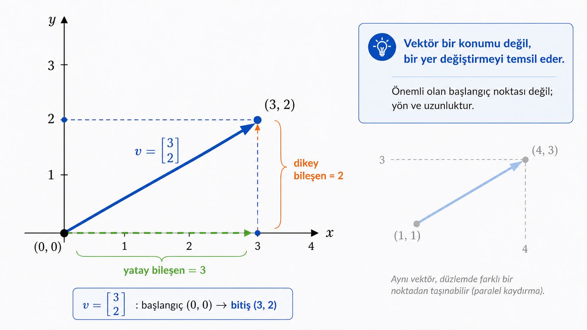
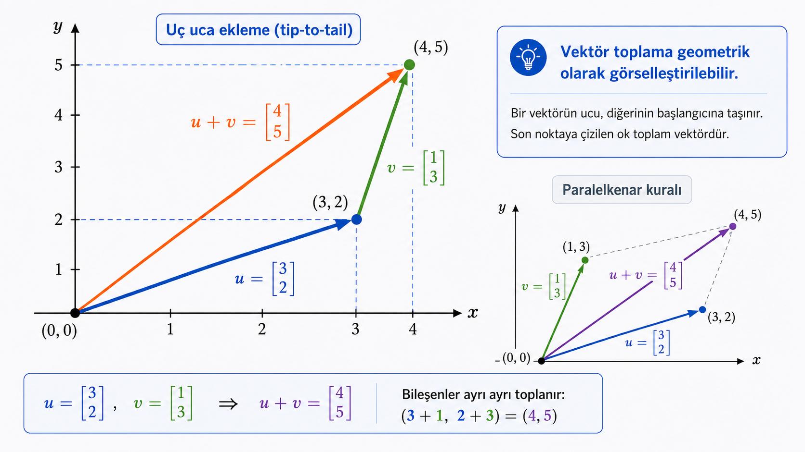
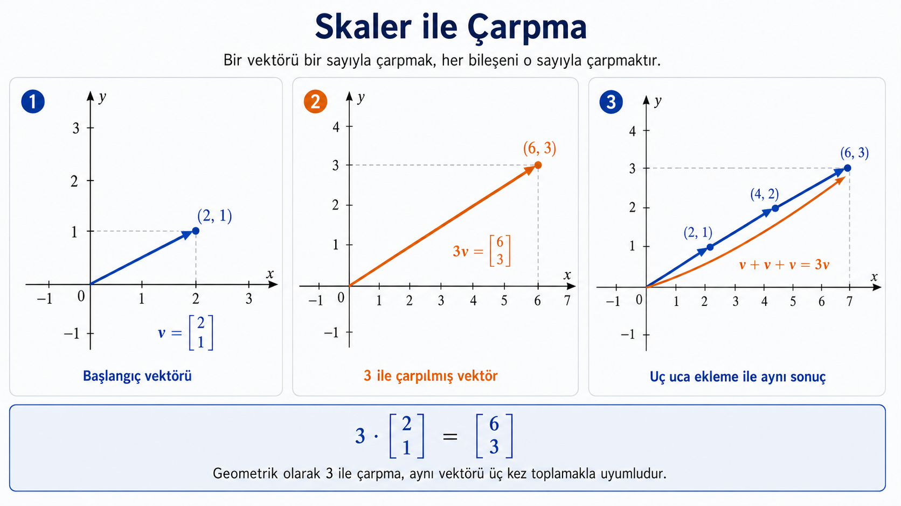
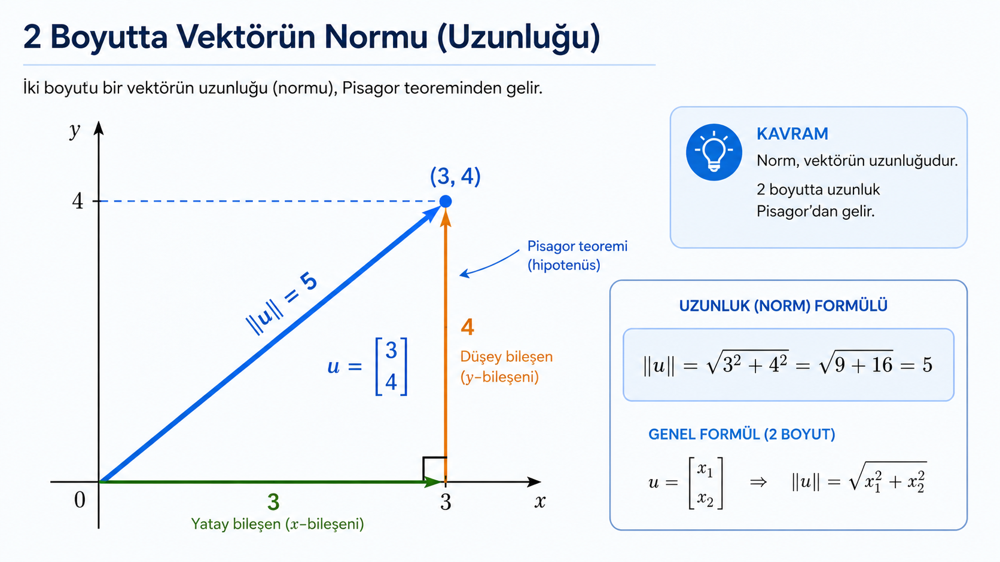

## Bu Derste Ne Kuruyoruz?

- Birden fazla sayıyı tek matematiksel nesne olarak yazacağız
- Bu nesneye **vektör** diyeceğiz
- Vektörlerde toplama, skaler çarpma ve uzunluk fikrini kuracağız
- Çok bileşenli nicelikleri düzenli biçimde temsil etmeyi öğreneceğiz

::: {.notes}
Bu dersin odağı lineer cebirdir; kuantum hesaplamaya girmeden önce gerekli temel yapı taşları burada kurulur. Vektörü önce sayıların düzenli bir listesi olarak tanıtıyoruz; ardından bu listeye geometrik bir anlam (yön ve büyüklük) ve cebirsel bir işlem kümesi (toplama, skaler çarpma, norm) kazandırıyoruz. Bu üç bakış açısı — liste, ok, işlem — aynı nesnenin farklı yüzleridir ve ders boyunca birbirini tamamlayacak şekilde kullanılacaktır.

Dersin sonunda vektörleri rahatça yazabilmek, boyutlarını ve uzunluklarını hesaplayabilmek, iki vektörü toplayıp skalerle çarpabilmek hedeflenir. Bu beceriler ileride matris-vektör çarpımı ve kuantum durum vektörleri için doğrudan kullanılacaktır.
:::

---

## Neden Vektör?

Bazı bilgileri tek sayı ile anlatmak yeterli değildir.

Bir noktanın düzlemdeki konumu:

$$
(3,2)
$$

Bir ürünün üç özelliği:

$$
\text{fiyat}=40,\qquad \text{ağırlık}=2,\qquad \text{stok}=15
$$

Bu değerleri tek nesne olarak yazabiliriz:

$$
v=
\begin{bmatrix}
40\\2\\15
\end{bmatrix}
$$

::: {.notes}
Vektörün temel motivasyonu, birbiriyle ilişkili birden çok sayıyı tek bir matematiksel nesne içinde tutmaktır. Bir noktanın konumu için $x$ ve $y$ koordinatlarını ayrı ayrı takip etmek yerine bunları $(3,2)$ gibi tek bir çift olarak yazarız; ürün örneğinde de fiyat, ağırlık ve stok üç ayrı değişken yerine tek bir sütun içinde toplanır.

Bu birleştirme kozmetik değildir: sayıları tek nesne haline getirdiğimizde onlar üzerinde tanımlı işlemler (toplama, ölçekleme, uzunluk hesabı) de tek adımda tüm bileşenlere birden uygulanabilir hale gelir. Bu, ilerleyen bölümlerdeki bileşen bazlı toplama ve skaler çarpma işlemlerinin neden doğal göründüğünü açıklar.
:::

---

## Vektör: Sıralı Sayılar

Bir **vektör**, sıralı sayılardan oluşan bir nesnedir.

$$
u=
\begin{bmatrix}
2\\
-1\\
4
\end{bmatrix}
$$

Bileşenler:

$$
u_1=2,\qquad u_2=-1,\qquad u_3=4
$$

Sıra önemlidir:

$$
\begin{bmatrix}2\\-1\\4\end{bmatrix}
\neq
\begin{bmatrix}-1\\2\\4\end{bmatrix}
$$

::: {.notes}
Buradaki kritik nokta "sıralı" kelimesidir. Vektör, kümeden farklı olarak elemanların hangi sırada durduğunu da bilgi olarak taşır; her bileşenin kendi konumuna bağlı bir kimliği vardır. $u_1=2$, $u_2=-1$, $u_3=4$ gösteriminde alt indis, o değerin vektördeki yerini belirtir ve bu yer değiştirilemez.

Bu nedenle $\begin{bmatrix}2\\-1\\4\end{bmatrix}$ ile $\begin{bmatrix}-1\\2\\4\end{bmatrix}$ aynı üç sayıdan oluşsa da farklı vektörlerdir — tıpkı aynı üç kelimenin farklı sırayla farklı bir cümle kurması gibi. Bu ayrım, ilerleyen derslerde matris çarpımı gibi sıraya duyarlı işlemleri anlamak için de temel oluşturur.
:::

---

## Tanıtım: Bilgiyi Sıralı Yazmak

:::: {.columns}
::: {.column width="50%"}
| Alan | Değer |
|---|---|
| Ad | Oktay |
| Soyad | Cesur |
| Görev | Eğitmen |
:::

::: {.column width="50%"}
| Alan | Değer |
|---|---|
| Ad | Eğitmen |
| Soyad | Oktay |
| Görev | Cesur |
:::
::::

::: {.notes}
Sıralamanın anlamını gündelik bir örnekle pekiştirebiliriz. Sol tablo ile sağ tablo aynı üç değeri ("Oktay", "Cesur", "Eğitmen") içerir; fark yalnızca hangi değerin hangi alana karşılık geldiğidir. Sol tabloda "Ad → Oktay" iken sağ tabloda "Ad → Eğitmen" olmuştur — anlam tamamen değişmiştir, oysa kullanılan sayı/kelime kümesi aynıdır.

Vektörde de durum benzerdir: bileşenin değeri kadar, o değerin hangi konumda (hangi $u_i$ olarak) durduğu da bilginin bir parçasıdır. Sırayı değiştirmek, farklı bir anlamı kodlamaktır.
:::

---

## Boyut

Bir vektörde kaç bileşen varsa, vektörün **boyutu** odur.

$$
\begin{bmatrix}
3\\-2
\end{bmatrix}
\quad \text{2 boyutlu}
$$

$$
\begin{bmatrix}
1\\0\\4\\-3
\end{bmatrix}
\quad \text{4 boyutlu}
$$

Genel gösterim:

$$
v=
\begin{bmatrix}
v_1\\v_2\\ \vdots \\ v_n
\end{bmatrix}
\in \mathbb{R}^n
$$

::: {.notes}
Boyut, bir vektörün kaç bileşenden oluştuğunu ifade eder ve bu sayı, vektörün ait olduğu uzayı belirler. İki bileşenli bir vektör düzlemi ($\mathbb{R}^2$), dört bileşenli bir vektör ise dört boyutlu uzayı ($\mathbb{R}^4$) temsil eder. Burada "boyut" geometrik bir sezgiye (2B, 3B uzay) karşılık gelir, ama tanım tamamen cebirsel: kaç sayı yan yana yazıldığı.

$\mathbb{R}^n$ gösterimi, $n$ bileşenli gerçek sayı vektörlerinin oluşturduğu kümeyi kısaca ifade eder. $v \in \mathbb{R}^n$ yazdığımızda, $v$'nin $n$ tane gerçek sayıdan oluşan sıralı bir liste olduğunu söylemiş oluruz. Bu gösterim ilerleyen derslerde matrislerin boyutlarını ve fonksiyonların hangi uzaydan hangi uzaya gittiğini ifade etmek için sürekli kullanılacaktır.
:::

---

## Satır ve Sütun Vektörü

Aynı değerler satır veya sütun olarak yazılabilir.

Satır vektörü:

$$
\begin{bmatrix} 2 & -1 & 4 \end{bmatrix}
$$

Sütun vektörü:

$$
\begin{bmatrix}
2\\
-1\\
4
\end{bmatrix}
$$

Bu derste işlemleri çoğunlukla **sütun vektörleri** ile göstereceğiz.

::: {.notes}
Satır ve sütun vektörü, aynı bileşenlerin farklı yönde dizilmesinden ibarettir; taşıdıkları bilgi aynıdır. Ancak matris cebirinde bu ikisi birbirinin yerine geçmez — bir matrisle çarpılabilmesi için vektörün satır mı sütun mu olduğu, çarpımın tanımlı olup olmadığını belirler.

Bu derste ve ilerleyen konularda işlemleri çoğunlukla sütun vektörleri ile göstereceğiz; bunun nedeni, kuantum hesaplamada durum vektörlerinin standart olarak sütun biçiminde ($|\psi\rangle$ ket gösterimi) yazılması ve matris-vektör çarpımının da bu düzende tanımlanmasıdır. Şimdiden bu alışkanlığı kurmak, sonraki derslerde gösterim karmaşasını önler.
:::

---

## Geometrik Yorum

İki boyutlu bir vektör düzlemde bir ok olarak düşünülebilir.

$$
v=
\begin{bmatrix}
3\\
2
\end{bmatrix}
$$

Bu vektör:

- Başlangıç noktası: $(0,0)$
- Bitiş noktası: $(3,2)$
- Yatay bileşen: 3
- Dikey bileşen: 2

::: {.notes}
Vektörün sayı listesi olarak tanımı cebirsel işlemler için yeterlidir, ama sezgi kazanmak için geometrik yorum önemlidir. İki boyutlu bir vektör, düzlemde orijinden başlayan ve belirli bir noktaya uzanan bir ok olarak düşünülebilir; $v=\begin{bmatrix}3\\2\end{bmatrix}$ vektörü $(0,0)$ noktasından $(3,2)$ noktasına giden oktur.

En doğru yorum "yer değiştirme"dir: vektör bir konumu değil, bir konumdan diğerine gitmek için gereken yatay ve dikey adımı temsil eder. Bu yüzden aynı vektör düzlemin herhangi bir noktasına taşınabilir — önemli olan başlangıç ve bitiş noktaları değil, aralarındaki yön ve uzaklıktır. Küçük bir eksen üzerinde ok çizmek, uzun bir işlem yapmadan bu sezgiyi pekiştirir.
:::

---

::: {style="auto; text-align: center;"}
{#vektor-tanim width=900px}
:::

---

## Örnek: Eğitime Katılan Gruplar

Bir eğitime 4 grup halinde katılım var.

Sabah katılımcı sayıları:

| Grup | 1 | 2 | 3 | 4 |
|---|---|---|---|---|
| Sabah | 12 | 8 | 15 | 5 |

Öğleden sonra her gruba yeni katılımcılar ekleniyor:

| Grup | 1 | 2 | 3 | 4 |
|---|---|---|---|---|
| Eklenen | 3 | 6 | 2 | 4 |

Soru: Her grubun gün sonundaki toplam katılımcı sayısı nedir?

$$
12+3=15,\qquad 8+6=14,\qquad 15+2=17,\qquad 5+4=9
$$

::: {.notes}
Bu, henüz vektör dili kullanmadan kurulan sıradan bir toplama problemidir: dört grubun sabah sayıları ile öğleden sonra eklenen sayıları grup grup toplanır. Grup 1 için $12+3=15$, Grup 2 için $8+6=14$, Grup 3 için $15+2=17$, Grup 4 için $5+4=9$ kişiye ulaşılır.

Dikkat edilmesi gereken nokta şudur: her grup kendi sayısıyla toplanmıştır — Grup 1'in sabah sayısı Grup 3'ün öğleden sonra eklenenleriyle karıştırılmamıştır. Bu "eşleşen satırların kendi aralarında toplanması" fikri, az sonra vektör toplamanın tam olarak ne anlama geldiğini gösterecektir.
:::

---

## Aynı Problemi Vektörle İfade Etmek

:::: {.columns}
::: {.column width="50%"}
Sabah katılımcı sayılarını bir vektör olarak yazalım:

$$
g=
\begin{bmatrix}
12\\8\\15\\5
\end{bmatrix}
$$

Öğleden sonra eklenen katılımcıları da bir vektör olarak yazalım:

$$
e=
\begin{bmatrix}
3\\6\\2\\4
\end{bmatrix}
$$
:::

::: {.column width="50%"}

Gün sonu toplam:

$$
g+e=
\begin{bmatrix}
12+3\\8+6\\15+2\\5+4
\end{bmatrix}
=
\begin{bmatrix}
15\\14\\17\\9
\end{bmatrix}
$$

:::
::::

::: {.notes}
Az önce tablo üzerinde tek tek yaptığımız dört toplama işlemi, aslında tek bir vektör toplamasıdır. $g$ vektörünün her bileşeni bir grubun sabah sayısını, $e$ vektörünün her bileşeni aynı grubun öğleden sonra eklenen sayısını tutar; sıra sabit tutulduğu için birinci bileşen hep Grup 1'e, dördüncü bileşen hep Grup 4'e karşılık gelir.

$g+e$ işlemi, önceki tabloda yaptığımız dört ayrı toplamayı ($12+3$, $8+6$, $15+2$, $5+4$) tek bir ifade altında toplar. Burada vektör, dört ayrı sayıyı takip etmek yerine tek bir nesneyi takip etmemizi sağlar; toplama kuralı da tablo üzerinde zaten yaptığımız şeyin resmî adıdır: bileşenler kendi hizalarındaki bileşenlerle toplanır.
:::

---

## Vektör Toplamanın Geometrik Yorumu

Grup örneği 4 boyutlu olduğu için çizilemez; ama aynı toplama kuralı 2 boyutta görselleştirilebilir.

$$
u=
\begin{bmatrix}
3\\2
\end{bmatrix},
\qquad
v=
\begin{bmatrix}
1\\3
\end{bmatrix},
\qquad
u+v=
\begin{bmatrix}
4\\5
\end{bmatrix}
$$

- $u$ okunu orijinden çiz
- $v$ okunun başlangıcını $u$'nun ucuna taşı
- Orijinden $v$'nin yeni ucuna çizilen ok, $u+v$'dir

::: {.notes}
Bileşen bazlı toplama, geometride "uç uca ekleme" (tip-to-tail) kuralıyla karşılık bulur. Önce $u$ okunu orijinden başlatarak çizeriz; ardından $v$ okunu, kendi yönünü ve uzunluğunu koruyarak $u$'nun bitiş noktasından başlatırız. Orijinden bu son noktaya çizilen yeni ok, toplam vektör $u+v$'yi verir. Sayısal örnekte $u=\begin{bmatrix}3\\2\end{bmatrix}$ okunun ucundan $v=\begin{bmatrix}1\\3\end{bmatrix}$ oku başlatılır ve varılan nokta $(4,5)$, yani $u+v=\begin{bmatrix}4\\5\end{bmatrix}$ olur.

Aynı sonuca "paralelkenar kuralı" ile de ulaşılabilir: $u$ ve $v$ okları aynı başlangıç noktasından çizilip bir paralelkenarın iki kenarı olarak düşünülürse, köşegen $u+v$'yi verir. İki yöntem de aynı cebirsel işlemin — bileşenlerin ayrı ayrı toplanmasının — farklı görsel anlatımlarıdır.

Grup örneğindeki $4$ boyutlu vektörler için böyle bir ok çizmek mümkün değildir, çünkü görsel sezgimiz $2$ ve $3$ boyutla sınırlıdır. Ancak toplama kuralı boyuttan bağımsız aynı kalır: kaç boyutlu olursa olsun, vektör toplama her zaman bileşenlerin kendi aralarında toplanmasıdır. Geometrik yorum bir sezgi aracıdır; cebirsel tanım ise her boyutta geçerli olan asıl kuraldır.
:::

---

::: {style="auto; text-align: center;"}
{#vektor-tanim width=900px}
:::

---

## Standart Baz Vektörleri

İki boyutta standart baz vektörleri:

$$
e_1=
\begin{bmatrix}
1\\0
\end{bmatrix},
\qquad
e_2=
\begin{bmatrix}
0\\1
\end{bmatrix}
$$

Yorum:

- $e_1$: yatay yönde bir birim
- $e_2$: dikey yönde bir birim

Her iki boyutlu vektör bu iki temel vektörle yazılabilir.

::: {.notes}
Standart baz vektörleri, koordinat sisteminin temel yönlerini temsil eden en basit birim vektörlerdir: $e_1$ tam olarak yatay eksende bir birim, $e_2$ tam olarak dikey eksende bir birim ilerlemeyi ifade eder. Her ikisi de uzunluğu $1$ olan vektörlerdir ve birbirine diktir.

Bu vektörlerin önemi, herhangi bir iki boyutlu vektörü ifade etmek için bir "alfabe" görevi görmeleridir — az sonra göreceğimiz gibi, düzlemdeki her nokta $e_1$ ve $e_2$'nin uygun katlarının toplamı olarak yazılabilir. İlerleyen derslerde bir matrisin ne yaptığını anlamanın en pratik yolu, o matrisin $e_1$ ve $e_2$ baz vektörlerini nereye taşıdığına bakmak olacaktır; bu yüzden baz vektörü fikrini burada sağlam kurmak önemlidir.
:::

---

## Baz Vektörleriyle Yazmak

$$
\begin{bmatrix}
a\\
b
\end{bmatrix}
=
a
\begin{bmatrix}
1\\0
\end{bmatrix}
+
b
\begin{bmatrix}
0\\1
\end{bmatrix}
$$

Örnek:

$$
\begin{bmatrix}
3\\
-2
\end{bmatrix}
=
3e_1-2e_2
$$

Yani:

$$
\begin{bmatrix}
3\\
-2
\end{bmatrix}
=
3
\begin{bmatrix}
1\\0
\end{bmatrix}
-2
\begin{bmatrix}
0\\1
\end{bmatrix}
$$

::: {.notes}
Herhangi bir vektör, baz vektörleri cinsinden yazılabilir. $\begin{bmatrix}a\\b\end{bmatrix}=a\,e_1+b\,e_2$ ifadesi, vektörün her bileşeninin ilgili baz vektörünün katsayısı olduğunu söyler: $a$ değeri "ne kadar $e_1$ yönünde", $b$ değeri "ne kadar $e_2$ yönünde" gidileceğini belirtir.

Sayısal örnekte $\begin{bmatrix}3\\-2\end{bmatrix}=3e_1-2e_2$ olması, bu vektörün yatayda $3$ birim ileri, dikeyde $2$ birim geri gittiğini ifade eder. Burada dikkat edilmesi gereken nokta, bu ifadenin skaler çarpma ($3e_1$, $-2e_2$) ile toplamanın ($+$) birlikte kullanılmasıdır — bu bileşim, az sonra adı konacak olan **lineer birleşim** kavramına doğrudan köprü kurar.
:::

---

## Vektör Toplama

Aynı boyutlu vektörler bileşen bileşen toplanır.

$$
u=
\begin{bmatrix}
2\\
-1\\
4
\end{bmatrix},
\qquad
v=
\begin{bmatrix}
3\\
5\\
-2
\end{bmatrix}
$$

$$
u+v=
\begin{bmatrix}
2+3\\
-1+5\\
4+(-2)
\end{bmatrix}
=
\begin{bmatrix}
5\\
4\\
2
\end{bmatrix}
$$

::: {.notes}
Vektör toplama, aynı boyutlu iki vektörün karşılıklı bileşenlerinin ayrı ayrı toplanmasıyla tanımlanır — yani $u+v$'nin birinci bileşeni $u$ ile $v$'nin birinci bileşenlerinin toplamı, ikinci bileşeni ikinci bileşenlerinin toplamıdır ve bu böyle devam eder. Örnekte $u=\begin{bmatrix}2\\-1\\4\end{bmatrix}$ ve $v=\begin{bmatrix}3\\5\\-2\end{bmatrix}$ toplandığında, her satır kendi hizasındaki satırla eşleşir: $2+3$, $-1+5$, $4+(-2)$.

Bu işlem geometrik olarak da yorumlanabilir: $u$ okunu çizdikten sonra $v$ okunu $u$'nun ucundan başlatırsak, elde edilen yeni ok $u+v$'yi verir. Ancak bileşen bazlı hesabı sağlam kurmak, geometrik sezgiden daha önceliklidir.
:::

---

## Toplama İçin Boyut Uyumu

Şu işlem tanımlıdır:

$$
\begin{bmatrix}
1\\2\\3
\end{bmatrix}
+
\begin{bmatrix}
4\\5\\6
\end{bmatrix}
=
\begin{bmatrix}
5\\7\\9
\end{bmatrix}
$$

Şu işlem tanımlı değildir:

$$
\begin{bmatrix}
1\\2\\3
\end{bmatrix}
+
\begin{bmatrix}
4\\5
\end{bmatrix}
$$

Çünkü bileşenler eşleşmez.

::: {.callout-warning}
## Dikkat

Vektör toplama yalnızca aynı boyutlu vektörler arasında yapılır.
:::

::: {.notes}
Bileşen bazlı toplama tanımı gereği, işlemin yapılabilmesi için iki vektörün de aynı sayıda bileşene sahip olması gerekir; aksi halde hangi bileşenin hangisiyle eşleşeceği belirsiz kalır. Üç bileşenli bir vektörle iki bileşenli bir vektörü toplamaya çalışmak, eşleşmeyen bir satırı ortada bırakır — bu nedenle işlem tanımsızdır, hatalı değil, kavramsal olarak anlamsızdır.

Bu kısıt ileride matris toplamada ve matris-vektör çarpımında da aynı biçimde karşımıza çıkacaktır: boyut uyumu, lineer cebirde işlemlerin tanımlı olup olmadığını belirleyen temel kontroldür.
:::

---

## Skaler ile Çarpma

Bir vektörü bir sayıyla çarpmak, her bileşeni o sayıyla çarpmaktır.

$$
3
\begin{bmatrix}
2\\
-1\\
4
\end{bmatrix}
=
\begin{bmatrix}
3\cdot2\\
3\cdot(-1)\\
3\cdot4
\end{bmatrix}
=
\begin{bmatrix}
6\\
-3\\
12
\end{bmatrix}
$$

Bu sayıya **skaler** denir.

::: {.notes}
Skaler, vektörden ayrı ele alınan tek bir sayıdır ("skaler" adı da buradan gelir — yalnızca büyüklük/ölçek bilgisi taşır, yön taşımaz). Bir vektörü bir skalerle çarpmak, vektörün her bileşenini o skalerle ayrı ayrı çarpmak demektir; örnekte $3$ skaleri $\begin{bmatrix}2\\-1\\4\end{bmatrix}$ vektörünün her bileşenine uygulanarak $\begin{bmatrix}6\\-3\\12\end{bmatrix}$ elde edilir.

Geometrik olarak bu işlem vektörün yönünü değiştirmez, yalnızca uzunluğunu skalerin mutlak değeri kadar ölçekler. $3$ ile çarpmak vektörü aynı doğrultuda üç katına çıkarır; bu davranış az sonra negatif skalerlerle karşılaştırılacaktır.
:::

---

::: {style="auto; text-align: center;"}
{#vektor-tanim width=900px}
:::

---

## Negatif Skaler

Negatif skaler, bileşenlerin işaretini de etkiler.

$$
-2
\begin{bmatrix}
1\\
-3\\
2
\end{bmatrix}
=
\begin{bmatrix}
-2\\
6\\
-4
\end{bmatrix}
$$

Geometrik yorum:

- Mutlak değer büyüklüğü ölçekler
- Negatif işaret yönü tersine çevirir

::: {.notes}
Negatif skalerle çarpma, pozitif durumdaki ölçekleme mantığını korur ama buna bir yön değişimi ekler. $-2\begin{bmatrix}1\\-3\\2\end{bmatrix}$ işleminde önce her bileşen $2$ ile ölçeklenir ($2, -6, 4$), sonra işaret ters çevrilir ($-2, 6, -4$) — sonuçta hem büyüklük iki katına çıkar hem de yön tam tersine döner.

Bu ayrım genel kurala götürür: skalerin mutlak değeri $|\text{skaler}|$ vektörün uzunluğunu ölçekler, skalerin işareti ise vektörün yönünü korur (pozitifse) ya da tersine çevirir (negatifse). İki boyutlu basit bir ok üzerinde negatif çarpmanın oku $180°$ döndürdüğü gösterilebilir; bu görsel, işaretin rolünü büyüklükten ayırt etmeye yardımcı olur.
:::

---

## Lineer Birleşim

Vektörleri skalerlerle çarpıp toplayabiliriz.

$$
2u-3v
$$

Örnek:

$$
u=\begin{bmatrix}1\\2\end{bmatrix},
\qquad
v=\begin{bmatrix}3\\-1\end{bmatrix}
$$

$$
2u-3v
=
2\begin{bmatrix}1\\2\end{bmatrix}
-3\begin{bmatrix}3\\-1\end{bmatrix}
=
\begin{bmatrix}2\\4\end{bmatrix}
-
\begin{bmatrix}9\\-3\end{bmatrix}
=
\begin{bmatrix}-7\\7\end{bmatrix}
$$

::: {.notes}
Lineer birleşim, vektörleri skalerlerle çarpıp sonuçları toplama işleminin genel adıdır ve lineer cebirin en temel kalıplarından biridir. $2u-3v$ ifadesi aslında iki ayrı işlemin bileşimidir: önce $u$ skaler $2$ ile, $v$ skaler $-3$ ile ölçeklenir, sonra bu iki sonuç bileşen bazlı toplanır.

Sayısal örnekte $u=\begin{bmatrix}1\\2\end{bmatrix}$, $v=\begin{bmatrix}3\\-1\end{bmatrix}$ için önce $2u=\begin{bmatrix}2\\4\end{bmatrix}$ ve $3v=\begin{bmatrix}9\\-3\end{bmatrix}$ hesaplanır, sonra fark alınarak $\begin{bmatrix}-7\\7\end{bmatrix}$ elde edilir. Bu iki adımlı yapı — önce ölçekle, sonra topla — daha önce gördüğümüz baz vektörleriyle yazma işleminin ($a e_1+b e_2$) genel halidir; ilerleyen derslerde vektör uzaylarının, kümelerin ve bağımsızlığın tanımı bu kalıp üzerine kurulacaktır.
:::

---

## Vektörün Uzunluğu

İki boyutta uzunluk Pisagor'dan gelir.

$$
u=
\begin{bmatrix}
3\\
4
\end{bmatrix}
$$

$$
\|u\|
=
\sqrt{3^2+4^2}
=
\sqrt{9+16}
=
5
$$

Genel formül:

$$
\left\|
\begin{bmatrix}
x_1\\x_2\\ \vdots \\ x_n
\end{bmatrix}
\right\|
=
\sqrt{x_1^2+x_2^2+\cdots+x_n^2}
$$

::: {.notes}
Vektörün uzunluğu, geometrik olarak Pisagor teoreminden gelir. İki boyutlu $u=\begin{bmatrix}3\\4\end{bmatrix}$ vektörü için bileşenler bir dik üçgenin dik kenarları gibi düşünülebilir; hipotenüs uzunluğu $\sqrt{3^2+4^2}=\sqrt{25}=5$ olarak bulunur. Bu, $3$-$4$-$5$ üçgeni olarak bilinen klasik bir örnektir.

Norm sembolü $\|u\|$ okunur: "u'nun normu" veya "u'nun uzunluğu". Genel formül $\|x\|=\sqrt{x_1^2+x_2^2+\cdots+x_n^2}$, ikinci boyuttaki Pisagor mantığını $n$ boyuta genişletir — her bileşenin karesi alınır, toplanır, karekökü alınır. Bu formül ileride kuantum durum vektörlerinin normalize edilmesinde (toplam olasılığın $1$ olması koşulunda) aynen kullanılacaktır.
:::

---

::: {style="auto; text-align: center;"}
{#vektor-norm width=900px}
:::

---

## Birim Vektör

Uzunluğu 1 olan vektöre **birim vektör** denir.

$$
\begin{bmatrix}
1\\0
\end{bmatrix}
\quad \Rightarrow \quad
\sqrt{1^2+0^2}=1
$$

$$
\begin{bmatrix}
\frac{3}{5}\\
\frac{4}{5}
\end{bmatrix}
\quad \Rightarrow \quad
\sqrt{
\left(\frac{3}{5}\right)^2+
\left(\frac{4}{5}\right)^2}
=1
$$

::: {.notes}
Birim vektör, normu tam olarak $1$ olan vektördür. $\begin{bmatrix}1\\0\end{bmatrix}$ için kontrol basittir: $\sqrt{1^2+0^2}=1$. İkinci örnekte $\begin{bmatrix}3/5\\4/5\end{bmatrix}$ ilk bakışta sıradan görünse de norm hesabı $\sqrt{(3/5)^2+(4/5)^2}=\sqrt{9/25+16/25}=\sqrt{25/25}=1$ sonucunu verir — bu vektör de birim vektördür.

Birim vektörler yönü saf biçimde temsil etmek için kullanışlıdır; uzunluk bilgisi $1$'e sabitlendiği için geriye kalan tek bilgi yöndür. Bu fikir, herhangi bir sıfırdan farklı vektörü kendi normuna bölerek ($u/\|u\|$) birim vektöre dönüştürme (normalize etme) işleminin de temelini oluşturur ve kuantum durum vektörlerinin normalize edilmesiyle doğrudan ilişkilidir.
:::

---

## Mini Kontrol

Aşağıdakilerden hangileri birim vektördür?

$$
a=
\begin{bmatrix}
1\\0
\end{bmatrix}
\qquad
b=
\begin{bmatrix}
\frac{1}{2}\\
\frac{1}{2}
\end{bmatrix}
\qquad
c=
\begin{bmatrix}
\frac{3}{5}\\
\frac{4}{5}
\end{bmatrix}
$$

Kontrol:

$$
\|a\|^2=1,\qquad
\|b\|^2=\frac{1}{2},\qquad
\|c\|^2=1
$$

::: {.notes}
Doğru cevap $a$ ve $c$'dir. $\|a\|^2=1^2+0^2=1$ ve $\|c\|^2=(3/5)^2+(4/5)^2=9/25+16/25=1$ oldukları için her ikisinin normu tam olarak $1$'dir. Buna karşılık $\|b\|^2=(1/2)^2+(1/2)^2=1/4+1/4=1/2$ çıktığı için $b$ birim vektör değildir; normu $\sqrt{1/2}\approx0{,}707$'dir.

Burada pratik bir teknik gösterilmektedir: bir vektörün birim vektör olup olmadığını kontrol etmek için doğrudan norm ($\sqrt{\cdot}$) almak yerine norm karesini ($\|\cdot\|^2$) hesaplamak yeterlidir ve karekök alma adımını atlayarak işlemi hızlandırır. Norm karesi $1$'e eşitse norm de $1$'dir; bu kısayol ileride sıkça kullanılacaktır.
:::

---

## Özet

1. Vektör, sıralı sayılardan oluşan matematiksel bir nesnedir
2. Boyut, bileşen sayısıdır
3. Standart baz vektörleri temel yönleri verir
4. Toplama ve skaler çarpma bileşen bileşen yapılır
5. Lineer birleşim, skaler çarpımların toplamıdır
6. Vektör uzunluğu kareler toplamının kareköküyle hesaplanır

::: {.notes}
Bu derste vektörü sıralı sayılardan oluşan bir nesne olarak tanımladık, boyutunu ve iki farklı yazım biçimini (satır/sütun) gördük, geometrik yorumunu (yer değiştirme oku) ve standart baz vektörleriyle ifadesini kurduk. Ardından temel işlemleri — bileşen bazlı toplama, skaler çarpma ve bunların bileşimi olan lineer birleşimi — işledik. Son olarak Pisagor teoreminden gelen norm (uzunluk) kavramını ve özel bir durum olan birim vektörü tanımladık.

Sonraki derse köprü: Burada kurduğumuz norm kavramı, tek bir vektörün "büyüklüğünü" ölçer ama iki vektör arasındaki ilişkiyi (ne kadar aynı yöndeler, dik mi değiller mi) henüz ölçemeyiz. Bu ilişkiyi sistematik biçimde hesaplamak için bir sonraki derste **iç çarpım** (dot product) kavramını kullanacağız; iç çarpım hem normu hem de dikliği tek bir işlemle genelleştirecektir.
:::
