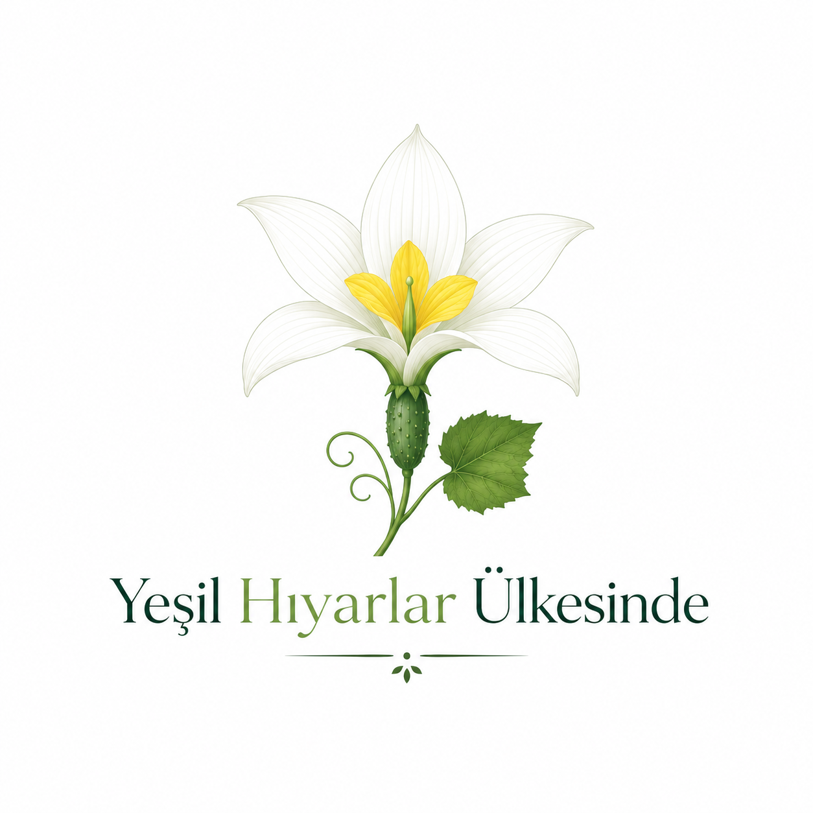

::: {.text-center}
{width=50%}
:::

## Memleketten Güzide Lezzetler

Bu yazı dizisi, ülkenin eğitim fidanlığında çürümeye karşı mücadele eden bir ferdinin, gözlemlerini ve tecrübelerini derleyip eldeki malzemelerle iç ferahlatıcı bir cacığın nasıl yapılacağına dair kendince oluşturduğu fikirlerini içermektedir. Bu kadar malzeme varken sorun nerede? Bir elimizde her türlüsünden (doğranmış, rendelenmiş, tohuma kaçmış, çiçek açmış) bolca hıyar, diğer elimizde patenti bu toplumda bulunan yoğurt ve her şeyin toplamında bir garip çıkmaz.  

::: {.text-center}
Olmak ya da olmamak...\
veya olamamak.\
Mesele sanki biraz da bu.
:::

::: {.text-center}
{width=40%}
:::

## Giriş

- [[yazilar/yhu/art-iceriden-bildiriyorum|İçeriden Bildiriyorum...]]
- [[yazilar/yhu/art-biraz-ciddiyet|Biraz Ciddiyet]]

## Bölümler

- [[yazilar/yhu/art-milli-evrak-bakanligi|Milli Evrak Bakanlığı]]

## Sıradaki Konular

Bu yazı dizisi 2019 pandemisi döneminde başladı; başlangıçta bir kitap olması düşünülüyordu. Çeşitli sebeplerle kenarda kaldı. Aşağıdaki başlıkların çoğu için kafamda taslaklar var, ama bütünü bir arada yazma baskısı, zamanla biriken eksikler ve güncelliğini yitiren konular süreci uzattı.

Liste bu haliyle ne eksiksiz ne de nihai. Bazı bölümler yazılacak, bazıları güncelliğini yitirdiği için düşecek, bazıları birleşecek, bazıları ayrışacak; burada hiç yer almayan başlıklar eklenecek. Mevcut çalışma alanım olan yapay zeka da bunlar arasında. Liste ağırlıklı olarak başlangıç döneminin izlerini taşıdığından olduğu gibi bırakıldı.

- Dershanecilik zihniyeti — Bürokrasiden sonraki en büyük sorun
- Devletçi yaklaşım vs liberal yaklaşım
- Eğitim mi ekonomiyi düzeltir yoksa ekonomi mi eğitimi düzeltir?
- 2020'li yıllarda sanayi tipi eğitimi savunmak
- Sisteme köle yetiştiren sistem — Eğitimin amacı nedir?
- Yabancı dil nasıl öğretilmez
- Trafik kurallarının bilinmediği yerde trigonometri anlatmak
- Eğitim teknolojileri ve online eğitim
- Nasıl öğreniriz? Süt emmekten roket fırlatmaya
- Çocukları eğitmek kolay, peki ya veliler?
- İnsanlık tarihi kadar eski, isimlendirmesi yeni bir kavram: "Z Kuşağı"
- Tıp sayısalda, coğrafya sözelde, peki burada mantık nerede?
- Öğrenciye dersi sevdirmek — Eğitimdeki en büyük safsata
- Çok iyi anlatan öğretmen gerçekten iyi midir?
- Bambaşka bir yapılandırmacı eğitim: İnşaatçı patronlar
- Parasız eğitim, taş yiyen öğretmenler ve umut tacirleri
- Öğretmenler odasında bir gün — Kısır Döngü
- Mesleki yönlendirme ("Üniversiteye gitsin, en kötü vizyon kazanır.")
- Öğretmen yetiştirme, iktisatçı öğretmenler ve 657
